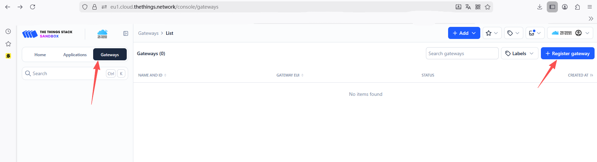
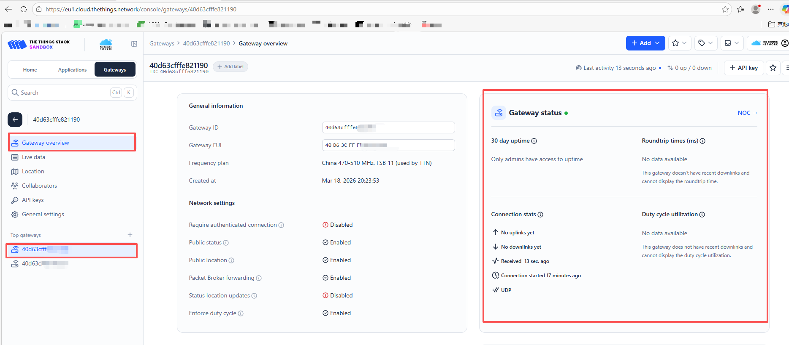
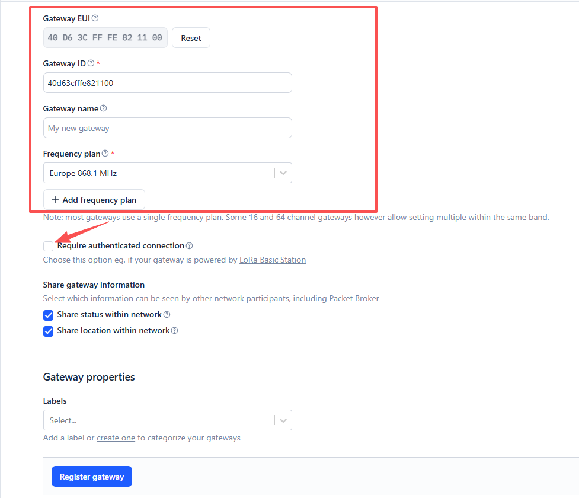
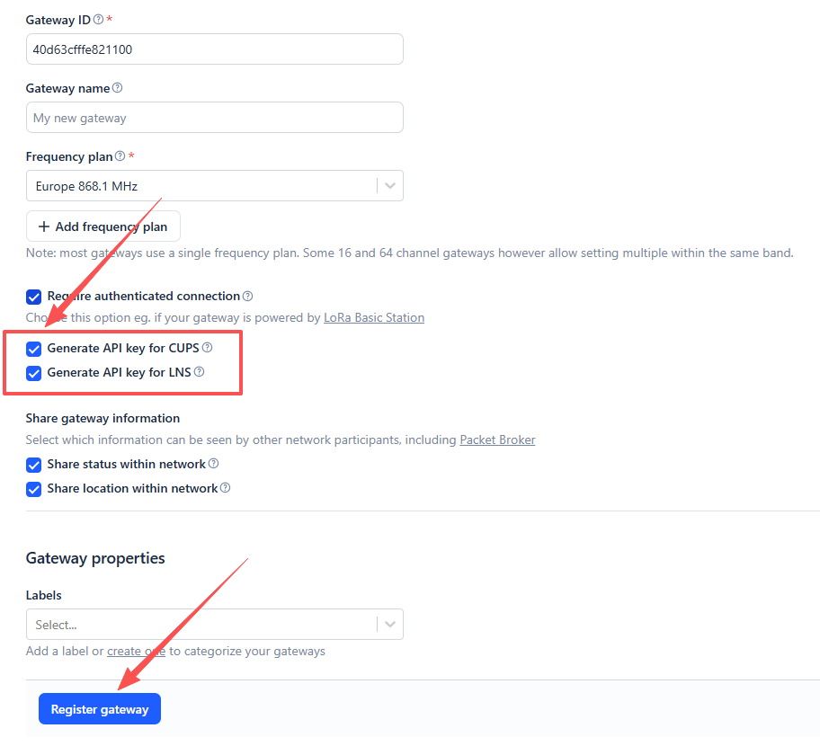
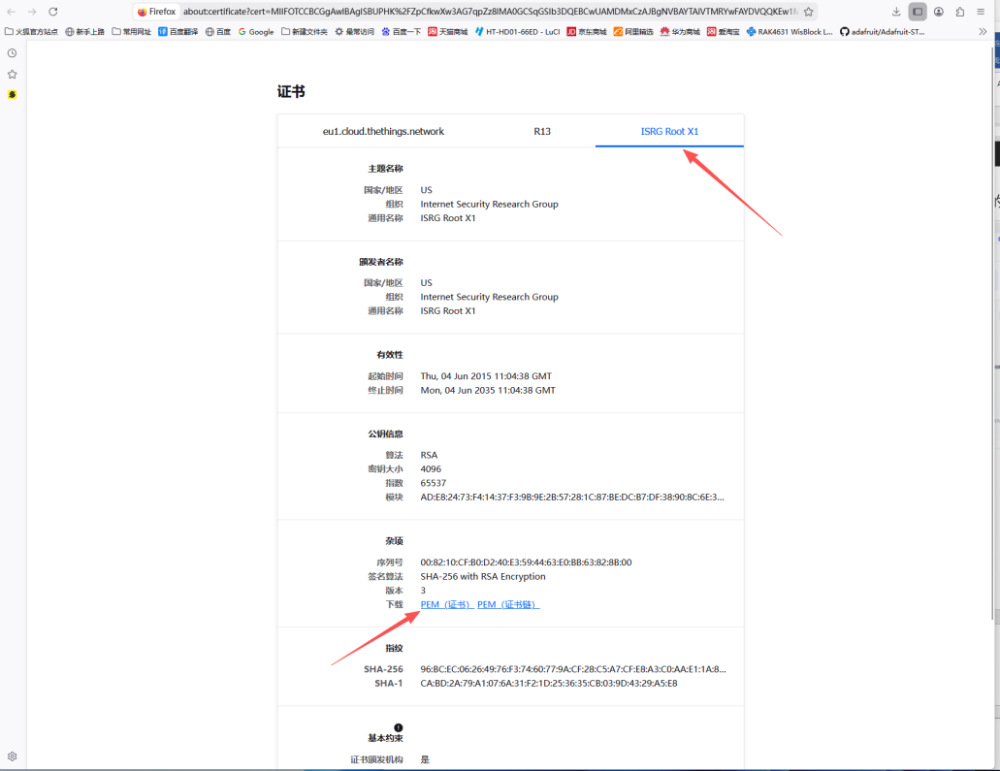
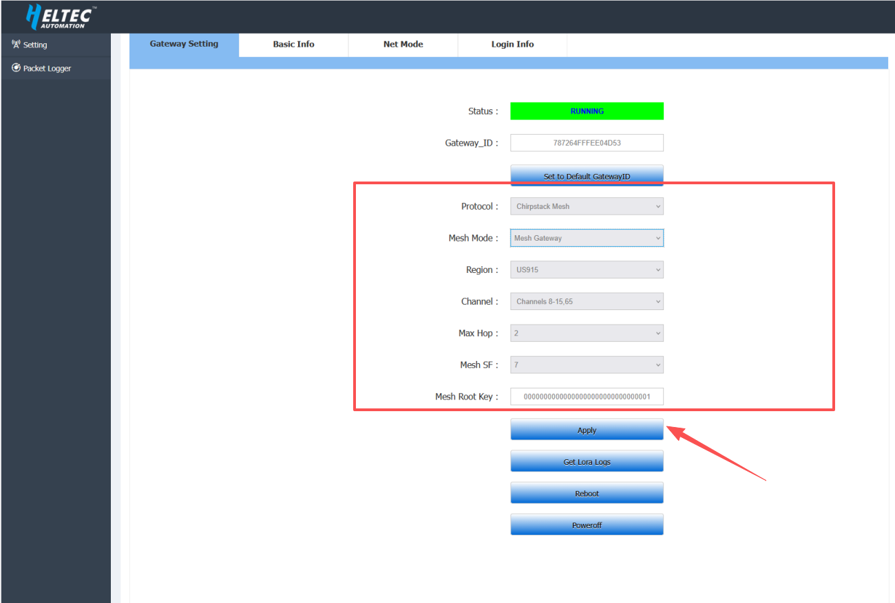
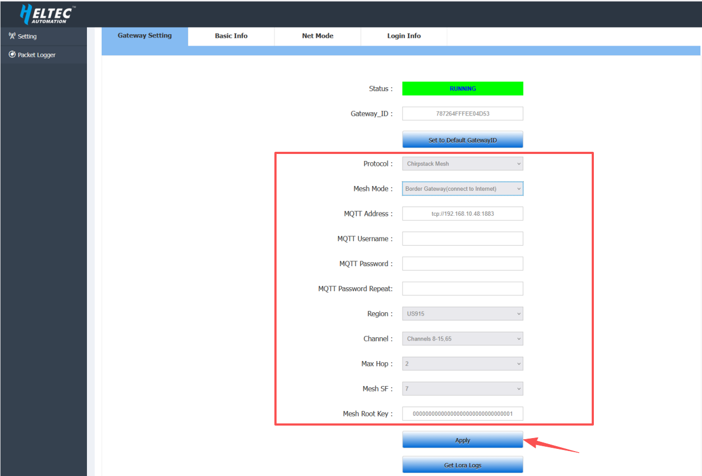
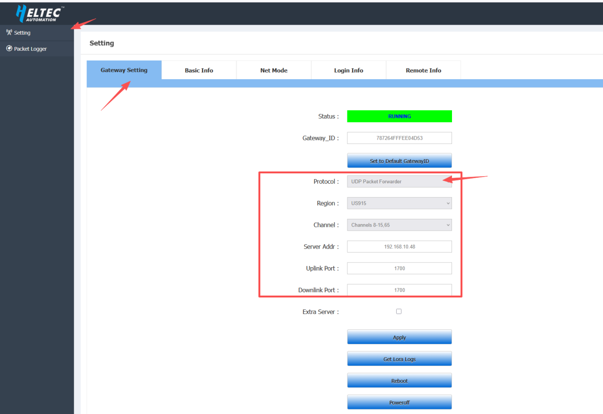
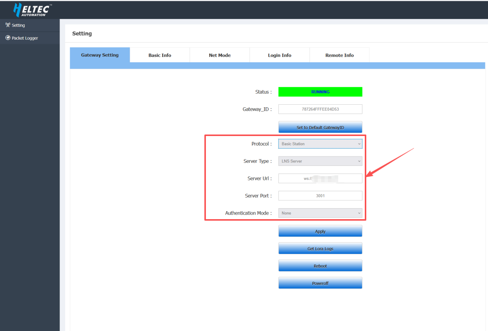

import Tabs from '@theme/Tabs';
import TabItem from '@theme/TabItem';
import styles from '@site/src/css/styles.module.css';

## Summary

This article aims to describe how to connect HT-M02_V2 Gateway to a LoRa server, such as [TTN](https://www.thethingsnetwork.org/), [ChirpStack](https://www.chirpstack.io/), which facilitates secondary development and rapid deployment of LoRa devices.

Before all operation, make sure the HT-M02 is runing well . If not, please refer to this [HT-M02_V2 Quick Start](/docs/devices/lorawan-application/lora-gateway/ht-m02_v2/quick_start) document.

<Tabs
groupId="tts"
queryString="tts"
defaultValue="tts"
className={styles.customTabs}
values={[
{label: 'TTN/TTS Server', value:'tts'},
{label: 'ChirpStack Server', value:'css'},
]}>

<TabItem value="tts">

<Tabs>
  <TabItem value="1" label="UDP Packet Forwarder" default>

### Register a LoRa gateway in TTN/TTS

1.Go to the [TTN Console](https://eu1.cloud.thethings.network/console), create an account, and log in.

2.After logging in, add your gateway in the TTN Console.

3.In the Gateway EUI field, enter the value corresponding to the Gateway ID shown on the 7603 gateway configuration page, then click **Confirm**.

- **Gateway EUI** -- The unique ID of HT-M7603 gateway, view from configuration page.

4. Complete the following configuration

- **Gateway ID**: Enter the corresponding Gateway EUI (letters must be in lowercase)
- **Gateway Name**: Customizable, optional
- **Frequency Plan**: Matches the LoRa band configuration in HT-M7603

After completing the configuration, click **Register Gateway**.

---

### Configure the Gateway

1.Connect the gateway to the network. Please refer to this [operation document](/docs/devices/lorawan-application/lora-gateway/ht-m02_v2/quick_start) for detailed steps. Once completed, configure the gateway in the “HT-M02 Config” interface according to the interface shown below.

- **Protocal**: `UDP packet forwarder`
- **Region**: Select the frequency plan that matches your device
- **Server Addr**:  `eu1.cloud.thethings.network`
- **Port UP**: 1700
- **Port Down**: 1700

After completing the configuration, click **Apply**.

---

2.After completing the configuration, the gateway will automatically connect to the server. If everything is set up correctly, the gateway will appear as connected on the TTN server.

</TabItem>
  <TabItem value="2" label="Basic Station">

### Register a LoRa gateway in TTN/TTS

1.Go to the [TTN Console](https://eu1.cloud.thethings.network/console), create an account, and log in.

2.After logging in, add your gateway in the TTN Console.

3.In the Gateway EUI field, enter the value corresponding to the Gateway ID shown on the 7603 gateway configuration page, then click **Confirm**.

- **Gateway EUI** -- The unique ID of HT-M7603 gateway, view from configuration page.

---

4. Complete the following configuration

- **Gateway ID**: Enter the corresponding Gateway EUI (letters must be in lowercase)
- **Gateway Name**: Customizable, optional
- **Frequency Plan**: Matches the LoRa band configuration in HT-M7603

:::warning
Make sure to check  `Require authenticated Connection`.
:::

---

5.Check `Generate API Key for CUPS` and `Generate API Key for LNS`, then click **Register Gateway** after completing the configuration.

6.Then download the gateway API keys by clicking `Download LNS Key` and `Download CUPS Key`. Finally, click `I have downloaded these keys`.

- **Download LNS Key:** Downloads the `tc.key` file for connecting the gateway to the server in Basic Station LNS mode.

- **Download CUPS Key:** Downloads the `cups.key` file for connecting the gateway to the server in Basic Station CUPS mode.

---

### Download the TTN certificate

the following example uses the Firefox browser

1.Click the security lock icon located to the left of eu1.cloud.thethings.network in the browser address bar.

2.Navigate to **More Information** → **Security** → **View Certificate**.

3.Click **ISRG ROOT X1**, then download the PEM certificate. This will download a file named eu1-cloud-thethings-network.pem.

---

### Configure the Gateway

1.Connect the gateway to the network. Please refer to this [operation document](/docs/devices/lorawan-application/lora-gateway/ht-m02_v2/quick_start) for detailed steps. Once completed, configure the gateway in the “HT-M02 Config” interface according to the interface shown below.

<Tabs>
  <TabItem value="1" label="LNS Mode" default>

**Connecting BasicStation to TTN in LNS Mode**

- **Protocal**: Basic Station
- **Server Type**:  LNS Server
- **Server Url**:  `wss://eu1.cloud.thethings.network`
- **Server Port**: `8887`
- **Authentication Mode**: TLS Server & Client Token
- **Trust(CA Certificate)**: Select the downloaded TTN certificate file (.pem format)
- **Client Certificate**: Leave this field empty
- **Client key**: Select the downloaded LNS Key file (tc.key)

After completing the configuration, click **Apply**.

</TabItem>
  <TabItem value="2" label="CUPS Mode">

**Connecting BasicStation to CUPS in LNS Mode**

- **Protocal**: Basic Station
- **Server Type**:  CUPS Server
- **Server Url**:  `eu1.cloud.thethings.network`
- **Server Port**: `443`
- **Authentication Mode**: TLS Server & Client Token
- **Trust(CA Certificate)**: Select the downloaded TTN certificate file (.pem format)
- **Client Certificate**: Leave this field empty
- **Client key**: Select the downloaded CUPS Key file (cups.key)

After completing the configuration, click **Apply**.

</TabItem>
</Tabs>

2.After completing the configuration, the gateway will automatically connect to the server. If everything is set up correctly, the gateway will appear as connected on the TTN server.

</TabItem>
</Tabs>

</TabItem>
<TabItem value="css">

### 1.[Deploy the ChirpStack Server](docs/devices/lorawan-application/lora-gateway/ht-m02_v2/chirpstack_deployment_via_docker)

### 2.Register LoRa Gateway in ChirpStack

After logging into the ChirpStack console, follow the steps below to add a gateway.

- Name: Can be set arbitrarily
- Description: Optional
- Gateway ID: Enter the unique identifier of the gateway (must match the gateway configuration)

After completing the configuration, click **Submit**.

### 2.Configure the Gateway

Connect the gateway to the network. Please refer to this [operation document](/docs/devices/lorawan-application/lora-gateway/ht-m02_v2/quick_start) for detailed steps. Once completed, configure the gateway in the “HT-M02 Config” interface according to the interface shown below.

<Tabs>
  <TabItem value="1" label="Mesh Mode" default>

In the ChirpStack Mesh network architecture, gateways are no longer single-point receiving devices. Instead, they are divided into two roles that work together to enable longer-range and more flexible LoRa data forwarding capabilities.

The core concept of the system is: Mesh gateways are responsible for **extending network coverage**, while Border gateways are responsible for **connecting to the server**.

### Mesh Mode

Mesh Mode: Does not require an internet connection. It only forwards LoRa signals and does not connect directly to the server.

- **Protocal**: chirpstack Mesh
- **Mesh Mode**:  Mesh Gateway
- **MQTT Address**:  `tcp://xxx.xxx.x.xxx:1883`

:::tip
`xxx.xxx.x.xxx` is the ChirpStack server address.
For example, if the ChirpStack server address is 192.168.10.49, then the MQTT Address should be set to: `tcp://192.168.10.48:1883`.
:::

- **MQTT Username**: Leave blank (or enter the username provided by the ChirpStack/MQTT server)
- **MQTT Password**: Leave blank (or enter the corresponding password)
- **MQTT Password Repeat**: Same as the MQTT password
- **Region**: Select the frequency plan that matches your device
- **Max Hop**: 2 (defines the maximum number of hops allowed; must match the Mesh Gateway configuration)
- **Mesh SF**: 7 (used for long-range communication scenarios; must match the Mesh Gateway configuration)
- **Mesh Root Key**: Enter a 32-character HEX value (network encryption key; must be identical to the Border Gateway)

After completing the configuration, click **Apply**.

--- 

### Border Mode

Border Mode: Requires an internet connection. It can directly receive data from end devices and forward it to the server, as well as receive data from Mesh gateways and relay it to the server.

- **Protocal**: chirpstack Mesh
- **Mesh Mode**:  Border Gateway
- **MQTT Address**:  `tcp://xxx.xxx.x.xxx:1883`

:::tip
`xxx.xxx.x.xxx` is the ChirpStack server address.
For example, if the ChirpStack server address is 192.168.10.49, then the MQTT Address should be set to: `tcp://192.168.10.48:1883`.
:::

- **MQTT Username**: Leave blank (or enter the username provided by the ChirpStack/MQTT server)
- **MQTT Password**: Leave blank (or enter the corresponding password)
- **MQTT Password Repeat**: Same as the MQTT password
- **Region**: Select the frequency plan that matches your device
- **Max Hop**: 2 (defines the maximum number of hops allowed; must match the Mesh Gateway configuration)
- **Mesh SF**: 7 (used for long-range communication scenarios; must match the Mesh Gateway configuration)
- **Mesh Root Key**: Enter a 32-character HEX value (network encryption key; must be identical to the Mesh Gateway)

After completing the configuration, click **Apply**.

---

Once all configurations are completed, the device will appear online on the server if configured correctly, indicating that the connection has been successfully established.

:::note
Mesh gateways typically allow direct viewing of connected device status within their individual **Gateway** pages. In contrast, Border gateways, acting as aggregation and uplink nodes, are usually managed through the **Gateway Mesh** unified view, where device status is monitored centrally.
:::

</TabItem>
  <TabItem value="3" label="UDP Packet Forwarder">

- **Protocal**: UDP Packet Forwarder
- **Region**: Select the frequency plan that matches your device
- **Server Address**:  ChirpStack server address
- **Uplink Port**: 1700
- **Downlinklink Port**: 1700

After completing the configuration, click **Apply**.

Once all configurations are completed, the device will appear online on the server if configured correctly, indicating that the connection has been successfully established.

</TabItem>
  <TabItem value="4" label="Basic Station">

- **Protocal**: Basic Station
- **Server Type**: LNS Server
- **Region**: Select the frequency plan that matches your device
- **Server Url**: ws://xxx.xxx.x.xxx

:::tip
`xxx.xxx.x.xxx` is the ChirpStack server address. For example, if the ChirpStack server address is 192.168.10.49, then the Server Url should be set to: ws://192.168.10.48.
:::

- **Server Port**: 3001

After completing the configuration, click **Apply**.

Once all configurations are completed, the device will appear online on the server if configured correctly, indicating that the connection has been successfully established.

</TabItem>
</Tabs>

</TabItem>
</Tabs>