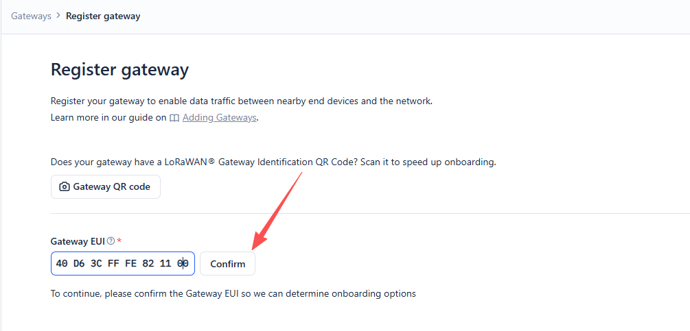
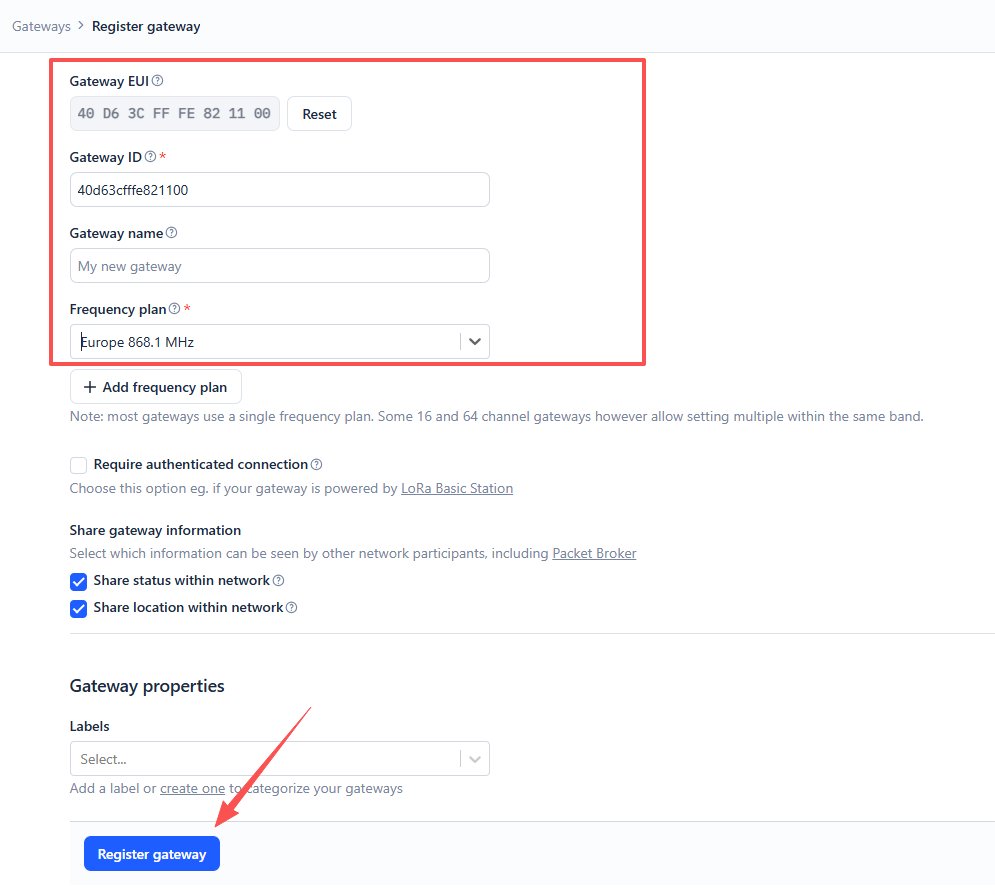
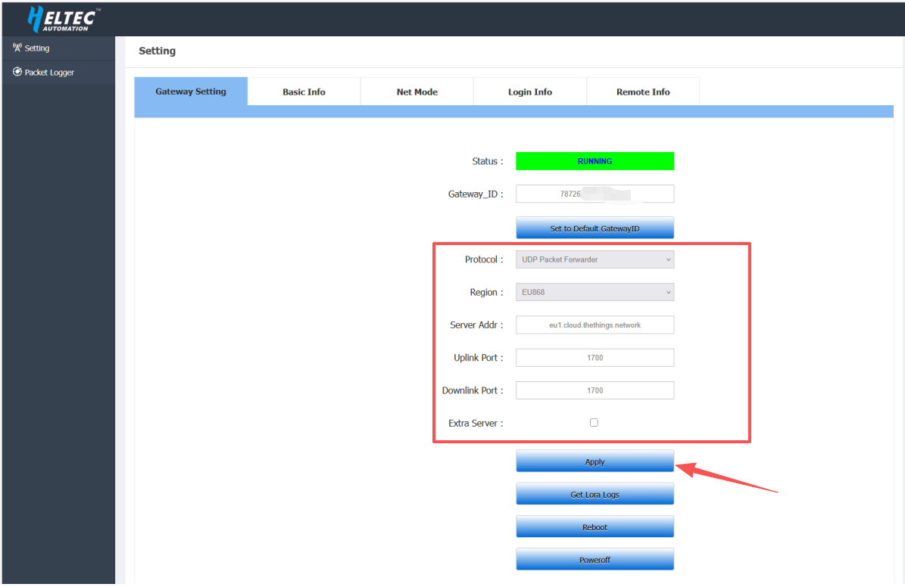
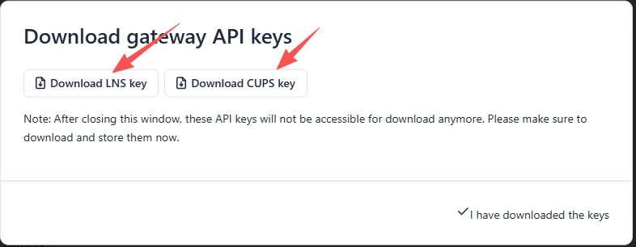
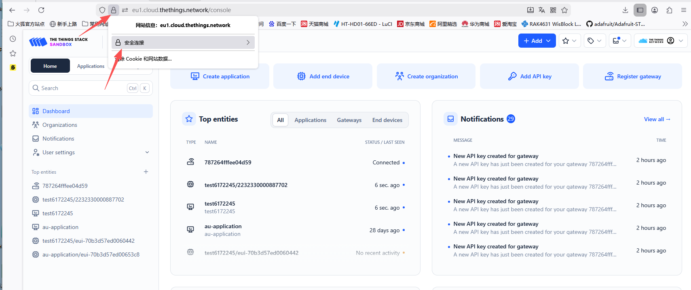
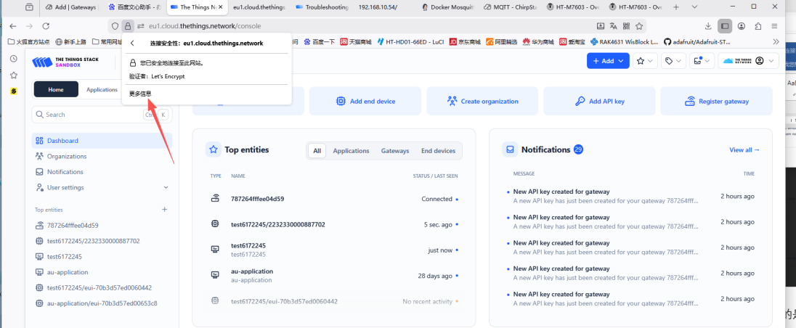
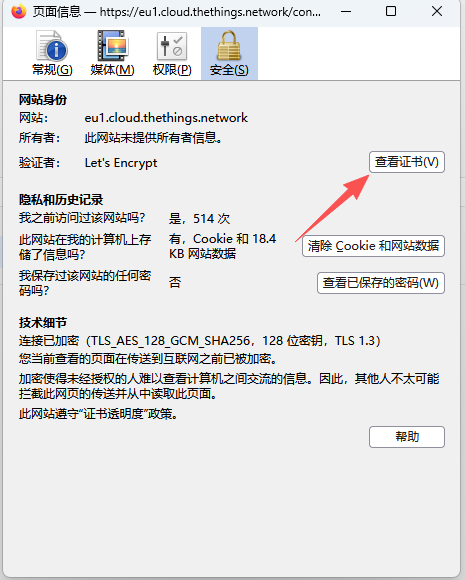
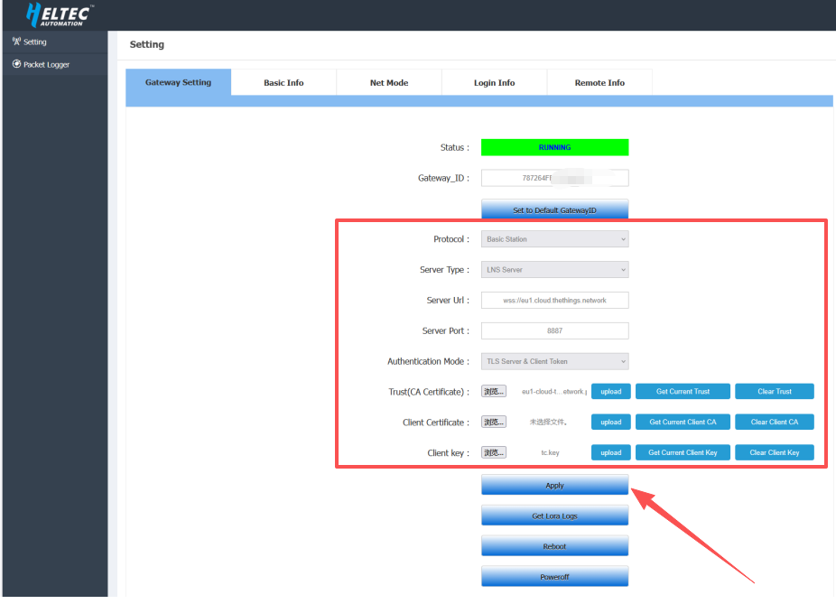
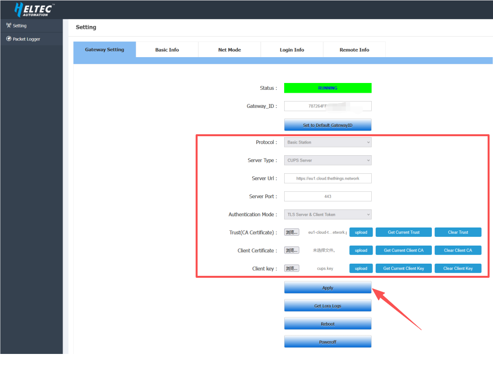
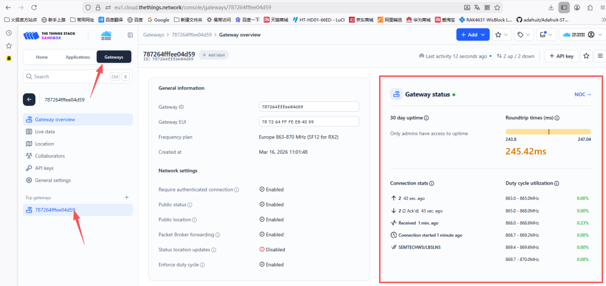

import Tabs from '@theme/Tabs';
import TabItem from '@theme/TabItem';
import styles from '@site/src/css/styles.module.css';

## Summary

This article aims to describe how to connect HT-M02_V2 Gateway to a LoRa server, such as [TTN](https://www.thethingsnetwork.org/), [ChirpStack](https://www.chirpstack.io/), which facilitates secondary development and rapid deployment of LoRa devices.

Before all operation, make sure the HT-M02 is runing well . If not, please refer to this [HT-M02_V2 Quick Start](/docs/devices/lorawan-application/lora-gateway/ht-m02_v2/quick_start) document.

<Tabs className={styles.customTabs}>
  <TabItem value="1" label="UDP Packet Forwarder" default>

### Step1 Register a LoRa Gateway in TTN/TTS

1.Go to the [TTN Console](https://eu1.cloud.thethings.network/console), create an account, and log in.

2.After logging in, add your gateway in the TTN Console.

3.In the Gateway EUI field, enter the value corresponding to the Gateway ID shown on the 7603 gateway configuration page, then click **Confirm**.

- **Gateway EUI** -- The unique ID of HT-M7603 gateway, view from configuration page.

4. Complete the following configuration

- **Gateway ID**: Enter the corresponding Gateway EUI (letters must be in lowercase)
- **Gateway Name**: Customizable, optional
- **Frequency Plan**: Matches the LoRa band configuration in HT-M7603

After completing the configuration, click **Register Gateway**.

---

### Step2 Configure the Gateway

1.Connect the gateway to the network. Please refer to this [operation document](/docs/devices/lorawan-application/lora-gateway/ht-m02_v2/quick_start) for detailed steps. Once completed, configure the gateway in the “HT-M02 Config” interface according to the interface shown below.

- **Protocal**: `UDP Packet Forwarder`
- **Region**: Select the frequency plan that matches your device
- **Server Addr**:  `eu1.cloud.thethings.network`
- **Port UP**: 1700
- **Port Down**: 1700

After completing the configuration, click **Apply**.

---

2.After completing the configuration, the gateway will automatically connect to the server. If everything is set up correctly, the gateway will appear as connected on the TTN server.

</TabItem>
  <TabItem value="2" label="Basic Station">

### Step1 Register a LoRa gateway in TTN/TTS

1.Go to the [TTN Console](https://eu1.cloud.thethings.network/console), create an account, and log in.

2.After logging in, add your gateway in the TTN Console.

3.In the Gateway EUI field, enter the value corresponding to the Gateway ID shown on the 7603 gateway configuration page, then click **Confirm**.

- **Gateway EUI** -- The unique ID of HT-M7603 gateway, view from configuration page.

4. Complete the following configuration

- **Gateway ID**: Enter the corresponding Gateway EUI (letters must be in lowercase)
- **Gateway Name**: Customizable, optional
- **Frequency Plan**: Matches the LoRa band configuration in HT-M7603

:::warning
Make sure to check  `Require authenticated Connection`.
:::

---

5.Check `Generate API Key for CUPS` and `Generate API Key for LNS`, then click **Register Gateway** after completing the configuration.

6.Then download the gateway API keys by clicking `Download LNS Key` and `Download CUPS Key`. Finally, click `I have downloaded these keys`.

- **Download LNS Key:** Downloads the `tc.key` file for connecting the gateway to the server in Basic Station LNS mode.

- **Download CUPS Key:** Downloads the `cups.key` file for connecting the gateway to the server in Basic Station CUPS mode.

---

### Step2 Download the TTN certificate

the following example uses the Firefox browser

1.Click the security lock icon located to the left of eu1.cloud.thethings.network in the browser address bar.

2.Navigate to **More Information** → **Security** → **View Certificate**.

3.Click **ISRG ROOT X1**, then download the PEM certificate. This will download a file named eu1-cloud-thethings-network.pem.

---

### Step3 Configure the Gateway

1.Connect the gateway to the network. Please refer to this [operation document](/docs/devices/lorawan-application/lora-gateway/ht-m02_v2/quick_start) for detailed steps. Once completed, configure the gateway in the “HT-M02 Config” interface according to the interface shown below.

<Tabs className={styles.customTabs1}>
  <TabItem value="1" label="LNS Mode" default>

**Connecting BasicStation to TTN in LNS Mode**

- **Protocal**: Basic Station
- **Server Type**:  LNS Server
- **Server Url**:  `wss://eu1.cloud.thethings.network`
- **Server Port**: `8887`
- **Authentication Mode**: TLS Server & Client Token
- **Trust(CA Certificate)**: Select the downloaded TTN certificate file `.pem format`
- **Client Certificate**: Leave this field empty
- **Client key**: Select the downloaded LNS Key file `tc.key`

After completing the configuration, click **Apply**.

</TabItem>
  <TabItem value="2" label="CUPS Mode">

**Connecting BasicStation to TTN in CUPS Mode**

- **Protocal**: Basic Station
- **Server Type**:  CUPS Server
- **Server Url**:  `https://eu1.cloud.thethings.network`
- **Server Port**: `443`
- **Authentication Mode**: TLS Server & Client Token
- **Trust(CA Certificate)**: Select the downloaded TTN certificate file `.pem format`
- **Client Certificate**: Leave this field empty
- **Client key**: Select the downloaded CUPS Key file `cups.key`

After completing the configuration, click **Apply**.

</TabItem>
</Tabs>

2.After completing the configuration, the gateway will automatically connect to the server. If everything is set up correctly, the gateway will appear as connected on the TTN server.

</TabItem>
</Tabs>

