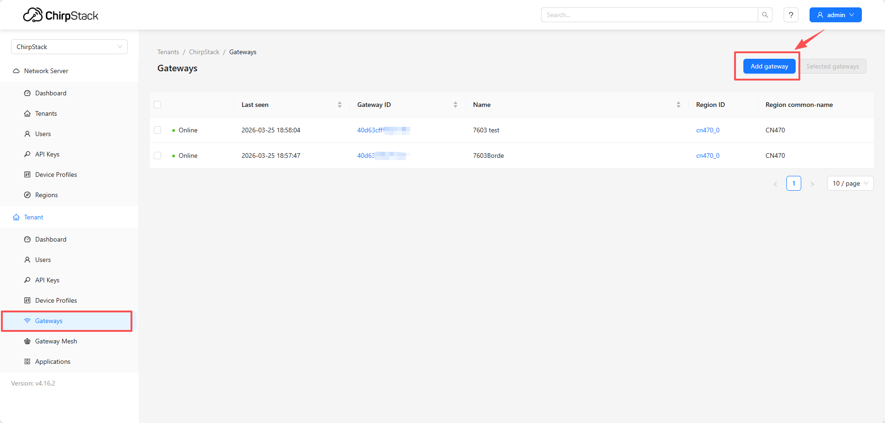
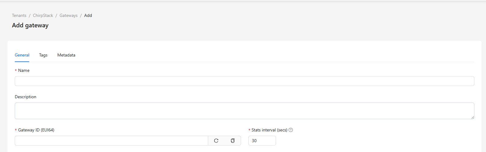
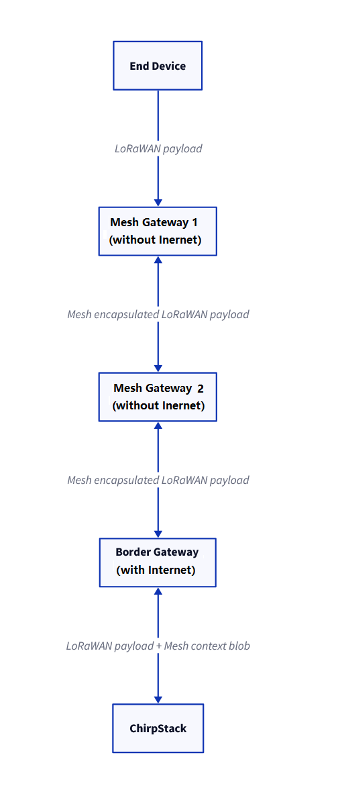
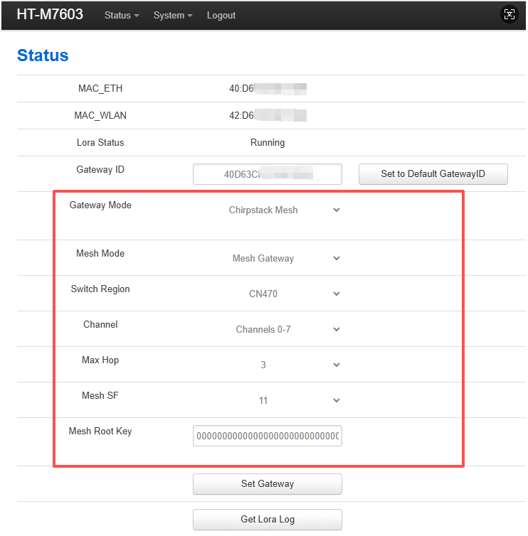
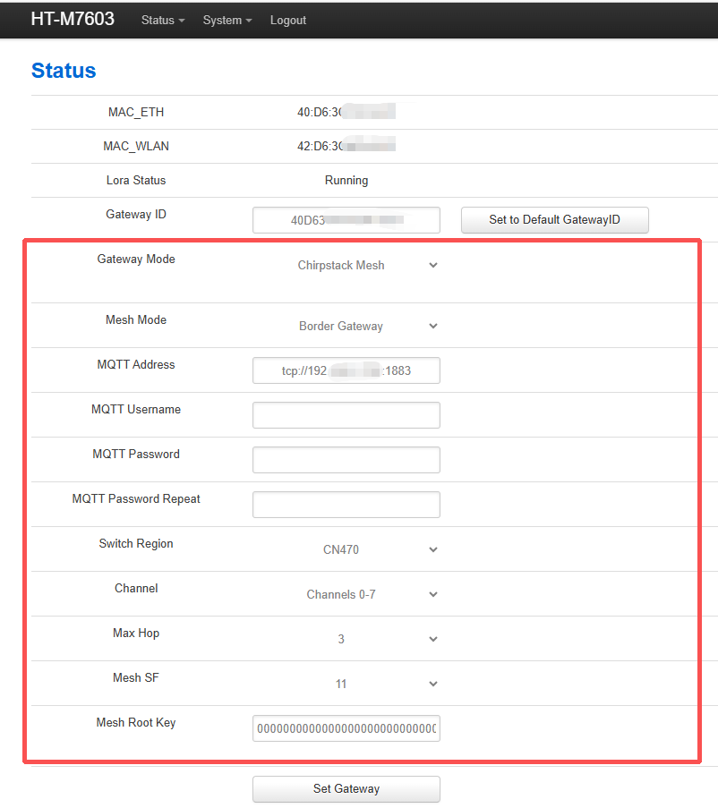
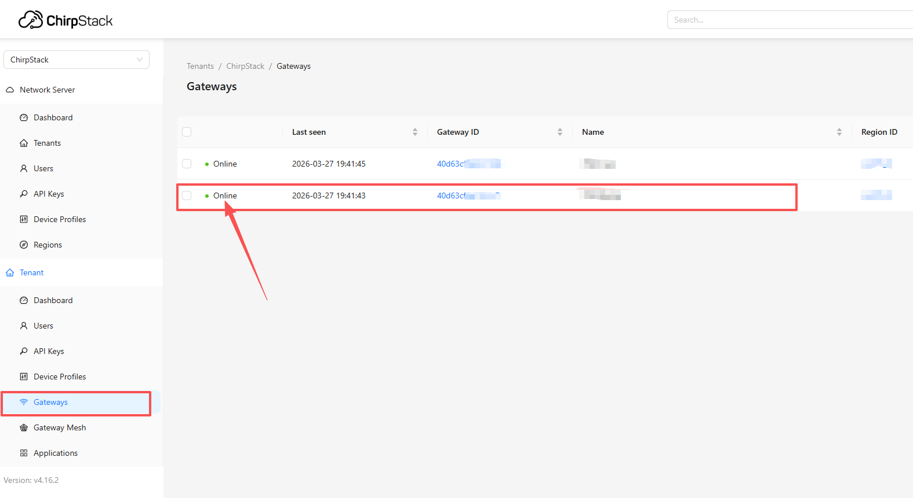
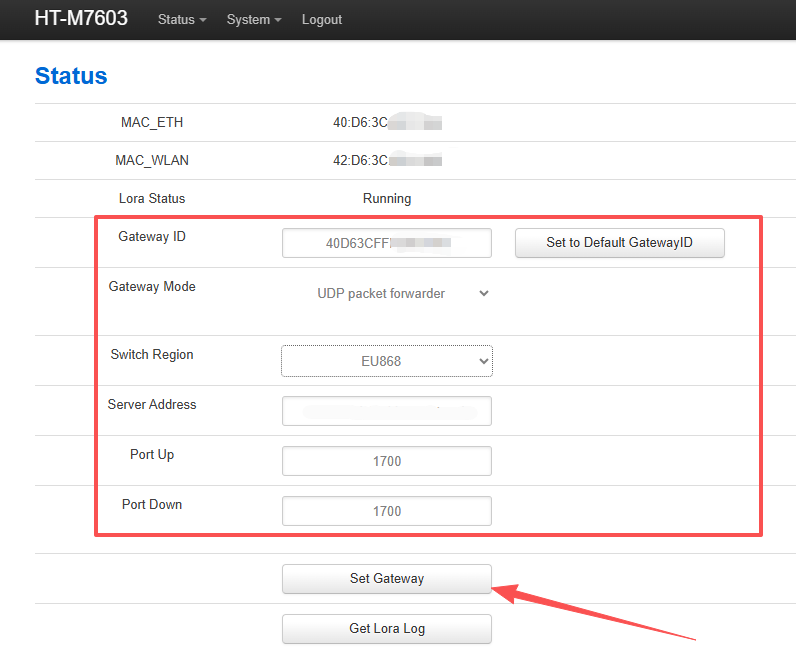
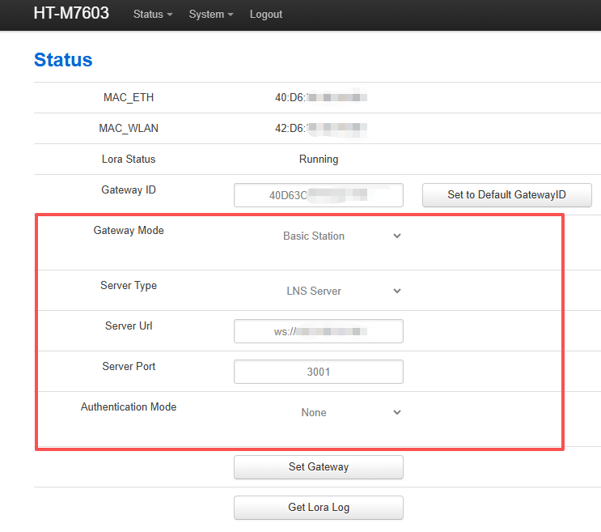

import Tabs from '@theme/Tabs';
import TabItem from '@theme/TabItem';
import styles from '@site/src/css/styles.module.css';

## Summary

This article aims to describe how to connect HT-M7603to a LoRa server, such as [TTN](https://www.thethingsnetwork.org/)/[TTS](https://lora.heltec.org/), [ChirpStack](https://www.chirpstack.io/), which facilitates secondary development and rapid deployment of LoRa devices.

Before all operation, make sure the HT-M7603 is runing well . If not, please refer to this [HT-M7603_Quick Start](/docs/devices/lorawan-application/lora-gateway/ht-m7603/Usage) document.

### 1.[Deploy the ChirpStack Server](docs/devices/lorawan-application/lora-gateway/ht-m02_v2/chirpstack_deployment_via_docker)

### 2.Register LoRa Gateway in ChirpStack

After logging into the ChirpStack console, follow the steps below to add a gateway.

- Name: Can be set arbitrarily
- Description: Optional
- Gateway ID: Enter the unique identifier of the gateway (must match the gateway configuration)

After completing the configuration, click **Submit**.

### 3.Configure the Gateway

Connect the gateway to the network. Please refer to this [operation document](/docs/devices/lorawan-application/lora-gateway/ht-m7603/Usage) for detailed steps. Once completed, configure the gateway in the “HT-M02 Config” interface according to the interface shown below.

<Tabs className={styles.customTabs}>
  <TabItem value="1" label="Mesh Mode" default>

In the ChirpStack Mesh network architecture, gateways are no longer single-point receiving devices. Instead, at least two gateway roles are required and work together to enable longer-range and more flexible LoRa data forwarding capabilities.

The core concept of the system is: **Mesh Gateway** are responsible for extending network coverage through multi-hop LoRa forwarding between gateways, while **Border Gateway** are responsible for connecting to the server. Mesh Gateways do not communicate directly with the server; instead, all uplink data is ultimately aggregated by the Border Gateway and forwarded to the ChirpStack server via IP networks.

### Mesh Gateway

Does not require an internet connection. It only forwards LoRa signals and does not connect directly to the server.

- **Gateway Mode**: chirpstack Mesh
- **Mesh Mode**:  Mesh Gateway
- **Switch Region**: Select the frequency plan that matches your device
- **Max Hop**: 3 (defines the maximum number of hops allowed; must match the Mesh Gateway configuration)
- **Mesh SF**: 11 (used for long-range communication scenarios; must match the Mesh Gateway configuration)
- **Mesh Root Key**: Enter a 32-character HEX value (network encryption key; must be identical to the Border Gateway)

After completing the configuration, click **Set Gateway**.

--- 

### Border Gateway

Requires an internet connection. It can directly receive data from end devices and forward it to the server, as well as receive data from Mesh gateways and relay it to the server.

- **Gateway Mode**: chirpstack Mesh
- **Mesh Mode**:  Border Gateway
- **MQTT Address**:  `tcp://xxx.xxx.x.xxx:1883`

:::tip
`xxx.xxx.x.xxx` is the ChirpStack server address.
For example, if the ChirpStack server address is 192.168.10.49, then the MQTT Address should be set to: `tcp://192.168.10.48:1883`.
:::

- **MQTT Username**: Leave blank (or enter the username provided by the ChirpStack/MQTT server)
- **MQTT Password**: Leave blank (or enter the corresponding password)
- **MQTT Password Repeat**: Same as the MQTT password
- **Switch Region**: Select the frequency plan that matches your device
- **Max Hop**: 3 (defines the maximum number of hops allowed; must match the Mesh Gateway configuration)
- **Mesh SF**: 11 (used for long-range communication scenarios; must match the Mesh Gateway configuration)
- **Mesh Root Key**: Enter a 32-character HEX value (network encryption key; must be identical to the Mesh Gateway)

After completing the configuration, click **Set Gateway**.

---

Once all configurations are completed, the device will appear online on the server if configured correctly, indicating that the connection has been successfully established.

:::note
Mesh gateways typically allow direct viewing of connected device status within their individual **Gateway** pages. In contrast, Border gateways, acting as aggregation and uplink nodes, are usually managed through the **Gateway Mesh** unified view, where device status is monitored centrally.
:::

</TabItem>
  <TabItem value="3" label="UDP Packet Forwarder">

- **Gateway Mode**: UDP Packet Forwarder
- **Switch Region**: Select the frequency plan that matches your device
- **Server Address**:  ChirpStack server address
- **Port Up**: 1700
- **Port Down**: 1700

After completing the configuration, click **Set Gateway**.

Once all configurations are completed, the device will appear online on the server if configured correctly, indicating that the connection has been successfully established.

</TabItem>
  <TabItem value="4" label="Basic Station">

- **Gateway Mode**: Basic Station
- **Server Type**: LNS Server
- **Server Url**: ws://xxx.xxx.x.xxx

:::tip
`xxx.xxx.x.xxx` is the ChirpStack server address. For example, if the ChirpStack server address is 192.168.10.49, then the Server Url should be set to: ws://192.168.10.48.
:::

- **Server Port**: 3001
- **Authentication Mode**: None

After completing the configuration, click **Set Gateway**.

Once all configurations are completed, the device will appear online on the server if configured correctly, indicating that the connection has been successfully established.

</TabItem>
</Tabs>
