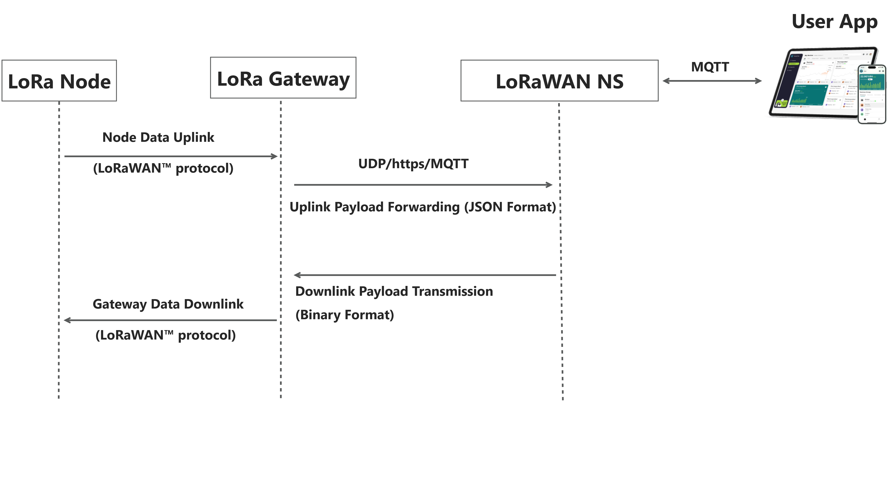

import Tabs from '@theme/Tabs';
import TabItem from '@theme/TabItem';
import React from "react";
import styles from '@site/src/css/styles.module.css';

import Img1 from './img/7603.png';
import Img2 from './img/m02.png';
import Img3 from './img/2802.png';
import Img4 from './img/m01.png';
import Img5 from './img/1303.png';
import Img6 from './img/v3.png';
import Img7 from './img/v4.png';
import Img8 from './img/trackerv2.png';
import Img9 from './img/114.png';
import Img10 from './img/213.png';
import Img11 from './img/paper.png';

This document serves as an introductory guide to LoRaWAN, aiming to help you establish a foundational understanding of the LoRaWAN system architecture. It provides an overview of the fundamental concepts, constituent components, structural framework, and implementation methods associated with the system. The ultimate objective is to enable you to quickly set up your own LoRaWAN system after reading this guide.

## What is LoRaWAN?

LoRaWAN is a wireless networking protocol based on *LoRa*1 spread spectrum radio technology. It's a low-power, long-range star networking system for IoT devices that send small amounts of data infrequently.

It constitutes a bidirectional communication path comprising a `Node -- Gateway -- Cloud Server -- Application` chain. Common technical mechanisms essential for communication stability. Including device management, security authentication, digital frequency hopping, and conflict resolution—are all incorporated into this protocol.

:::tip Note 1
LoRa spread spectrum radio technology is a mature technology; if you are unfamiliar with it, you can consult an AI or a search engine.
:::

## LoRaWAN System Architecture

To build a LoRaWAN system, the following three components are essential.
1. LoRa NS
2. LoRa Gateway
3. LoRa Node

The relationship among the three can be described using this architectural diagram.

### Part 1. LoRaWAN NS

This section comprises two parts: `LoRa Network Server` and `LoRa Application Server`. However, people habitually refer to these two components collectively as "LoRa NS". It typically runs on a server(local or cloud). It is the core network component that manages devices and processes data from gateways. It receives uplink data from LoRaWAN Gateways, handles routing and processing, and forwards data to applications or cloud platforms. It is also responsible for device authentication, network control, and data security.

**Here are some common LoRaWAN server platforms**

- [Snapemu](/docs/platform/snapemu) -- A comprehensive IoT management platform with LoRaWAN support developed by Heltec, it's a lightweight and open-source IoT devices visualization management platform. Including device management, data analysis, curve drawing, and data storage.
- [ChirpStack](/docs/platform/chirpstack/chirpstack_deployment_via_docker) -- Well-known open-source solution.
- [The Things Stack](/docs/platform/ttn/gateways_connect_to_ttn/connect_to_ttn) -- TTN/TTS, public LoRaWAN network.

### Part 2. LoRa Gateway

The primary function of the gateway is data forwarding.
- Uplink: It receives data transmitted by LoRa nodes via the LoRaWAN protocol, packages it into JSON format, and sends the data to the LoRa NS over the network (UDP, TCP/IP).
- Downlink: converts the downlink data, ACKs, etc. from the LoRa NS into LoRa radio signals and transmit to LoRa Nodes.

**The following are our mainstream LoRaWAN gateway products.**

  {[
    {
      img: Img1,
      text: "HT-M7603 Indoor Gateway",
      link: "/docs/devices/lorawan-application/lora-gateway/ht-m7603"
    },
    {
      img: Img2,
      text: "HT-M02 Edge Gateway",
      link: "/docs/devices/lorawan-application/lora-gateway/ht-m02_v2"
    },
    {
      img: Img3,
      text: "HT-M2802 Indoor Gateway",
      link: "/docs/devices/lorawan-application/lora-gateway/ht-m2802"
    },
    {
      img: Img4,
      text: "HT-M01S Indoor Gateway",
      link: "/docs/devices/lorawan-application/lora-gateway/ht-m01s_v2"
    },
    {
      img: Img5,
      text: "HT1303 LoRaWAN Module",
      link: "/docs/devices/lorawan-application/lora-gateway/ht-1303"
    }
    
  ].map((item, index) => (

    

      
 e.currentTarget.style.transform = "translateY(-6px)"}
        onMouseLeave={e => e.currentTarget.style.transform = "translateY(0)"}
      >
        
      

      

        <a href={item.link} target="_blank">
          <button style={{
            width: "80%",
            padding: "10px 0",
            background: "#25c2a0",
            color: "#fff",
            border: "none",
            borderRadius: "999px",
            cursor: "pointer",
            fontWeight: "500"
          }}>
            {item.text}
          </button>
        </a>
      

    

  ))}

### Part 3. LoRa Node

LoRaWAN End Device (also called LoRa Node) is the device that is deployed on your application side. It can be a type of sensor data collector that convert the sensor data into LoRaWAN format and transmits via a LoRa radio signal. Or a controller for actuators such as water pumps or motors. focuses on data collection and transmission, directly communication with a gateway.

**We offer a wide range of LoRa/LoRaWAN node devices, which can be broadly categorized into three types:**

<Tabs
groupId="lorawan"
queryString="lorawan"
defaultValue="lorawan"
className={styles.customTabs}
values={[
{label: 'Maker/Dev Kit', value:'lorawan'},
{label: 'Module', value:'module'},
{label: 'Plug & Play', value:'play'},
]}>

<TabItem value="lorawan">

This category of products integrates essential peripherals such as power management, display modules, and complete RF circuitry, enabling you to rapidly build functional prototypes and efficiently bring your ideas to life.

**ESP32 Series**

| Series          | Descrption    |
|-----------------|---------------|
|[WiFi LoRa 32 V3](https://heltec.org/project/wifi-lora-32-v3/) | ESP32-S3FN8 + SX1262 + OLED Display |
|[WiFi LoRa 32 V4](https://heltec.org/project/wifi-lora-32-v4/) | ESP32-S3R2 + SX1262 + OLED Display, 28 ± 1 dBm output |
|[Wireless Tracker](https://heltec.org/project/wireless-tracker/) | ESP32-S3FN8 + SX1262 + UC6580 + LCD Display |
|[Wireless Tracker V2](https://heltec.org/project/wireless-tracker-v2/) | ESP32-S3FN8 + SX1262 + UC6580 + LCD Display 28 ± 1 dBm output |
|[Wireless Paper](https://heltec.org/project/wireless-paper/) | ESP32-S3FN8 + SX1262 + 2.13-inch E-Ink Display |
|[Wireless Stick](https://heltec.org/project/wireless-stick-v3/) | ESP32-S3FN8 + SX1262 + 0.49*OLED Display |
|[Wireless Stick Lite](https://heltec.org/project/wireless-stick-lite-v2/) | ESP32-S3FN8 + SX1262 |
|[Wifi Kit 32](https://heltec.org/project/wifi-kit32-v3/) | ESP32-S3FN8 + CP2102 + OLED Display |
|[Vision Master T190](https://heltec.org/project/vision-master-t190/)| ESP32-S3R8 + SX1262 + TFT Display |
|[Vision Master T213](https://heltec.org/project/vision-master-e213/)| ESP32-S3R8 + SX1262 + E-Ink Display |
|[Vision Master T290](https://heltec.org/project/vision-master-e290/)| ESP32-S3R8 + SX1262 + E-Ink Display |

**nRF52840 Series**

| Series          | Descrption    |
|-----------------|---------------|
|[Mesh Node T114](https://heltec.org/project/mesh-node-t114/) |  nRF52840 + SX1262 + TFT Display |
|[Mesh Node T096](https://heltec.org/project/t096/) | nRF52840 + SX1262 + 	UC6580 + TFT Display, 28 ± 1 dBm output |

**CubeCell Series**

| Series          | Descrption    |
|-----------------|---------------|
|[CubeCell GPS-6502](https://heltec.org/project/htcc-ab02s/) |  ASR6502  + SX1262 + OLED Display |
|[CubeCell Dev-Board Plus](https://heltec.org/project/htcc-ab02/) | ASR6502  + SX1262 + OLED Display |
|[CubeCell AB01 Dev-Board](https://heltec.org/project/htcc-ab01-v2/) | ASR6502  + SX1262 |

</TabItem>
<TabItem value="module" >

| Module          | Descrption    |
|-----------------|---------------|
|[Wireless Shell](https://heltec.org/project/wireless-shell-v3/) |  ESP32-S3FN8  + SX1262  |
|[Wireless Min Shell HT-CT62](https://heltec.org/project/ht-ct62/) | ESP32-C3FN4  + SX1262 |
|[Mesh Node 5262M](https://heltec.org/project/ht-n5262m/) | nRF52840  + SX1262 |
|[CubeCell AM02 Module Plus](https://heltec.org/project/htcc-am02/) | ASR6502 + SX1262 |
|[CubeCell AM01 Module V2](https://heltec.org/project/htcc-am01-v2/) | ASR6502 + SX1262 |

</TabItem>
<TabItem value="play" >

| Plug & Play          | Descrption    |
|-----------------|---------------|
|[MeshPocket](https://heltec.org/project/meshpocket/) | nRF52840 + SX1262|
|[WiFi LoRa 32 Expansion Kit](https://heltec.org/project/wifi-lora-32-v4-expansion-housing/) | V4 + pre-installed accessories|
|[RS485-LoRaWAN Wireless Converter](https://heltec.org/project/rs485-lorawan-wireless-converter/) | ESP32C3-FN4  + SX1262  |
|[RS485-LoRa Wireless Converter](https://heltec.org/project/rs485-lora-wireless-converter/) | ESP32C3-FN4  + SX1262 |
|[HT-M00S Single Channel LoRa Gateway](https://heltec.org/project/ht-m00s-single-channel-lora-gateway/) | ESP32C3-FN4 + SX1262 |
|[Wireless Aggregator Sensor Docker](https://heltec.org/project/hri-3631/) | IP66 |
|[Wireless Aggregator — Bus Transformer](https://heltec.org/project/hri-3632/) | IP66 |
|[Wireless Aggregator — Valve Controller](https://heltec.org/project/hri-3633/) | IP66 |

</TabItem>
</Tabs>
