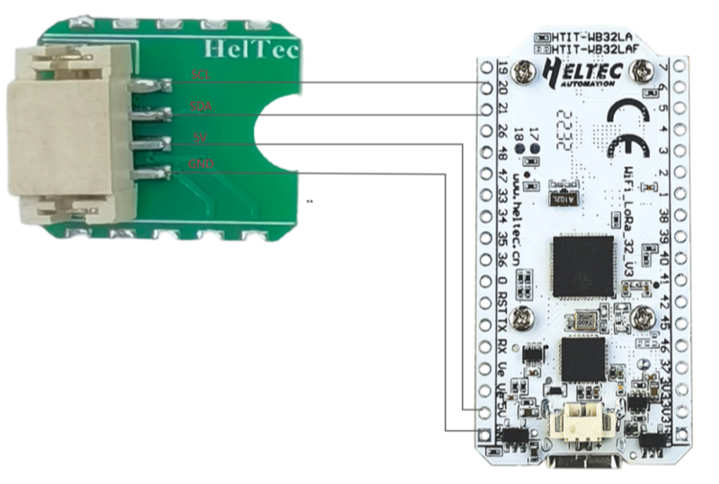
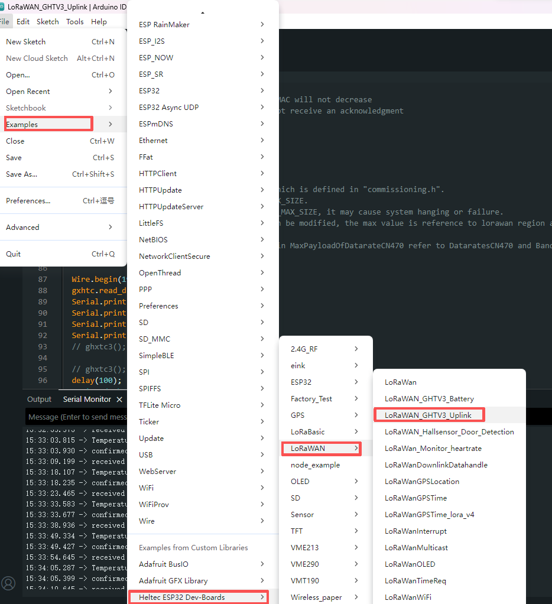
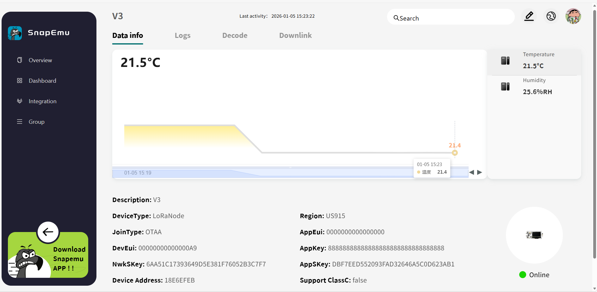

## What is LoRa?

LoRa is a low-power, long-range **wireless modulation technology** for LPWAN applications, enabling IoT devices to communicate over kilometers while achieving ultra-low power consumption and long battery life.

## What is LoRaWAN?

LoRaWAN is a standardized Low Power Wide Area Network (LPWAN) **communication protocol**,
primarily designed for battery-powered IoT end devices.
It enables secure transmission of device data over long distances while maintaining extremely low power consumption.

## LoRaWAN System Architecture

A complete LoRaWAN system architecture typically consists of the following four core components:

- End Devices/ Node [[LoRa Node Devices](/docs/devices/lorawan-application/lora-node-devices/) + [Open Source Hardware](/docs/devices/open-source-hardware/)]
- [LoRa Gateways](/docs/devices/lorawan-application/lora-gateway/)
- Network Server
- Application Server / Cloud Platform [[TTN/TTS](https://console.cloud.thethings.network/) + [ChirpStack](https://www.chirpstack.io/) + [SnapEmu](platform.snapemu.com)]

:::tip
The **Network Server** functionality is typically integrated into the cloud platform, so users do not need to manage it separately.
:::

## End Devices/ Node

End devices (nodes) are battery-powered IoT endpoints responsible for sensing data or detecting events and transmitting compact payloads to the LoRaWAN network using low-power, long-range wireless communication. They operate in a highly energy-efficient manner, remaining in sleep mode for most of the time and waking only to transmit or receive data when required.

In practical implementations, Heltec end devices are typically categorized into two types: ready-to-use [**LoRa Node Devices**](/docs/devices/lorawan-application/lora-node-devices/) for plug-and-play deployment, and [**Open-Source Hardware**](/docs/devices/open-source-hardware/) based on platforms such as ESP32, nRF52840, and CubeCell, which are designed for flexible and customizable IoT development.

---

## [LoRa Gateways](/docs/devices/lorawan-application/lora-gateway/)

### 1. Receiving LoRa Wireless Data

The LoRa Gateway is responsible for receiving wireless data from LoRa end devices.
By simultaneously monitoring multiple radio frequency channels and supporting different spreading factors (SF), the gateway can concurrently receive uplink data from devices operating at different data rates, enabling scalable deployment of end devices.

### 2.Receiving LoRa Wireless Data

The LoRa Gateway is responsible for receiving wireless data from LoRa end devices.
By simultaneously monitoring multiple radio frequency channels and supporting different spreading factors (SF), the gateway can concurrently receive uplink data from devices operating at different data rates, enabling scalable deployment of end devices.

### 3.Downlink Data Transmission

When the server issues a command, the LoRa Gateway transmits the downlink data over the LoRa link within the designated time window. Downlink success depends on the end device Class (A/B/C), network load, and RF environment, so proper scheduling and management are required in a LoRaWAN network.

The [SnapEmu](/docs/platform/snapemu/downlinkdata_example_on_snapemu) platform supports command downlink, enabling remote control and configuration of devices.

---

## Application Server / Cloud Platform

### 1.Data Decoding and Processing

- Receives data forwarded from the Network Server.

- Decodes, parses, and processes the raw LoRa data into actionable business information, such as temperature, humidity, or door status.

### 2.Device Management and Control

- Maintains device registration, status, and configuration parameters.

- Sends commands or configuration updates to end devices via downlink messages.

### 3.Data Storage and Analysis

- Stores historical data in a database or cloud platform.

- Supports data visualization, statistical analysis, alert rules, and remote monitoring.

### 4.Application Integration and Open Interfaces

- Provides APIs (e.g., RESTful or MQTT) for integration with third-party applications, cloud services, or BI systems.

- Enables data sharing, automated control, and intelligent analytics.

---
## How to Rapidly Build a LoRaWAN System

:::tip
Here, we present a simple LoRaWAN demonstration using the Heltec WiFi LoRa 32 V3 to transmit temperature and humidity sensor data to the SnapEmu platform.
:::

### Preparation

- A Sensor GXHTC3
- A LoRa Gateway [HT-M7603](/docs/devices/lorawan-application/lora-gateway/ht-m7603/)
- A LoRa Node [WiFi LoRa 32 V3](/docs/devices/open-source-hardware/esp32-series/lora-32/wifi-lora-32-v3/)
- Heltec LoRaWAN Server [SnapEmu](/docs/platforms)

### Usage Guide

**1.Hardware Connection**

**2.[Gateway configuration](/docs/devices/lorawan-application/lora-gateway/ht-m7603/Usage)** 
**3.[Gateway Register on Snapemu](/docs/platform/snapemu/register-device/gateway-register-on-snapemu)** 
**4. [Node Register on Snapemu](/docs/platform/snapemu/register-device/node-register-on-snapemu)** 

:::note
The OTAA parameters in the LoRaWAN example code must match the OTAA configuration used when registering the node.
:::

**5.** Run the GXHTC3 temperature and humidity sensor LoRaWAN example code to collect and transmit temperature and humidity data.

**6.** If everything operates normally, the temperature and humidity sensor data will be available on the SnapEmu platform after the node successfully completes the network join procedure.

