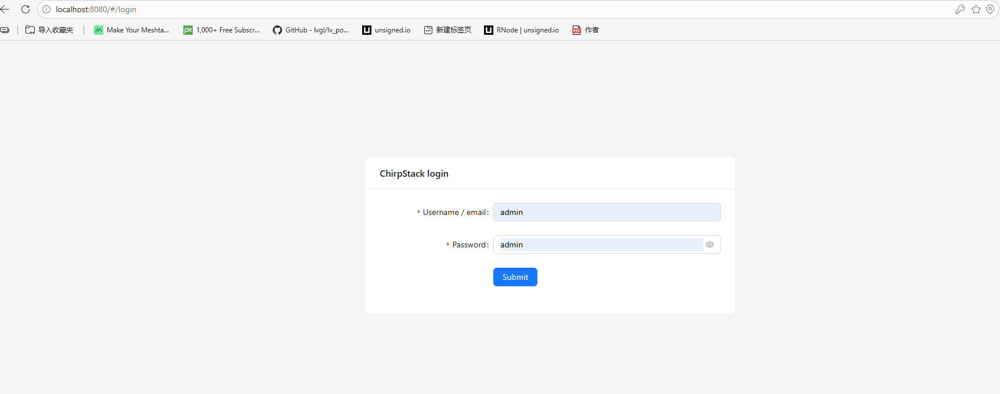
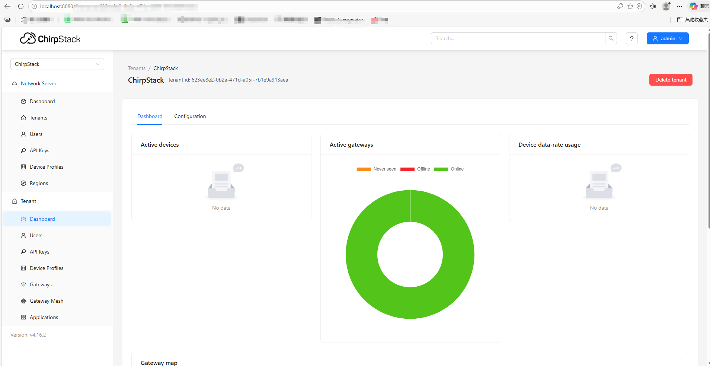

# ChirpStack Deployment via Docker

:::note
We recommend deploying ChirpStack using Docker for a simpler and more reliable setup. If you prefer not to use Docker, please refer to the [official documentation](https://www.chirpstack.io/docs/getting-started/debian-ubuntu.html
).
:::

## Step 1 Install Docker

Updates the package list (required before installation).

```
sudo apt update
```

Installs Docker and required dependencies -y auto-confirms installation.

```
sudo apt install -y ca-certificates curl gnupg lsb-release docker
```

## Step 2 Enable Docker for Current User

Adds the current user to the Docker group, allowing Docker commands to be run without sudo.

```
sudo usermod -aG docker $USER
```

:::warning
Log out and log back in or reboot to apply changes.
:::

## Step 3 Install Git and Clone Project

Installs Git

```
sudo apt install -y git
```

Downloads the ChirpStack Docker project

```
git clone https://github.com/Bei-Ji-Quan/chirpstack-docker.git
```

Enters the project directory

```
cd chirpstack-docker
```


## Step 4 Starts all ChirpStack Services

Start the ChirpStack services

```
docker compose up -d
```

Before running ./run_chirpstack_server us915_1, it is recommended to execute the following command to stop and clean up any existing containers:

```
docker compose down
```

automatically deploys Docker containers; the parameter us915_1 specifies the LoRaWAN frequency band and must match your deployment region. The table below lists the mapping between regions and frequency bands—simply change the parameter to the desired band and run the command accordingly.

```
./run_chirpstack_server us915_1
```

:::tip
For example, if you need to switch from the US915 band to the EU868 band, you can replace `./run_chirpstack_server us915_1` with `./run_chirpstack_server eu868`.
:::


### LoRaWAN Frequency Band Table

| Region / Band | Uplink Frequency Range (MHz)  | Uplink Frequency (BW125K / SF7–12) | Uplink Frequency (BW250K) | Uplink Frequency (BW500K) |
| ------------- | ----------------------------- | ---------------------------------- | ------------------------- | ------------------------- |
| as923         | 923.2–924.6                   | 923.2–924.6                        | —                         | —                         |
| as923_2       | 921.4–922.8                   | 921.4–922.8                        | —                         | —                         |
| as923_3       | 916.6–918.0                   | 916.6–918.0                        | —                         | —                         |
| as923_4       | 917.3–918.7                   | 917.3–918.7                        | —                         | —                         |
| au915_0       | 915.2–916.6                   | 915.2–916.6                        | —                         | 915.9 (SF8)               |
| au915_1       | 916.8–918.2                   | 916.8–918.2                        | —                         | 917.5 (SF8)               |
| au915_2       | 918.4–919.8                   | 918.4–919.8                        | —                         | 919.1 (SF8)               |
| au915_3       | 920.0–921.4                   | 920.0–921.4                        | —                         | 920.7 (SF8)               |
| au915_4       | 921.6–923.0                   | 921.6–923.0                        | —                         | 922.3 (SF8)               |
| au915_5       | 923.2–924.6                   | 923.2–924.6                        | —                         | 923.9 (SF8)               |
| au915_6       | 924.8–926.2                   | 924.8–926.2                        | —                         | 925.5 (SF8)               |
| au915_7       | 926.4–927.8                   | 926.4–927.8                        | —                         | 927.1 (SF8)               |
| cn470_0       | 470.3–471.7                   | 470.3–471.7                        | —                         | —                         |
| cn470_1       | 471.9–473.3                   | 471.9–473.3                        | —                         | —                         |
| cn470_2       | 473.5–474.9                   | 473.5–474.9                        | —                         | —                         |
| cn470_3       | 475.1–476.5                   | 475.1–476.5                        | —                         | —                         |
| cn470_4       | 476.7–478.1                   | 476.7–478.1                        | —                         | —                         |
| cn470_5       | 478.3–479.7                   | 478.3–479.7                        | —                         | —                         |
| cn470_6       | 479.9–481.3                   | 479.9–481.3                        | —                         | —                         |
| cn470_7       | 481.5–482.9                   | 481.5–482.9                        | —                         | —                         |
| cn470_8       | 483.1–484.5                   | 483.1–484.5                        | —                         | —                         |
| cn470_9       | 484.7–486.1                   | 484.7–486.1                        | —                         | —                         |
| cn470_10      | 486.3–487.7                   | 486.3–487.7                        | —                         | —                         |
| cn470_11      | 487.9–489.3                   | 487.9–489.3                        | —                         | —                         |
| eu433         | 433.175–433.575               | 433.175–433.575                    | —                         | —                         |
| eu868         | 867.1–868.5                   | 867.1–868.5                        | 868.3 (SF7)               | —                         |
| in865         | 865.0625 / 865.4025 / 865.985 | 865.0625 / 865.4025 / 865.985      | —                         | —                         |
| kr920         | 922.1–922.5                   | 922.1–922.5                        | —                         | —                         |
| ru864         | 868.9–869.1                   | 868.9–869.1                        | —                         | —                         |
| us915_0       | 902.3–903.7                   | 902.3–903.7                        | —                         | 903.0 (SF8)               |
| us915_1       | 903.9–905.3                   | 903.9–905.3                        | —                         | 904.6 (SF8)               |
| us915_2       | 905.5–906.9                   | 905.5–906.9                        | —                         | 906.2 (SF8)               |
| us915_3       | 907.1–908.5                   | 907.1–908.5                        | —                         | 907.8 (SF8)               |
| us915_4       | 908.7–910.1                   | 908.7–910.1                        | —                         | 909.4 (SF8)               |
| us915_5       | 910.3–911.7                   | 910.3–911.7                        | —                         | 911.0 (SF8)               |
| us915_6       | 911.9–913.3                   | 911.9–913.3                        | —                         | 912.6 (SF8)               |
| us915_7       | 913.5–914.9                   | 913.5–914.9                        | —                         | 914.2 (SF8)               |

Once the services are running, access the ChirpStack web interface via

```
http://localhost:8080
```

The default username and password are both: `admin`



After completing the above steps, ChirpStack is successfully deployed.


