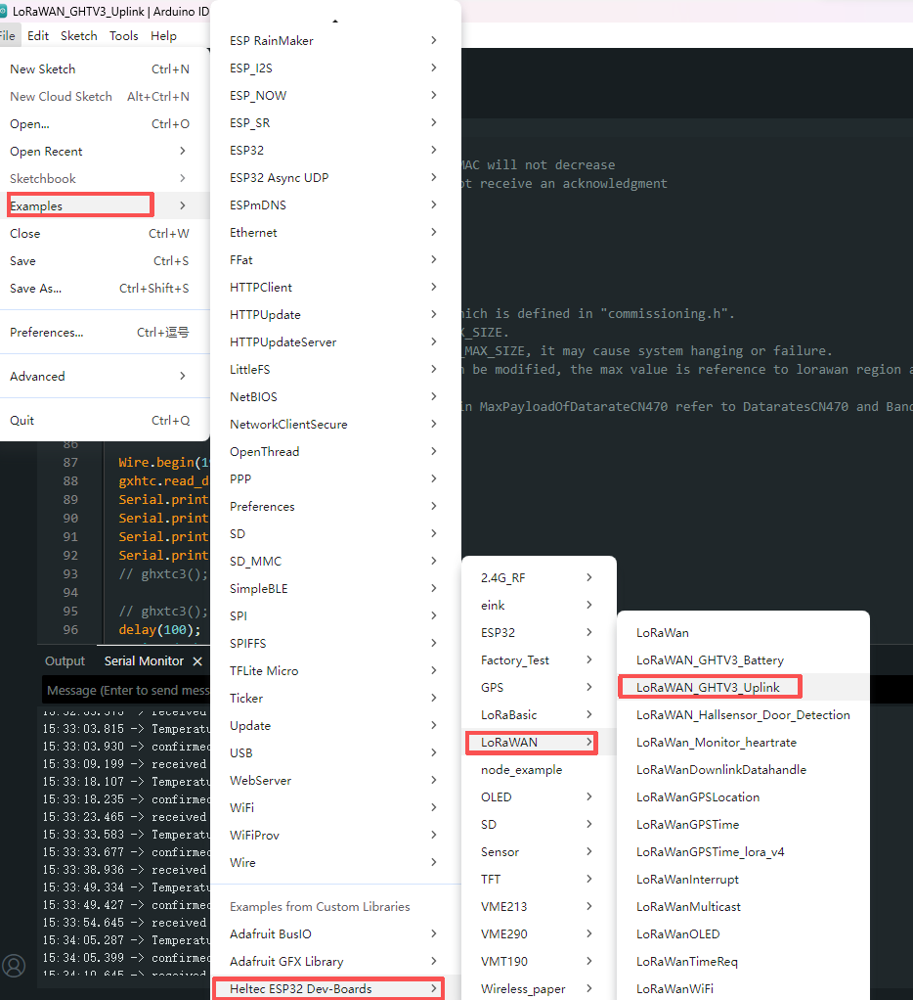
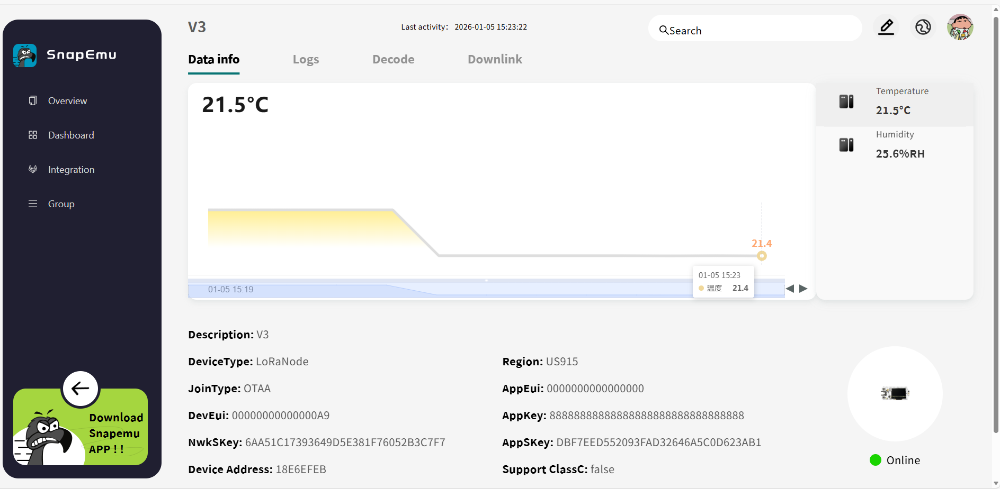

import Tabs from '@theme/Tabs';
import TabItem from '@theme/TabItem';
import React from "react";
import styles from '@site/src/css/styles.module.css';

# How to Rapidly Build a LoRaWAN System

>This guide shows how to build a LoRaWAN system with Heltec devices and the SnapEmu platform, enabling low-power, long-range IoT communication. Data is collected by LoRa nodes, transmitted via a gateway, and visualized on SnapEmu.

## Summary

This document is a comprehensive guidance document aimed at explaining how to quickly build a LoRaWAN network. To build a LoRaWAN communication system you must need these three parts:

- **A LoRaWAN server**  
- **A LoRaWAN Gateway**  
- **A LoRaWAN Node device**  

### Hardware preparation

- [A LoRaWAN Gateway](/docs/devices/lorawan-application/#part-2-lora-gateway)
- [A LoRaWAN Node device](/docs/devices/lorawan-application/#part-3-lora-node)
- High quality USB_Type_C cable

### Software Preparation

- Arduino development environment: [ESP32](/docs/devices/open-source-hardware/esp32-series/esp32-quick-start)/[nRF52840](/docs/devices/open-source-hardware/nrf52840-series/nrf52840-series-quick-start)/[CubeCell](/docs/devices/open-source-hardware/cubecell-series/cubecell-quick-start)
- A LoRaWAN server -- [SnapEmu](/docs/platform/snapemu/)

:::tip
Using the WiFi LoRa 32 V3 with a temperature and humidity sensor as an example
:::

### Step 1. Hardware Connection
Connect the sensor to the node via the GND, VCC, SDA, and SCL pins.

### Step 2. Device Registration
- [Register WiFi LoRa 32 on SnapEmu](/docs/platform/snapemu/register-device/node-register-on-snapemu)
- [Register a LoRa gateway on SnapEmu](/docs/platform/snapemu/register-device/gateway-register-on-snapemu)

### Step 3. Run the Example Code
Use the provided LoRaWAN example code. Once the setup is complete, run the code to start data transmission.

### Step 5. Data Visualization
View real-time sensor data on the SnapEmu platform.

:::note
This example presents a simplified LoRaWAN system with node-based data collection, gateway transmission, and SnapEmu visualization. The code follows the standard LoRaWAN protocol and supports multiple sensors via a [unified format](/docs/devices/general-docs/data_format_document). See the documentation for [Uplink](/docs/platform/snapemu/downlinkdata_example_on_snapemu) and [Downlink](/docs/platform/snapemu/downlinkdata_example_on_snapemu) details.
:::

---

## Frequently Asked Questions

### Why is the Gateway still shown as offline after being successfully registered in the LoRaWAN NS?

>Gateway registration only means that the gateway information has been added to the LoRaWAN NS. It does not mean the gateway has successfully connected to the server. The gateway will only be shown as online after it is properly connected to the network and successfully forwards data to the LoRaWAN NS.

**You can check the issue by looking at the following points:**

- 1.The gateway is not connected to the network, for example, it is not plugged into Ethernet or not connected to Wi-Fi.

- 2.The **Region** configured on the gateway must match the one selected during registration.
- 3.The operating mode configured on the gateway (Packet Forwarder / Basic Station) must match the mode supported by the current platform.
- 4.The server address is incorrectly configured. (For example, when using SnapEmu, the server address should be: `lora.snapemu.com`)
- 5.The port configured on the gateway must match the requirement of the LoRaWAN NS.
- 6.The **Gateway ID** configured on the gateway must match the **Gateway EUI** registered in the LoRaWAN NS; otherwise, the server cannot correctly recognize the gateway.
- 7.After modifying the configuration, the gateway settings must be saved and applied; otherwise, the new configuration will not take effect.

---

### Why is the LoRa node registered in the LoRaWAN NS but still unable to communicate?

>Registering the LoRa node in the LoRaWAN NS only means the node information has been added to the platform. It does not mean the node is already able to communicate. The node will only work properly after it has successfully joined the network and sent valid data.

**You can check the issue by looking at the following points:**

- 1.The node has not successfully joined the network.

- 2.The `AppEUI`, `DevEUI`, or `AppKey` in the node firmware do not match the values registered in the LoRaWAN NS.
- 3.The frequency plan used by the node does not match the configured LoRaWAN **region**.
- 4.The node and gateway are not operating on the same frequency band, so communication cannot be established properly.
- 6.The node signal is too weak or the node is too far from the gateway, causing unstable communication.
- 5.The node has joined the network, but it is not actually sending **uplink data**.

