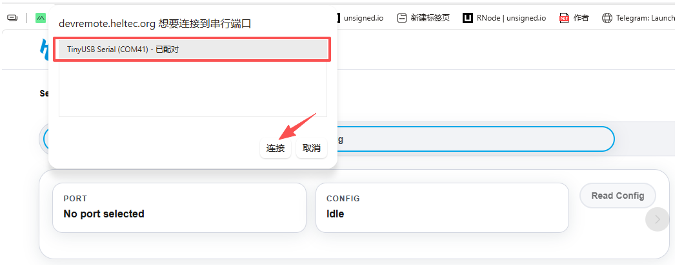
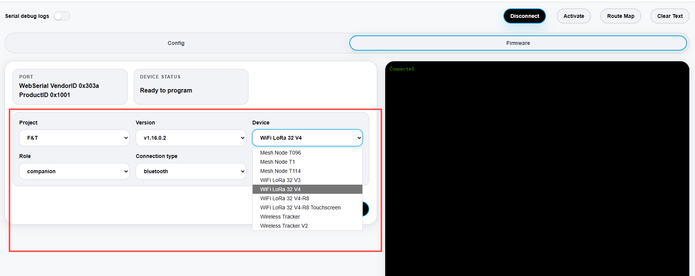
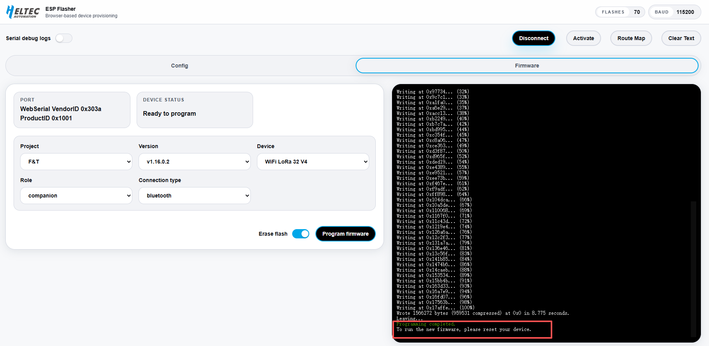
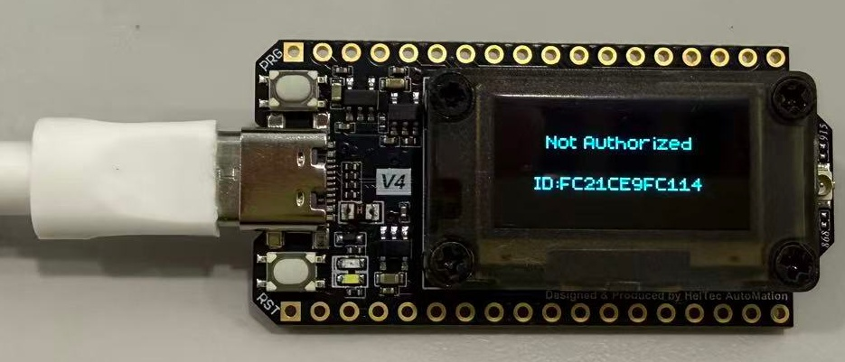
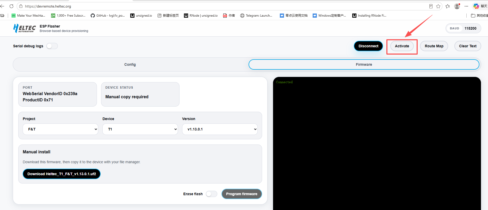
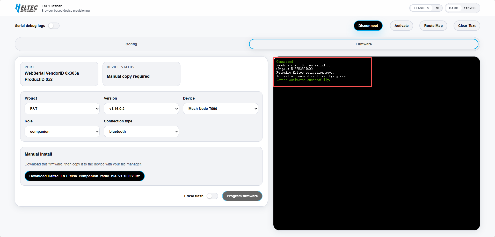

>**F&T** is a **MeshCore-based** communication firmware system designed for long-range, decentralized device-to-device communication. It enables peer-to-peer messaging, GPS-based location sharing, and basic device status management through a simple and intuitive user interface.

## Flash F&T Firmware

***Follow the steps below to flash the F&T firmware:***

1. Connect the device to your computer using a USB cable.

2. Enter **Bootloader mode**:  Press and hold the **PRG button**, then press and release the **RST button**, and finally release the **PRG button**. The device will enter Bootloader mode and become ready for firmware flashing.

3. Open the firmware flashing page: https://devremote.heltec.org/

4. Click **Connect**.

   

5. Select the corresponding **COM port**, then click **Connect** again.

   
   
   Once the device is successfully connected, the connection status will be displayed on the right side of the page.

6. Configure the flashing options:

   - **Project:** Select **F&T**.  
   - **Device:** Select the corresponding device model.
   - **Connection Type:** Select the connection method **WiFi**, **Bluetooth**, or **USB**.
  
   

:::tip
Currently, F&T is the only available project. More open-source projects may be added in the future.
:::

7. After completing the configuration: `Click Erase Flash` --> `Click Program Firmware`
   
   
   
   

   The tool will automatically complete the firmware flashing process. Once the flashing process is completed successfully, press the **RST button** once to restart the device.

---   

:::note
After flashing the F&T firmware, the device must be activated through the Device Remote platform before use.
:::

### Activate the Device

If the device displays the following screen, it indicates that the device has not been activated yet. 

***Please follow the steps below to activate the device:***

1. On the [Device Remote page](https://devremote.heltec.org/), Click **Connect**.

2. Select the corresponding **COM port**, then click **Connect** again.

3. Click **Activate**.

4.The device will be activated automatically. Once activated, the device is ready to use the F&T system.

---

## Function Selection

*After the device starts up, it will enter the UI interface and open the **Home** page by default.*

`Double-press` the **PRG button** to enter or exit the function selection menu, which provides access to five available functions.

| Function | Description |
|----------|-------------|
| **Home** | Return to the main screen and view basic device information |
| **Recent** | View recent messages |
| **Radio** | Configure radio communication settings |
| **GPS** | View current GPS positioning information |
| **System** | Configure device system settings |

### Navigation

- `Short press` the **PRG Button** to move the selection to the next option.
- `Press and hold` the **PRG Button** to confirm the selected function.
- `Double-press` the **PRG Button** to return to the previous menu.

---

### System Settings

The **System** menu provides various device configuration options, including:

- **Region:** Configure the device region settings.
- **Screen Off:** Configure the duration before the screen turns off automatically.
- **Bluetooth:** Enable or disable Bluetooth.
- **GPS:** Enable or disable GPS.
- **Location Share:** Enable or disable location sharing.
- **LNA:** `For devices equipped with an LNA`, the LNA function can be enabled or disabled directly from the System menu.

:::note
If the firmware is connected through Bluetooth, **Bluetooth must be enabled in the System** menu before connecting the device to the MeshCore app.
:::