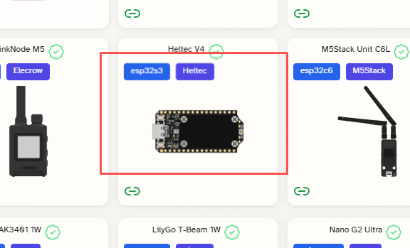

:::warning
**For hardware version **V4.3**, please use firmware version **2.7.20** or above.**
:::

## Firmware Flashing
### Web Flasher
1. **Enter Bootloader mode**

  Since the CP2102 has been removed in the V4 version, you must enter Bootloader mode when flashing the firmware. The method is as follows:
  - Connect the USB-C cable.
  - Press and hold the USER button, press the RST button once, then release the USER button
2. Go to the Meshtastic Web flash page: https://flasher.meshtastic.org/

3. Select Heltec V4, choose the firmware version, and start flashing.

### Flash via ESP32 Flasher Tool
1. Firmware address:
- [Meshtastic-2.7.20-OLED](https://resource.heltec.cn/download/WiFi_LoRa_32_V4/firmware/firmware-heltec-v4-2.7.20.2be5225.factory(1).bin)
2. For usage instructions, please refer to this link:
[How to use ESP32 Flash Tool](https://resource.heltec.cn/download/tools/How%20to%20use%20ESP32%20Flasher%20tool.pdf)

--------------------

## Power up
Press and hold the "**PWR**" button for **3 seconds** to activate the battery function.

--------------------

### Button
- **PWR**: Press and hold for 3 seconds to power the device on or off.
- **RST**: Reset
- **USER**
  - Single press: Next option, Wake
  - Long press 2 seconds: Enter or select the current option.
  - Long press and hold for 5 seconds, then release: Shutdown
- **35**: Custom key

--------------------

For more information, please refer to the official Meshtastic documentation: https://meshtastic.org/docs/introduction/