This document describes the installation, configuration, and usage of the buzzer, GXHTV3 sensor, and BME280 sensor in the V4 Expansion Kit.

## 1.Buzzer settings 

If you wish to manually install the buzzer, first remove the back panel of the expansion box.
The buzzer is designed with snap-in slots and can be directly snapped into any corresponding slot (all five slots on the back panel are identical; simply ensure it is securely seated).

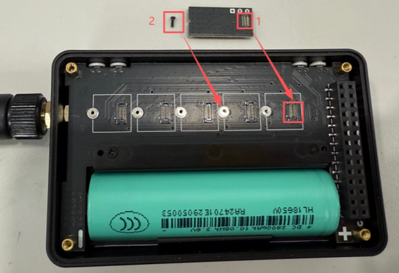

Finally, secure it with screws to complete the installation.

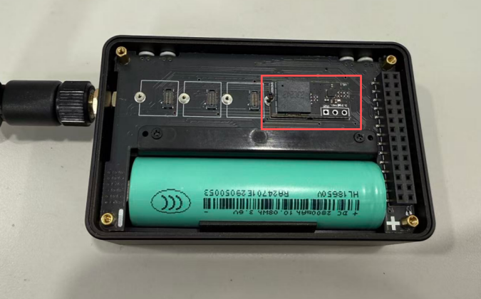

:::tip
If your expansion box is supplied with a pre-installed buzzer, please skip the above installation steps.
:::
---
For development kits equipped with a touchscreen, as long as a buzzer is installed, it will be enabled by default in ALL Enable mode upon first use. 
For development kits without a touchscreen, the buzzer must be manually configured in the **Meshtastic App** by setting the corresponding GPIO pin before it can be used.

Go to Settings → Device.

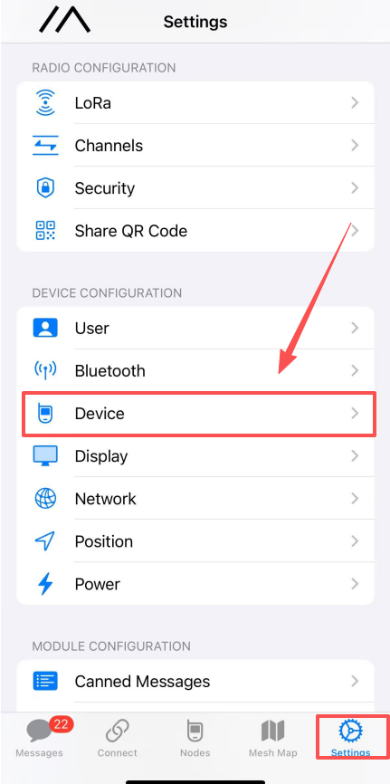

Set the buzzer pin to pin6

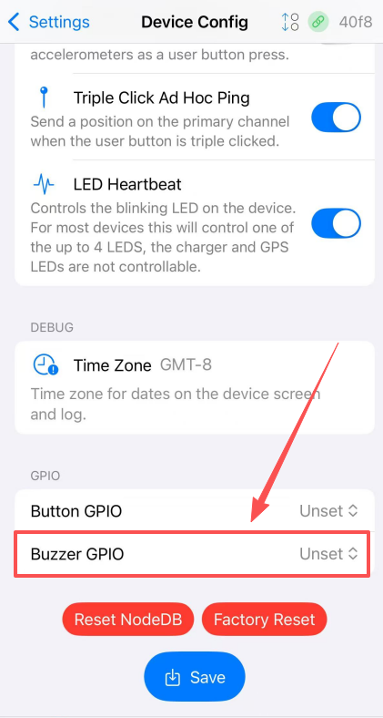   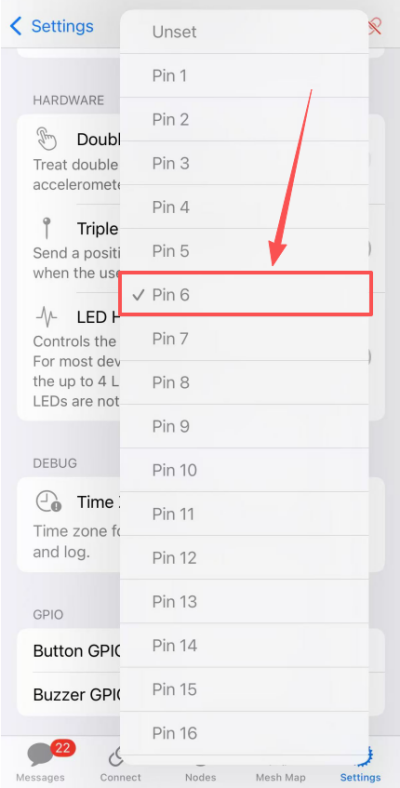

Clicking “Save” will restart the device and automatically enable the buzzer.

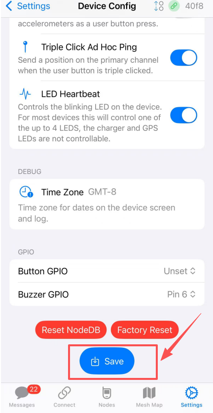

**The buzzer supports 4 modes and can be set using the following steps:**

1. Enter the **System** menu  
2. Press and hold the User button or the touchscreen to enter the system settings.
3. Select **Notifications**  
4. Open **Buzzer Mode** and choose the preferred option

| Mode          | Click Sound | Message Notification Sound  |
|---------------|-------------|-----------------------------|
| ALL Enable    | Yes         | Yes                         |
| Disable       | No          | No                          |
| DMS Only      | No          | No                          |
| Notifications | No          | Yes                         |
| System Only   | Yes         | No                          |

## 2.GXHTV3 and BME280 Sensor Settings

If you need to manually install the sensor, first remove the rear panel of the expansion box.
The sensor features a snap-in design and can be directly inserted into any corresponding slot (all five slots on the back panel are identical; you may use any one of them for installation).

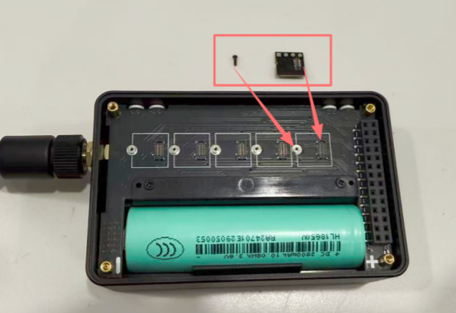

Finally, secure it with screws to complete the installation.

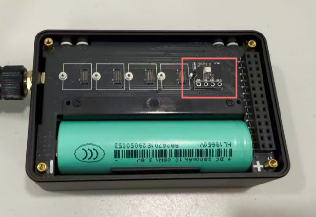

:::tip
If your expansion box is supplied with a pre-installed sensor, please skip the above installation steps.
:::

---

1. Complete the device connection in the Meshtastic App and ensure that the LoRa region is correctly configured.

2. Go to Settings → Telemetry.

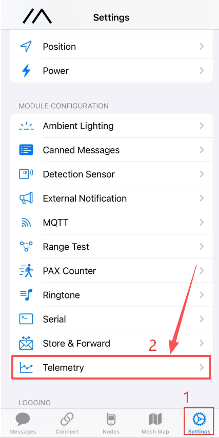

3. Enable Environmental Monitoring and check Display on Device.

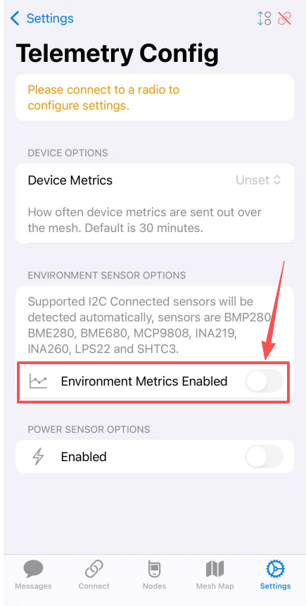

4.Tap Save to apply the settings.

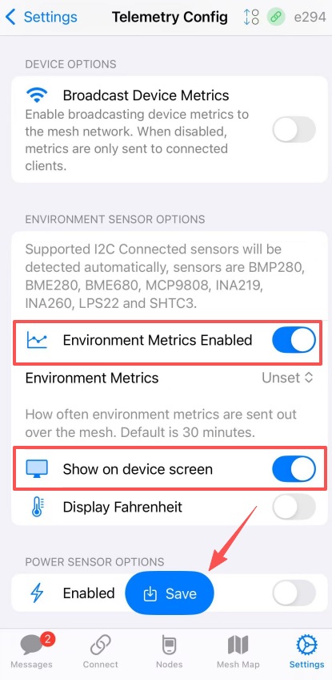

5.The sensor data will then be displayed simultaneously in the App and on the device screen.

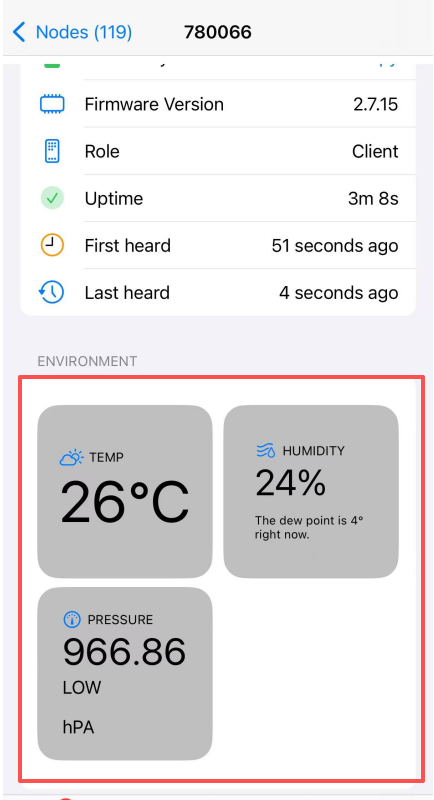

6.On devices equipped with a touchscreen, sensor data can be viewed in the Classic UI.
Navigate to the last menu tab using the User button or touch input to access the sensor data screen.

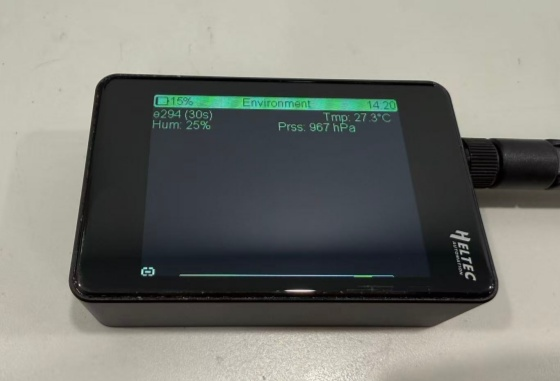

7. On devices without a touchscreen, sensor data is also displayed in the device’s Classic UI.
Users can navigate to the last menu tab using the User button to view the sensor data screen.

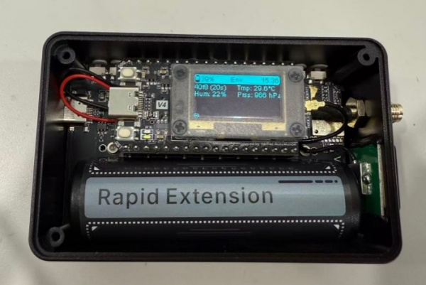

