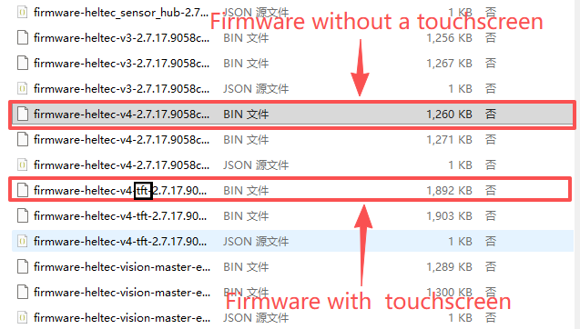

This document serves as an operation guide for the Meshtastic Expansion Kit, covering physical button functions, touchscreen gestures (Expansion Kit only), non-touchscreen operation, UI navigation, and switching between the Classic UI and MUI.

## Firmware Update

The Expansion Kit is shipped with Meshtastic firmware pre-installed. If a firmware upgrade is required, users can update the firmware according to the device type as follows:

- Expansion Kits with a glass panel use the V4 firmware, which can be downloaded and updated via the Meshtastic official web interface.

- Expansion Kits with a touchscreen require dedicated touchscreen firmware. As of Meshtastic v2.7.15, firmware for touchscreen-enabled devices is included in the main firmware releases; however, it must currently be downloaded from the [Meshtastic GitHub Releases](https://github.com/meshtastic/firmware/releases) page. When upgrading, please select the ESP32-S3 build.

:::warning
devices with and without a touchscreen require different firmware files. Touchscreen firmware can be identified by the **`tft`** tag in the filename. Be sure to select the firmware that matches your device type. Downloading or flashing an incorrect firmware may result in the touchscreen not functioning or displaying properly.
:::

## Expansion Kits with a Glass Panel 

### 1.Button (No Touchscreen) Instructions

- USER Button
  - Single press: Next / Forward
  - Long press: Confirm / Enter

- RST Button: Reset

- GPIO35 Button: In the Meshtastic no-touchscreen firmware, GPIO35 Button is not supported and will not take effect.  

- PWR Button: Press and hold for 3 seconds to power the device on or off.

### 2.Charge
For first-time use of the expansion kit, it is recommended to charge the device using a USB cable to ensure adequate battery power before startup.

### 3.Power up

Press and hold the **PWR** button for 3 seconds to power on the device.
Both versions start in the **Classic UI** by default.

:::tip
Please note that after powering on, the device may take 3–5 seconds to complete the startup process. During this time, continue holding the **PWR** button until the LED indicator illuminates, indicating that the device has successfully started. 
:::

### 4.Operation

Expansion Kits with a glass panel boot into the Classic UI by default. Without connecting to the Meshtastic mobile app, users can perform basic operations using the device’s User button, including setting the LoRa region and sending predefined simple messages (such as “Hi”), allowing the device to operate independently for basic communication.

Connecting to the Meshtastic app is not required for basic operation, but it becomes more convenient and necessary in the following scenarios:

- Sending custom text messages
- [Setting up the buzzer](/docs/devices/open-source-hardware/esp32-series/lora-32/wifi-lora-32-expansion-kit/sensor-setting#1buzzer-settings)
- [Configuring and managing sensors](/docs/devices/open-source-hardware/esp32-series/lora-32/wifi-lora-32-expansion-kit/sensor-setting#2gxhtv3-and-bme280-sensor-settings)

---

## Expansion Kits with a Touchscreen 

<iframe
  width="100%"
  height="500"
  src=" https://www.youtube.com/embed/NNXZOnf5NNk"
  title="Heltec Capsule Sensor V3. A Portable LoRa/LoRaWAN Node device compatible with Meshtastic"
  frameborder="0"
  allow="accelerometer; autoplay; clipboard-write; encrypted-media; gyroscope; picture-in-picture"
  allowfullscreen
></iframe>

### 1.Button & Touch Instructions

**Physical Buttons**

- USER Button
  - Single press: Next / Forward
  - Long press: Confirm / Enter

- GPIO35 Button
  - Single press: Back / Return
  - Long press: Exit
 
- PWR Button: Power switch
- RST Button: Reset

**WiFi LoRa 32 Expansion Kit Touchscreen Operations**

- **Tap on the screen:** Next / Forward (same as USER key)  
- **Long press on the screen:** Confirm / Enter

### 2.Charge
For first-time use of the expansion kit, it is recommended to charge the device using a USB cable to ensure adequate battery power before startup.

### 3.Power up

Press and hold the **PWR** button for 3 seconds to power on the device.
Both versions start in the **Classic UI** by default.

:::tip
Please note that after powering on, the device may take 3–5 seconds to complete the startup process. During this time, continue holding the **PWR** button until the LED indicator illuminates, indicating that the device has successfully started. 
:::

### 4.Operation

Expansion Kits with a touchscreen boot into the Classic UI by default and support switching to MUI (Meshtastic UI) on the device, providing a fully touchscreen-based user experience.

In MUI mode, users can enter and send custom messages directly via the touchscreen; however, this mode does not support connection to the Meshtastic mobile app.
To view temperature, humidity, and barometric pressure sensor data or perform related configurations, users must switch back to the Classic UI and connect to the Meshtastic mobile app for setup and management.

- [Setting up the buzzer](/docs/devices/open-source-hardware/esp32-series/lora-32/wifi-lora-32-expansion-kit/sensor-setting#1buzzer-settings)
- [Configuring and managing sensors](/docs/devices/open-source-hardware/esp32-series/lora-32/wifi-lora-32-expansion-kit/sensor-setting#2gxhtv3-and-bme280-sensor-settings)

### 5.Switching from Classic UI to MUI

The MUI interface provides enhanced touchscreen capabilities, including full-screen touch and a virtual keyboard.

:::note
MUI is supported only on devices equipped with a touchscreen.
:::

**Switching Steps**

1. Enter the **System** menu  
2. **Long press** to open system settings  
3. Select **Reboot/Shutdown**  
4. Tap **Switch to MUI**  
5. Confirm with **Yes**  
6. The device will reboot into MUI

**Notes**

- USER button wakes the screen when it turns off  
- MUI supports full touchscreen operation  
- A virtual keyboard appears when sending messages in a channel  
- MUI allows text input and browsing without relying on a phone

### 6.Return from MUI to Classic UI

1. In MUI, tap the **Settings** icon  
2. Open **Reboot/Shutdown**  
3. Press and hold the **Bluetooth icon** in the center  
4. Select **OK**  
5. The device will reboot back to Classic UI

:::tip
If you accidentally tap the Bluetooth icon, the device will enter Programming mode. If this happens, simply long-press the Bluetooth icon to return to the MUI interface. Once you're back in MUI, you can repeat the steps mentioned above.
:::

:::note
**Reference:** Meshtastic official docs — https://meshtastic.org/docs/configuration/radio/
:::

