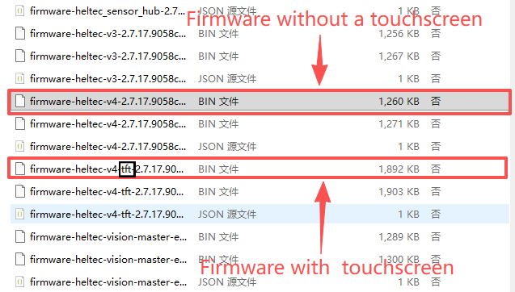
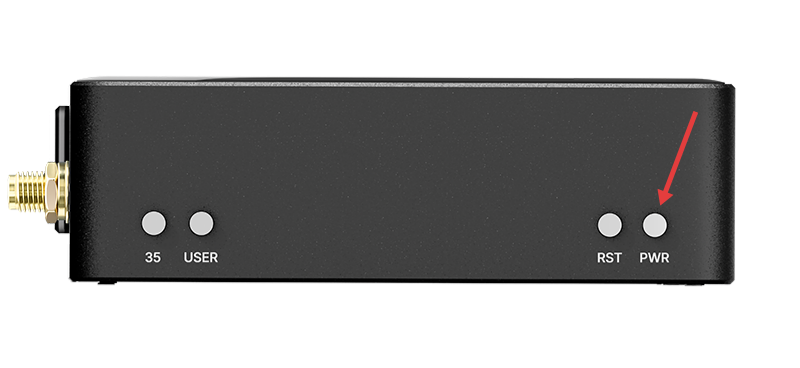
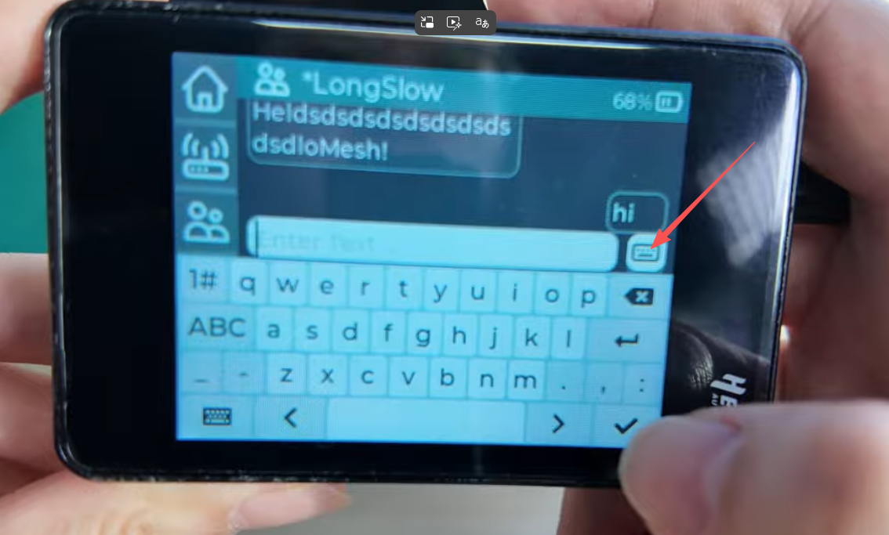
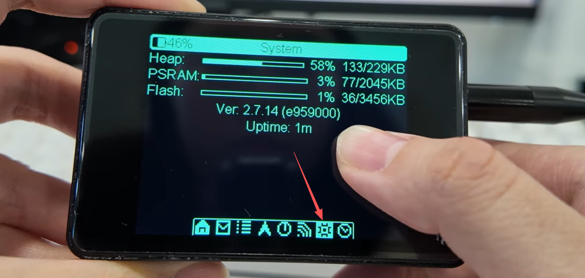
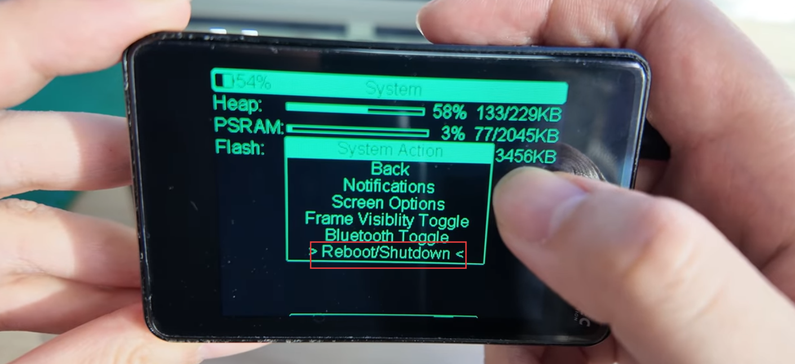
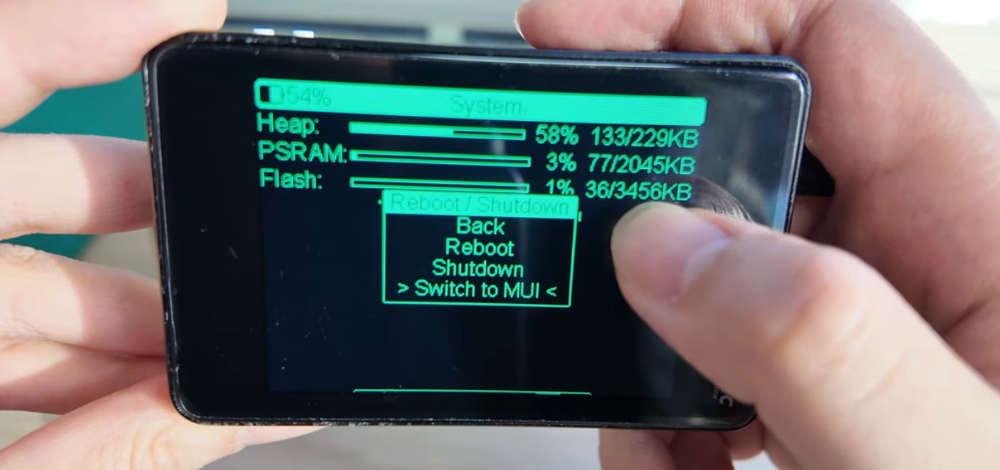
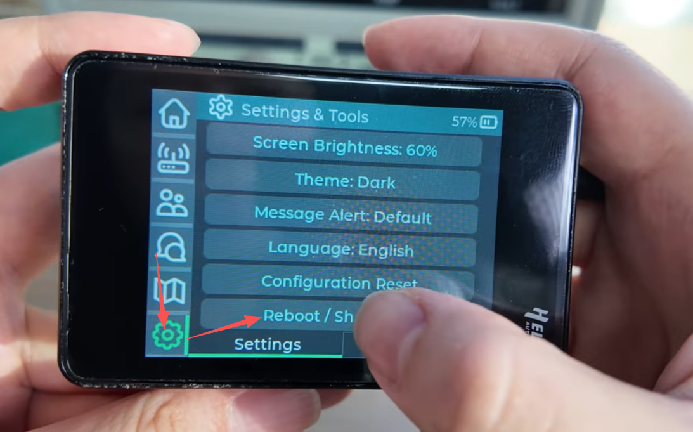
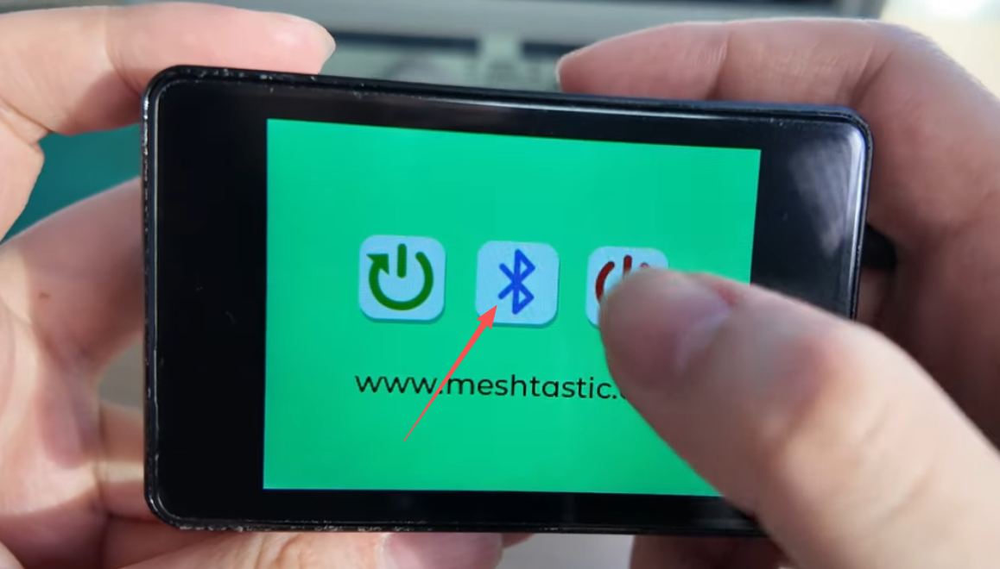
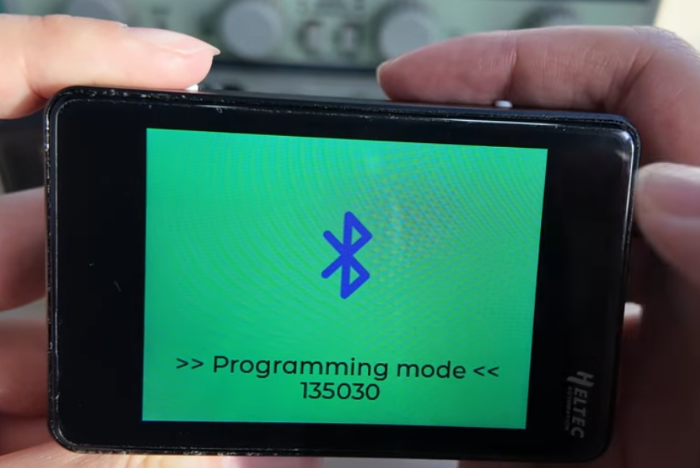

<iframe
  width="100%"
  height="500"
  src=" https://www.youtube.com/embed/NNXZOnf5NNk"
  title="Heltec Capsule Sensor V3. A Portable LoRa/LoRaWAN Node device compatible with Meshtastic"
  frameborder="0"
  allow="accelerometer; autoplay; clipboard-write; encrypted-media; gyroscope; picture-in-picture"
  allowfullscreen
></iframe>

:::warning
**For hardware version **V4.3**, please use firmware version **2.7.20** or above.**
:::

:::warning
**Defualt OLED screen version and touchscreen version require different firmware files.**

:::

## Firmware Flashing
### Web Flasher
*For the touchscreen version, the WebFlasher has not been released yet.*
### Flash via ESP32 Flasher Tool
- Firmware address:
  - [Meshtastic-2.7.20-Touch](https://resource.heltec.cn/download/WiFi_LoRa_32_V4/firmware/Touch/firmware-heltec-v4-tft-2.7.20.1116217.factory.bin)
- For usage instructions, please refer to this link:
[How to use ESP32 Flash Tool](https://resource.heltec.cn/download/tools/How%20to%20use%20ESP32%20Flasher%20tool.pdf)

--------------------

## Power
Press and hold the PWR button for 3 seconds to turn the battery on or off.

--------------------

## BaseUI
BaseUI is a simple and power-efficient interface. In this interface, tapping the touchscreen is only used to simulate the function of the USER button.
### Button
- **USER** (**Only effective in the touchscreen version of BaseUI**)
  - Single press: Next option, Wake
  - Long press 2 seconds: Enter or select the current option.
  - Long press and hold for 5 seconds, then release: Shutdown
- **35**(**Only effective in the touchscreen version of BaseUI**)
  - Single press: Back / Return
  - Long press: In the main menu, press and hold to **"enter the convenient communication page"**; in the submenu, longpress to **"exit"**.
### Touch Interaction
- **Tap on the screen:** Next option, Wake(same as USER key)  
- **Long press on the screen:** Confirm / Enter

--------------

## MUI
MUI is a UI specifically designed for touchscreens. In this UI, the USER button and custom buttons will no longer function.  
You can perform control by touching the corresponding areas on the screen.

### On-Screen Keyboard
When you tap the option you want to output, a keyboard will pop up on the right side, allowing you to start typing.

### Bluetooth
In MUI mode, you **Cannot** use the Bluetooth function.
### Wi-Fi
In the "Settings" option of MUI, you can find a "WiFi" option where you can enter WiFi information. However, this WiFi can only be used for MQTT data upload and **Cannot** be used for connecting to the mobile app.

-------------

## Switching UI
### BaseUI to MUI
1. Click **USER** button, enter the **System** menu

2. **Long press** to open system settings,Click **USER** button to **Reboot/Shutdown**

3. Long press `USER` button, open reboot settings. Select **Switch to MUI**, and confirm with **Yes**, the device will reboot into MUI.

### MUI to BaseUI
1. In MUI, tap the **Settings** icon, open **Reboot/Shutdown** 

3. Press and hold the Bluetooth icon on the screen until the "**Switch into BaseUI**" prompt appears.  

4. Select **OK**  
If you accidentally enter the Bluetooth configuration interface, press and hold the Bluetooth icon to return to the MUI interface.

:::tip
If you accidentally tap the Bluetooth icon, the device will enter Programming mode. If this happens, simply long-press the Bluetooth icon to return to the MUI interface. Once you're back in MUI, you can repeat the steps mentioned above.

:::

--------------------

For more information, please refer to the official Meshtastic documentation: https://meshtastic.org/docs/introduction/

