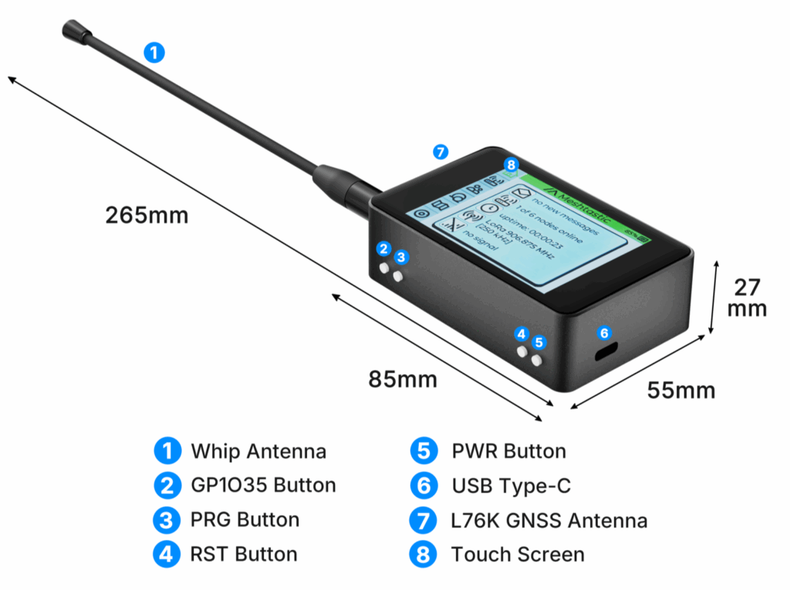
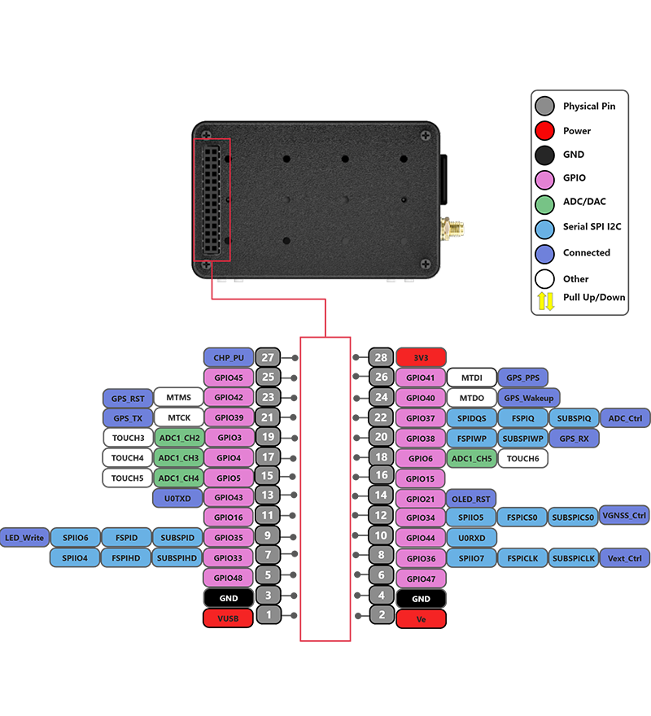

import styles from '@site/src/css/styles.module.css';

# WiFi LoRa 32 Expansion Kit

  

The [WiFi LoRa 32 Expansion Kit](https://heltec.org/project/wifi-lora-32-v4-expansion-housing/) is a comprehensive set specifically designed for the WiFi LoRa 32 series, including protective cases, expansion carrier boards, sensor modules, and more. You can view 3D models and customize product parameters on the [MQB platform](https://mqb.heltec.org/) to assemble a kit that meets your needs.

## PinMap

## Important Resources
- [Datasheet](https://resource.heltec.cn/download/WiFi_LoRa_32_Expansion_Kit/WiFi_LoRa_32_Expansion_Kit_Datasheet_20251104141049.pdf)
- [Main board schematic diagram](https://resource.heltec.cn/download/WiFi_LoRa_32_V4/Schematic/Expansion_board_V0.7.pdf)
- [Touchscreen Data](https://resource.heltec.cn/download/WiFi_LoRa_32_Expansion_Kit/Touchscreen-Data)
- [L76K GNSS Module User Manual](https://resource.heltec.cn/download/Mesh_Node_T114/Quectel_L76_GNSS_Presentation_V1.4.pdf)

## Usage Docs
- [SDK](https://wiki.heltec.org/docs/devices/open-source-hardware/esp32-series/esp32-quick-start)
- [Meshtastic](/docs/devices/open-source-hardware/esp32-series/lora-32/wifi-lora-32-expansion-kit/usage-guide)
- [Buzzer and Sensor Configuration Guide](/docs/devices/open-source-hardware/esp32-series/lora-32/wifi-lora-32-expansion-kit/sensor-setting)

