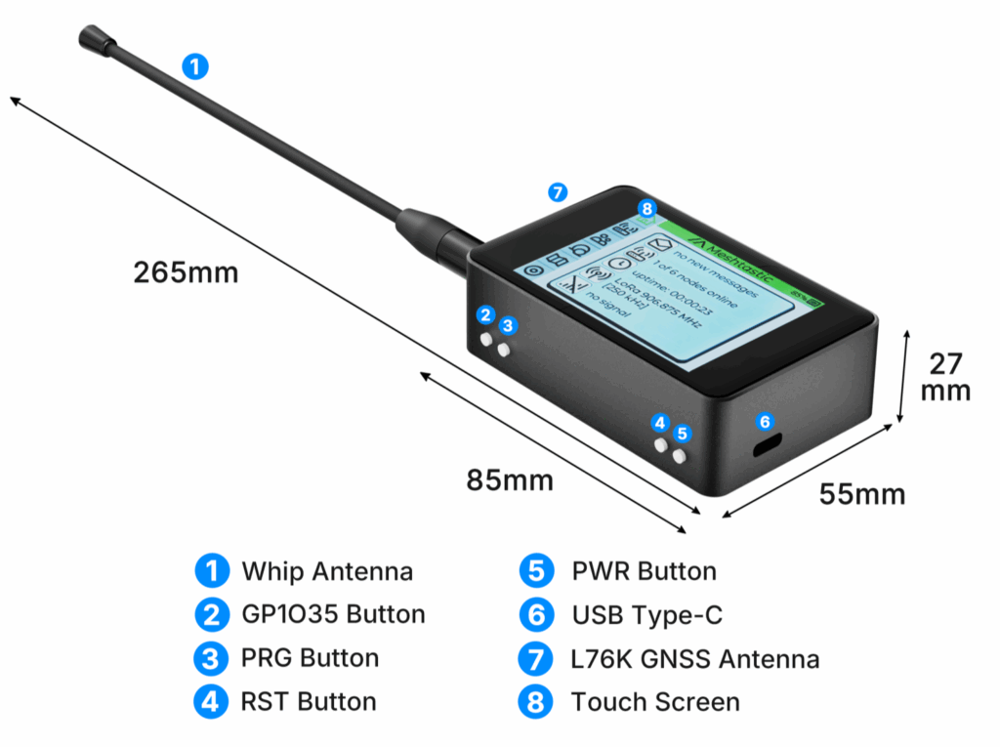
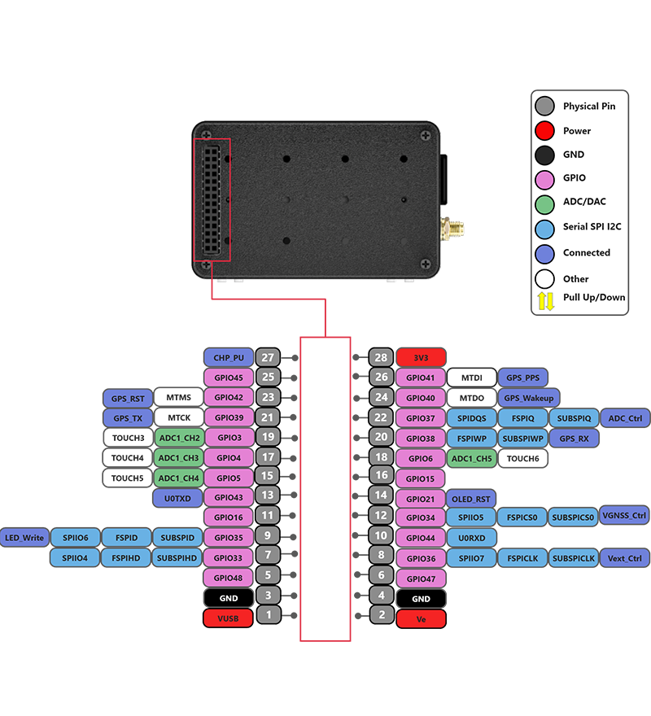

import styles from '@site/src/css/styles.module.css';

  

The WiFi LoRa 32 Expansion Kit is a comprehensive set specifically designed for the WiFi LoRa 32 series, including protective cases, expansion carrier boards, sensor modules, and more. You can view 3D models and customize product parameters on the [MQB platform](https://mqb.heltec.org/) to assemble a kit that meets your needs.

{

  <a href="https://heltec.org/project/wifi-lora-32-v4-expansion-housing/" className={styles.btnLink1}>
    Product Page
  </a>

}

## Button & Touch Instructions

The operation of the physical buttons is the same across all versions.

### 1. Physical Buttons

- USER Button
  - Single press: Next / Forward
  - Long press: Confirm / Enter

- GPIO35 Button
  - Single press: Back / Return
  - Long press: Exit
 
- PWR Button: Power switch
- RST Button: Reset

### 2. WiFi LoRa 32 Expansion Kit Touchscreen Operations 

- **Tap on the screen:** Next / Forward (same as USER key)  
- **Long press on the screen:** Confirm / Enter

The glass-panel version **does not support touch input** and relies entirely on physical buttons.

## Button (No Touchscreen) Instructions

- USER Button
  - Single press: Next / Forward
  - Long press: Confirm / Enter

- RST Button: Reset

- GPIO35 Button: In the Meshtastic no-touchscreen firmware, GPIO35 Button is not supported and will not take effect.  

- PWR Button: Press and hold for 3 seconds to power the device on or off.

:::note
Please note that after powering on, the device may take 3–5 seconds to complete the startup process. During this time, continue holding the POWER button until the LED indicator illuminates, indicating that the device has successfully started. 
:::

---

## PinMap

## Important Resources
- [Datasheet](https://resource.heltec.cn/download/WiFi_LoRa_32_Expansion_Kit/WiFi_LoRa_32_Expansion_Kit_Datasheet_20251104141049.pdf)
- [ L76K GNSS Module User Manual](https://resource.heltec.cn/download/Mesh_Node_T114/Quectel_L76_GNSS_Presentation_V1.4.pdf)
- [ Main board schematic diagramL](https://resource.heltec.cn/download/WiFi_LoRa_32_V4/Schematic/Expansion_board_V0.7.pdf)
- [Touchscreen Data](https://resource.heltec.cn/download/WiFi_LoRa_32_Expansion_Kit/Touchscreen-Data)
- [Meshtastic Firmware](https://github.com/meshtastic/firmware/releases/download/v2.7.17.9058cce/firmware-esp32s3-2.7.17.9058cce.zip)

:::warning
Devices with and without a touchscreen use different firmware versions. Firmware for touchscreen-enabled devices is identified by the **`tft`** tag in the filename. Please select the firmware that matches your hardware configuration.

:::

## Product Usage Guide

**The following documentation will help you get started quickly with the product**
- [Meshtastic Quick Start Guide](/docs/devices/open-source-hardware/esp32-series/lora-32/wifi-lora-32-expansion-kit/usage-guide)
- [Install WiFi LoRa 32 V4 development environment](https://www.youtube.com/watch?v=oEhdyE-AA0g&t=69s)
- [Applied to LoRaWAN](/docs/devices/open-source-hardware/esp32-series/esp32-quick-start?esp32=lorawan)
- [Applied to Meshtatic](/docs/devices/open-source-hardware/esp32-series/esp32-quick-start?esp32=meshtastic)
