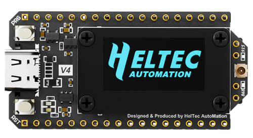

## V4.0

- 2025-09-24  public sale
- MCU: 
  - From ESP32-S3N8 to ESP32-S3R2
  - Flash has been upgraded from 8MB built-in to 16MB external, with the addition of 2M PSRAM.

- Power:
  - Add SH1.25-2P solar energy interface.

- Wireless performance:
  - LoRa transmission power upgraded from 21 ± 1dBm to 28 ± 1dBm.
  - 2.4G antenna, upgraded from metal spring antenna to FPC antenna.

- Peripheral Interface:
  - Cancel CP2102.
  - Add SH1.25-8Pin GNSS interface.
  - Pin expansion from 36Pin to 40Pin, providing more GPIO.

- Process and Design:
  - The screen connection method has changed from welding to B2B interface, supporting free disassembly and assembly of the screen.
  - The pin process has changed from silver plating to gold plating, resulting in better conductivity and oxidation resistance.
  - There is a plastic screen stand as mechanical protection

## V4.3.1

- 2026-2-5  public sale
- The FEM chip has been upgraded to **KCT8103L**.
- A filter footprint has been reserved in the RX chain (not populated by default at the factory, allowing for future expansion and debugging).
- GPIO5 has been reassigned as the FEM control pin, and GPIO46 is now reserved as an available pin.
- The reverse polarity protection MOSFET has been changed from AO3400 to SI2302.
- Optimized the power consumption caused by the ADC remaining continuously enabled, reducing overall standby power consumption.
- Improved the 2.4G antenna interface design. Users can select the IPEX connector by switching a 0Ω resistor.
- In accordance with Espressif's official recommendations, the ESP32 power supply layout, grounding, RF routing, UART, and Flash layout have been optimized to enhance overall system stability and RF performance.