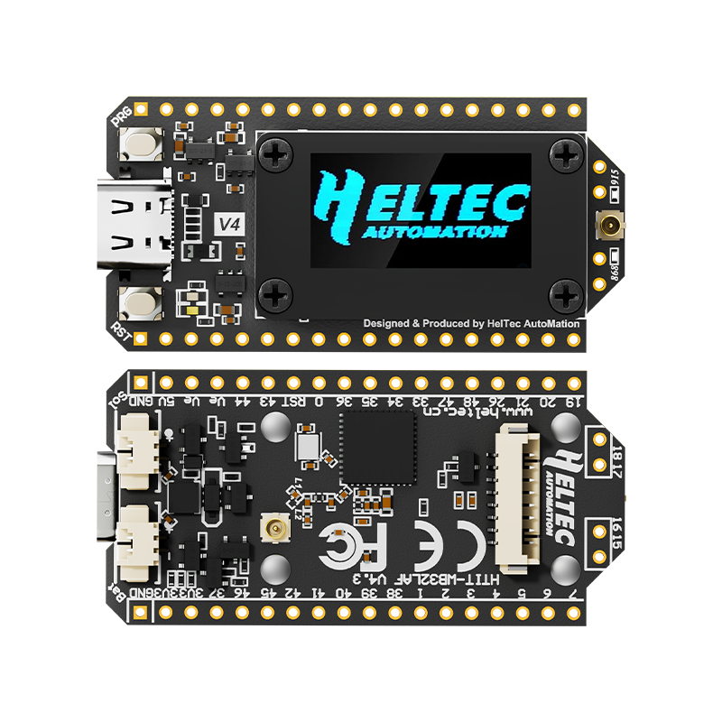

import styles from '@site/src/css/styles.module.css';

## V4.0

- 2025-09-24  public sale
- MCU: 
  - From ESP32-S3N8 to ESP32-S3R2
  - Flash has been upgraded from 8MB built-in to 16MB external, with the addition of 2M PSRAM.

- Power:
  - Add SH1.25-2P solar energy interface.

- Wireless performance:
  - LoRa transmission power upgraded from 21 ± 1dBm to 28 ± 1dBm.
  - 2.4G antenna, upgraded from metal spring antenna to FPC antenna.

- Peripheral Interface:
  - Cancel CP2102.
  - Add SH1.25-8Pin GNSS interface.
  - Pin expansion from 36Pin to 40Pin, providing more GPIO.

- Process and Design:
  - The screen connection method has changed from welding to B2B interface, supporting free disassembly and assembly of the screen.
  - The pin process has changed from silver plating to gold plating, resulting in better conductivity and oxidation resistance.
  - There is a plastic screen stand as mechanical protection

## V4.3.1

**The most significant hardware update in V4.3.1 focuses on improvements to the RX LNA section, incorporating user feedback to enhance RF flexibility and performance.**
- 2026-2-25  update

- The FEM chip has been upgraded to **KCT8103L**, allowing software control over whether the RX signal path passes through the LNA.

- GPIO Adjustments

  - GPIO5 has been reassigned as the FEM control pin.

  - GPIO46 is now reserved as an available GPIO for user applications.

- Power Circuit Improvements

  - Reverse Polarity Protection MOSFET changed from AO3400 to SI2302.

  - ADC power consumption optimized to reduce overall standby current.

- 2.4G Antenna Interface Improvement Users can now switch to the IPEX connector by modifying a 0Ω resistor, providing greater antenna configuration flexibility.

- The overall layout of the ESP32 has been optimized, including improvements to power routing, grounding design, RF trace layout, and the placement of UART and Flash components, thereby further enhancing system stability and RF performance.

- About 1W (30 dBm) Output Requirement
---
A SAW filter pad is now reserved in the RX chain. It is not populated by default, providing flexibility for future expansion, customization, and RF debugging.
  
- Two SAW filter footprints are reserved on the PCB:

  - **U10:** Located before the LNA input stage
  - **U11:** Located after the LNA output stage

- When installing a filter at U10: Remove resistor R32. Populate R37 and R38 with 0 Ω resistors (0402 package).

- When installing a filter at U11: Remove resistor R30. Populate R35 and R36 with 0 Ω resistors (0402 package).

- Recommended SAW filter models:

  - **868:** B39871B4377P810
  - **915:** B39921B4344P810
---
:::note
Many users have expressed interest in a 1W (30 dBm) LoRa output. However, the maximum output of LoRa 32 V4 remains 28 dBm. This is because achieving 30 dBm output requires the FEM to operate at 5V, and battery boost conversion to 5V introduces significant efficiency loss, which is not suitable for low-power applications.
:::

