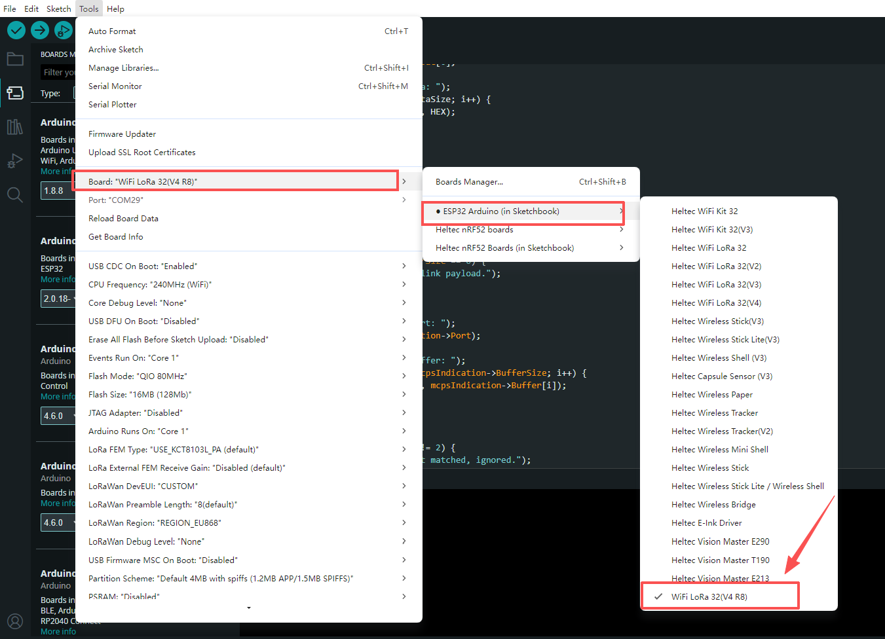

import styles from '@site/src/css/styles.module.css';

# WiFi LoRa 32 V4 R8

  

The WiFi LoRa 32 now comes with the latest ESP32-S3R8 version.

{

  <a href="https://heltec.org/project/wifi-lora-32-v4/" className={styles.btnLink1}>
    Product Page
  </a>

}

## Product characteristics
- Based on ESP32-S3R8 + SX1262, supporting Wi-Fi b/g/n, BLE, and LoRa.
- Equipped with 8MB PSRAM and 16MB external Flash for UI and complex applications.
- Available in high-power 28 dBm.
- Added SH1.25-2Pin solar panel and SH1.25-8Pin GNSS interfaces.

## Main Pin Changes

| Main Change  | WiFi LoRa 32 V4  | WiFi LoRa 32 V4 R8  |
|--------------|------------------|---------------------|
| Vext_Ctrl    | GPIO36           | GPIO40              |
| VGNSS_Ctrl   | GPIO34           | GPIO42              |
| LED          | GPIO35           | GPIO46              |
| PA_CTX       | Unbroken-out     | GPIO5               |
| GNSS_RST     | GPIO42           | Removed             |
| ADC_Ctrl     | GPIO37           | Removed             |

## Important Resources
- [Datasheet](https://resource.heltec.cn/download/WiFi_LoRa_32_V4-R8/datasheet/WiFi_LoRa_32_V4R8.pdf)
- [Schematic diagram](https://resource.heltec.cn/download/WiFi_LoRa_32_V4-R8/Schematic/HTIT-WBR8H_V4.3.2.pdf)
- [Pin Map](https://resource.heltec.cn/download/WiFi_LoRa_32_V4-R8/pinmap/lora%20_32_v4-R8%20pinmap.png)
- [Related links](https://resource.heltec.cn/download/WiFi_LoRa_32_V4-R8)

## Product Usage Guide

**The following documentation will help you get started quickly with the product**
- [Install development environment](/docs/devices/open-source-hardware/esp32-series/esp32-quick-start)
- [Three Development Platforms](/docs/devices/open-source-hardware/esp32-series/three-platform/)
- [Applied to LoRaWAN](/docs/devices/open-source-hardware/esp32-series/esp32-quick-start?esp32=lorawan)
- [Applied to Meshtatic](/docs/devices/open-source-hardware/esp32-series/esp32-quick-start?esp32=meshtastic)
- [How to use license](/docs/devices/general-docs/how_to_use_license)

:::note
The device is based on the ESP32-S3R8 chip. In Arduino IDE, select **WiFi LoRa 32 (V4 R8)** to ensure correct configuration and compilation.
:::

