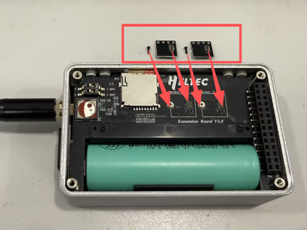
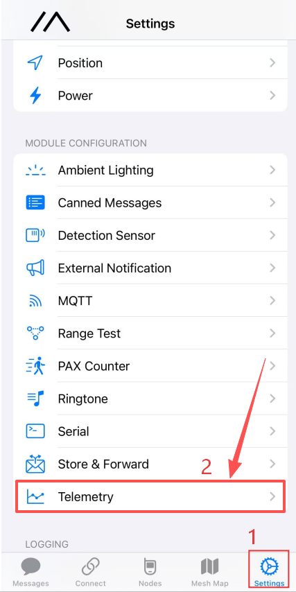
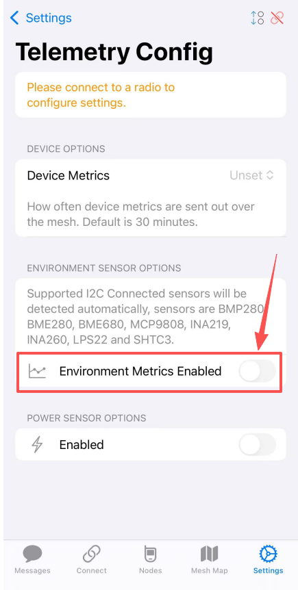
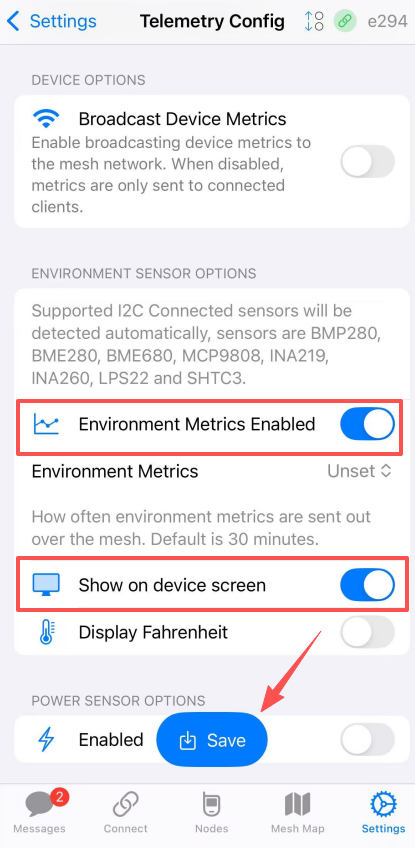
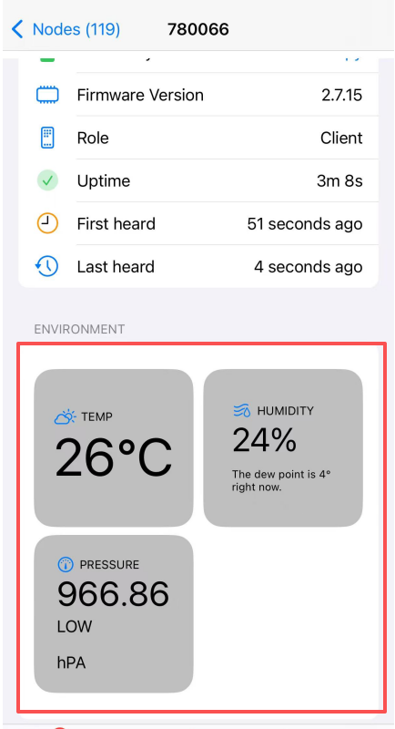
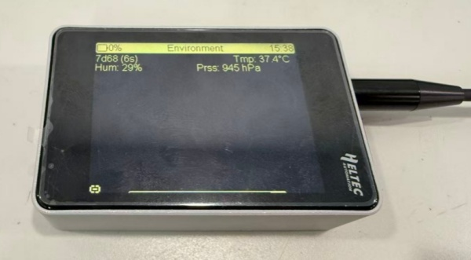
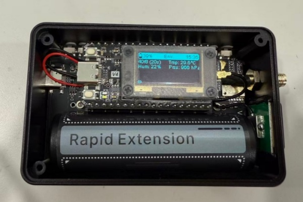

import styles from '@site/src/css/styles.module.css';

## Flashing Meshtastic Firmware

1. Connect the device to your computer via USB-C.
2. **Enter BootLoader mode:** Press and hold the USER button, press RST once, then release the USER button.
3. Select the serial port to flash your code. After flashing is complete, press RST to restart.

:::note
  After entering Boot mode, the serial port number may change, so remember to reselect the port.
:::

:::warning
The **WiFi LoRa 32 Expansion Kit V2** currently supports local firmware flashing only.
Meshtastic firmware version **2.7.25** or later is required to support flashing for the WiFi LoRa 32 Expansion Kit V2.
The firmware is provided as a .bin file that includes both `tft` and `factory` images.

:::

---

***After flashing the firmware, the device will enter the MUI interface by default.***

## Sensor Setting

:::tip
If the sensor is not pre-installed, remove the rear cover of the expansion box and insert the sensor into the corresponding slot. The sensor adopts a snap-in design for easy installation. If the sensor has already been installed, skip this step.
:::

1. Complete the device connection in the Meshtastic App and ensure that the LoRa region is correctly configured.

2. Go to Settings → Telemetry.

3. Enable Environmental Monitoring and check Display on Device.

4.Tap Save to apply the settings.

5.The sensor data will then be displayed simultaneously in the App and on the device screen.

6.On devices equipped with a touchscreen, sensor data can be viewed in the Classic UI.
Navigate to the last menu tab using the User button or touch input to access the sensor data screen.

7. On devices without a touchscreen, sensor data is also displayed in the device’s Classic UI.
Users can navigate to the last menu tab using the User button to view the sensor data screen.

