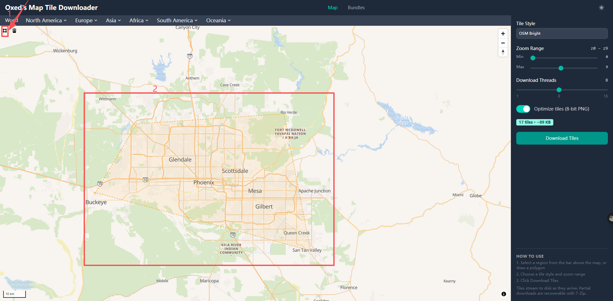
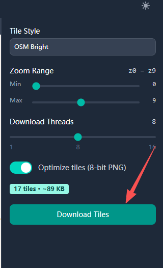

import styles from '@site/src/css/styles.module.css';

# WiFi LoRa 32 Expansion kit V2 Quick Start

## Installing the Battery
After removing the casing, you can install the battery. Battery type:
**18650 flat-top lithium battery**. Be careful not to reverse the positive and negative terminals.

## Power On/Off
Press and hold the Power button for 3 seconds to turn the device on or off.

## Charging
You can power or charge the device via the USB-C port. The applicable voltage is **5V**.

## Insert the SD card

If an SD card is required, insert it as shown in the diagram, ensuring it is oriented correctly to avoid incorrect insertion.

---

## Download Offline Map

1.Open the map download tool: https://download.tiles.coalition.space/

2.Select the map area by clicking the Rectangle Tool (Draw / Rectangle Tool) on the left toolbar, then drag on the map to define the required download region. Once finished, right-click or click the tool again to complete the selection.

3.Set Zoom Range (recommended default). Min Zoom represents the lowest zoom level (larger coverage area), and Max Zoom represents the highest zoom level (higher detail).

4.Set Download Threads (recommended default). Higher values increase download speed but may cause network instability.

5.Click Download Tiles to start downloading. A compressed file will be generated automatically.

6.Extract the downloaded archive to obtain the tile directory in z/x/y format.

7.Copy the entire extracted tile folder to the root directory or the designated map directory on the SD card, ensuring the folder structure remains unchanged (z/x/y hierarchy must be preserved).

8.Insert the SD card into the device. The offline map will then be available for loading and use.

## Programming & Firmware Flashing 

1. Connect the device to your computer via USB-C.
2. Enter BootLoader mode: Press and hold the USER button, press RST once, then release the USER button.
3. Select the serial port to flash your code. After flashing is complete, press RST to restart.

:::note
  After entering Boot mode, the serial port number may change, so remember to reselect the port.
:::

:::warning
The **WiFi LoRa 32 Expansion Kit V2** currently supports local firmware flashing only.
Meshtastic firmware version **2.7.25** or later is required to support flashing for the WiFi LoRa 32 Expansion Kit V2.
The firmware is provided as a .bin file that includes both `tft` and `factory` images.

:::