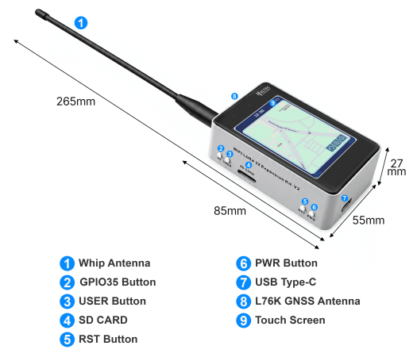

import styles from '@site/src/css/styles.module.css';

# WiFi LoRa 32 Expansion Kit V2

  

The WiFi LoRa 32  V4-R8. It features an integrated SD card slot, making it well-suited for data-intensive applications such as offline mapping. It also includes a built-in buzzer and GNSS module as standard, and supports expansion with a wide range of external sensors.

{

  <a href="  https://heltec.org/project/v4-r8-ex/" className={styles.btnLink1}>
    Product Page
  </a>

}

## Important Resources
- [Datasheet](https://resource.heltec.cn/download/WiFi_LoRa_32_V4-R8/datasheet/WiFi_LoRa_32_V4R8.pdf)
- [Main board schematic diagram](https://resource.heltec.cn/download/WiFi_LoRa_32_V4/Schematic/Expansion_board_V0.7.pdf)
- [Touchscreen Data](https://resource.heltec.cn/download/WiFi_LoRa_32_Expansion_Kit/Touchscreen-Data)
- [L76K GNSS Module User Manual](https://resource.heltec.cn/download/Mesh_Node_T114/Quectel_L76_GNSS_Presentation_V1.4.pdf)

## Usage Docs
- [SDK](https://wiki.heltec.org/docs/devices/open-source-hardware/esp32-series/esp32-quick-start)
- [Meshtastic](/docs/devices/open-source-hardware/esp32-series/lora-32/wifi-lora-32-expansion-kit/usage-guide)
- [Buzzer and Sensor Configuration Guide](/docs/devices/open-source-hardware/esp32-series/lora-32/wifi-lora-32-expansion-kit/sensor-setting)

