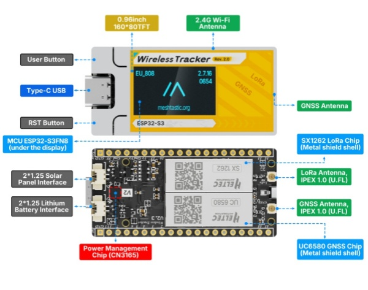

import Tabs from '@theme/Tabs';
import TabItem from '@theme/TabItem';
import styles from '@site/src/css/styles.module.css';
import DocCard from '@theme/DocCard';

# Wireless Tracker V2

  

Wireless Tracker V2 integrates the Semtech SX1262 LoRa transceiver and UC6580 GNSS module on the high-performance ESP32-S3FN8 platform, delivering reliable long-range communication and precise positioning in a compact, developer-friendly design. With upgraded 28 ±1 dBm TX power and optimized RF architecture, it provides extended range, stronger penetration, and enhanced system stability for demanding tracking applications.

{

  <a href=" https://heltec.org/project/wireless-tracker-v2/" className={styles.btnLink1}>
    Product Page
  </a>

}

## Product characteristics
- ESP32-S3FN8 + SX1262 + UC6580 supporting Wi-Fi, LoRa, Bluetooth, and GNSS.
- 28 ±1 dBm high-power LoRa for longer range.
- Dual-frequency L1 with multi-system GNSS support.
- Onboard lithium battery and solar with smart power management.
- Onboard TFT display and enhanced GNSS reception.

## Important parameters
| parameters         | Wireless Tracker V2         |
|--------------------|----------------------------|
|Master and LoRa Chip      |	    ESP32-S3FN8 + SX1262                |
|GNSS Chipset  |     UC6580               |
| Max. TX Power      |   	28±1dBm                 |
| Charging IC          | 	CN3165           |
| Battery            |  Supports 3.7V Li-ion battery power supply and solar panel charging|
| Dimensions         |   53.00 * 25.40 * 9.37mm	    |

## Important Resources

- [GNSS Datasheet](https://resource.heltec.cn/download/Wireless_Tracker_V2/GNSS_Datasheet/UC6580_Datasheet_EN_R1_1.pdf)
- [Datasheet](https://resource.heltec.cn/download/Wireless_Tracker_V2/Wireless_Tracker_v2_Datasheet/Wireless%20Tracker%20v2.pdf)
- [Schematic diagram](https://resource.heltec.cn/download/Wireless_Tracker_V2/Schematic/HTIT-Tracker_V2.3.pdf)
- [Pin Map](https://resource.heltec.cn/download/Wireless_Tracker_V2/Pin_Map/Tracker_v2.3.png)
- [Hardware Update Log](/docs/devices/open-source-devices/esp32-series/lora-32/wireless-tracker-v2/hardware-update-log)

## Product Usage Guide
**The following documentation will help you get started quickly with the product**
- [Install development environment](/docs/devices/open-source-hardware/esp32-series/esp32-quick-start?esp32=esp32)
- [Applied to LoRaWAN](/docs/devices/open-source-hardware/esp32-series/esp32-quick-start?esp32=lorawan)
- [Applied to Meshtatic](/docs/devices/open-source-hardware/esp32-series/esp32-quick-start?esp32=meshtastic)
- [How to use license](/docs/devices/general-docs/how_to_use_license)