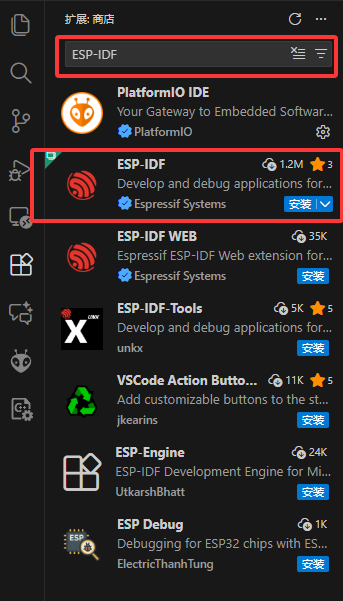
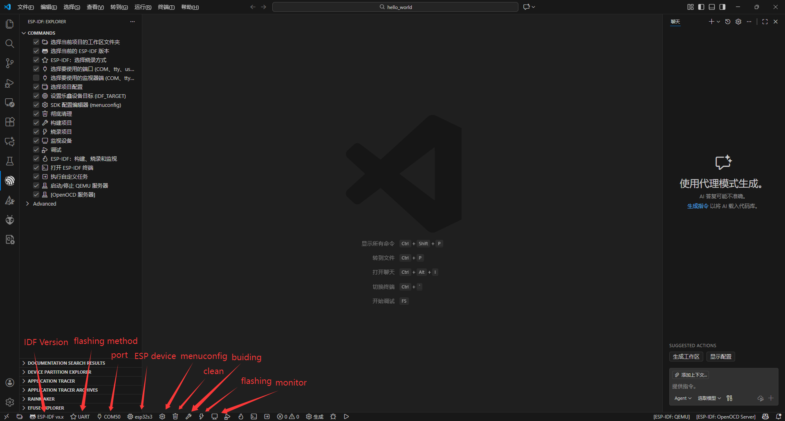
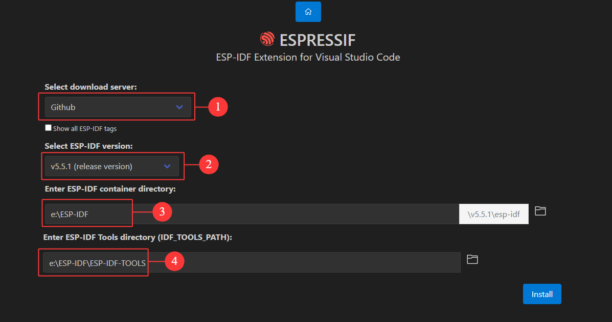
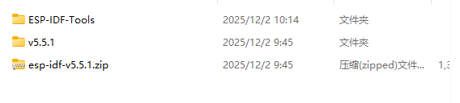
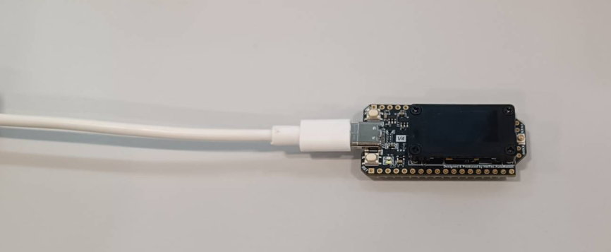
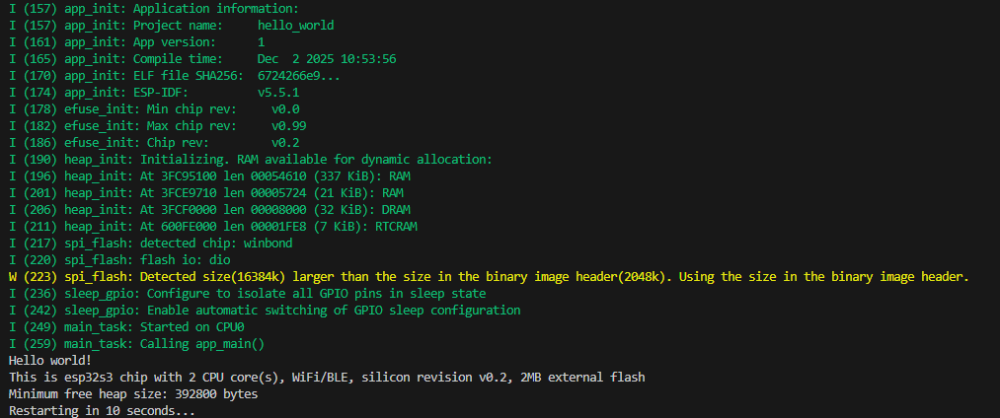
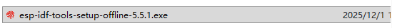
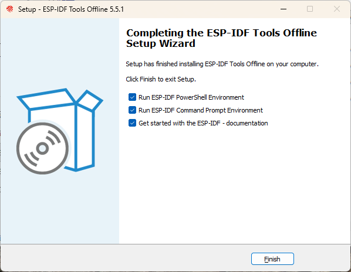
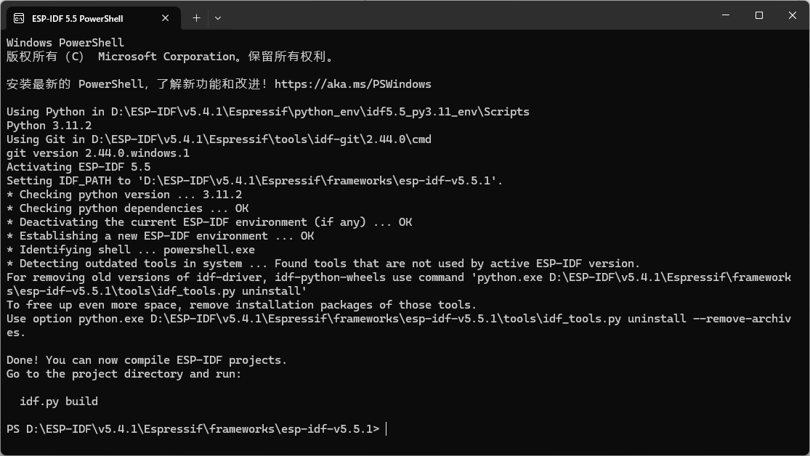
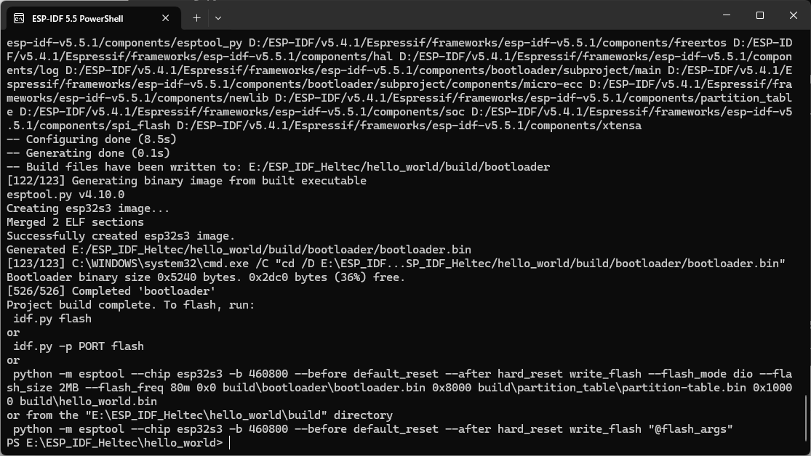

import Tabs from '@theme/Tabs';
import TabItem from '@theme/TabItem';
import styles from '@site/src/css/styles.module.css';

:::tip
This guide uses the **WiFi LoRa 32 V4** development board as a reference example.
:::

<Tabs
groupId="esp32"
queryString="esp32"
defaultValue="esp32"
className={styles.customTabs}
values={[
{label: 'Installation via VS Code', value:'esp32'},
{label: 'Manual Installation', value:'manual'},
]}>

<TabItem value="esp32">

## 1.Install Visual Studio Code
Download and install [Visual Studio Code](https://code.visualstudio.com/) from the official website.
After installation, launch VS Code.

## 2. Install the ESP-IDF Extension

1.Open the Extensions view by pressing `Ctrl + Shift + X`.
In the search bar, enter **ESP-IDF** and install the Espressif ESP-IDF extension.



2.After installation, the following functions are provided.



3.**Install the ESP-IDF Toolchain**.




- Select download server: selected GitHub (`Check` show all ESP idf tags)
- Select ESP-IDF version: Suggest prioritizing stable versions
- Enter ESP-IDF container directory: Select the installation directory
- Enter ESP-IDF Tools directory: It should be located within the ESP-IDF installation directory

4.Click Install to start downloading and installing the ESP-IDF tools. Wait until the installation process completes successfully.


5.Using E:\ESP-IDF\v5.5.1\esp-idf as an example installation path, you can find the corresponding component directories and example projects under this directory.





---
## 3. Routine usage

1.Connect the device to the computer.


2.Open the folder`E:\ESP-IDF\v5.5.1\esp-idf\examples\get-started\hello_world` directly in Visual Studio Code.


- Select the serial port that corresponds to the connected device
- choose esp32s3 as the target chip

:::warning
If environment variables related to Anaconda or other Python virtual environments are present, they may conflict with the Python environment required by ESP-IDF, potentially causing incorrect toolchain or target detection. It is recommended to remove these environment variables before installation. If removal is not feasible, [manual installation](/docs/devices/open-source-hardware/esp32-series/three-platform/ESP-IDF/?esp32=manual) is advised.
:::

3.After the configuration is complete, click Flash to build and upload the firmware to the device.


</TabItem>
<TabItem value="manual" >

## 1.Installation steps

1.For Windows systems, please download ESP-IDF from the [official Espressif download page](https://dl.espressif.com/dl/esp-idf/?idf=4.4 ).


2.Select the required version and double-click the downloaded .exe file to start the installation.



3.Select “I accept the agreement”, then click Next to proceed through the setup wizard.


4.Select the desired installation path and continue clicking Next until the installation process starts.


5.Upon successful installation, the system will display the interface shown in the figure below.



---

## 2.Routine usage

**Building and Flashing ESP-IDF Example (Hello World)**

1.Download the required [ESP-IDF release](https://github.com/espressif/esp-idf/releases) package from the official Espressif repository and extract it to a local directory.

2.Launch the ESP-IDF PowerShell installed with ESP-IDF.

3.Change the working directory to the hello_world example located in the ESP-IDF directory you just extracted:

```
cd <ESP-IDF_PATH>/examples/get-started/hello_world
```

4.Configure the target chip for your development board.

```
idf.py set-target esp32s3
```


5.Run the following command to build the project.

```
idf.py build
```



6.Connect the development board to your computer and identify the correct serial port.


7.Then flash the firmware using.
```
idf.py -p PORT flash
```


:::note
Replace PORT with your actual serial port
:::

8.Start the serial monitor to view runtime output.

```
idf.py -p PORT monitor
```
9.If the installation and flashing are successful, the serial monitor will display the Hello world! output.


</TabItem>
</Tabs>

**For additional operations, please refer to the official documentation.**
- [ESP-IDF Getting Started Guide](https://docs.espressif.com/projects/esp-idf/en/latest/esp32/get-started/index.html)
- [ESP-IDF VS Code Extension](https://github.com/espressif/vscode-esp-idf-extension)
- [ESP-IDF Framework and APIs](https://github.com/espressif/esp-idf)


