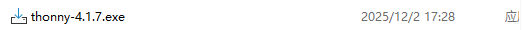
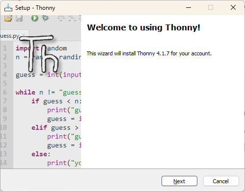
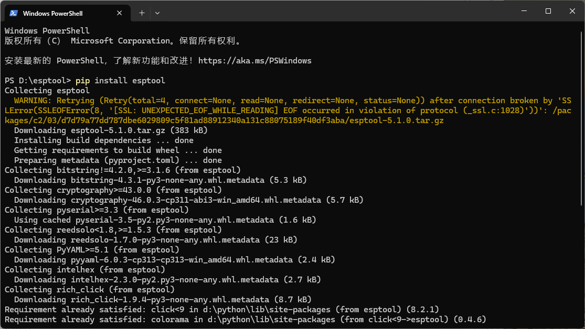

import Tabs from '@theme/Tabs';
import TabItem from '@theme/TabItem';
import styles from '@site/src/css/styles.module.css';

:::tip
This guide uses the **WiFi LoRa 32 V4** development board as a reference example.
:::

## 1.Environment Installation

1. [Installing Thonny IDE](https://thonny.org/).


2.Select the required version and double-click the downloaded .exe file to start the installation.


3.click **Next**.



4.Select “I accept the agreement”, then click Next to proceed through the setup wizard.


5.Click Install and wait for the installation to complete.


## 2.Install esptool

If this is the first time installing MicroPython on an ESP32 development board, you must use esptool to erase the chip’s Flash and then flash the MicroPython firmware. For esptool installation instructions, refer to the [official Espressif documentation](https://docs.espressif.com/projects/esptool/en/latest/esp32s3/installation.html).


Run the following command in the terminal to complete the installation.

```
pip install esptool
```


## 3.Flash Firmware

1.Locate and download the MicroPython firmware for the ESP32-S3 from the [official MicroPython website](https://micropython.org/download/).


:::warning
When downloading the firmware, select the `.bin` firmware file.
:::


2.Erase the chip Flash. On Windows systems, run the following command.

```
esptool erase_flash
```

3.Then flash the firmware to the board starting at address 0x0000.

```
esptool --port PORTNAME --baud 460800 write_flash 0 ESP32_BOARD_NAME-DATE-VERSION.bin
```

:::note
Replace `PORT` with the actual device port and replace `ESP32_BOARD_NAME-DATE-VERSION.bin` with the downloaded firmware file.
:::


## 4.Routine usage

1.Connect the development board to your computer and identify the correct serial port.


2.Open Thonny and configure the interpreter.


3.Select serial port and chip.


:::warning
If the `Board CDC` port is not available, it usually indicates that an incorrect firmware has been flashed. Please download and flash the correct .bin firmware for your development board.
:::

4.After the configuration is complete, enter the following example code in the editor and click the Run button in the upper-left corner to execute it.
```
import time
from machine import Pin

pin35 = Pin(35, Pin.OUT)# Initialize GPIO pin 35 as an output pin

while True:
    pin35.value(not pin35.value())# Toggle the pin state (ON to OFF, or OFF to ON)
    time.sleep(1)# Wait for 1S before repeating the loop

```


5.After successful operation, you can see that the LED of V4 is lit up.


:::tip
For more operational information, please refer to the [fficial documentation of micropython](https://docs.micropython.org/en/latest/esp32/tutorial/intro.html).
:::