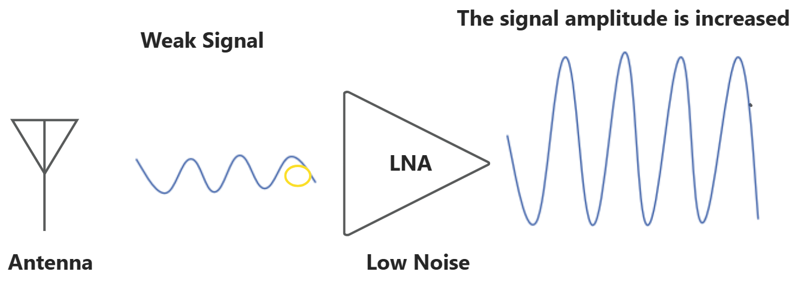
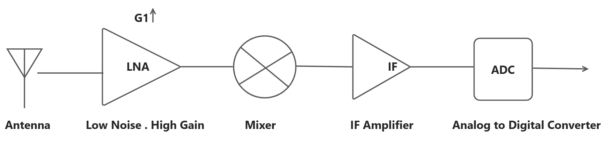
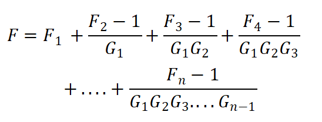
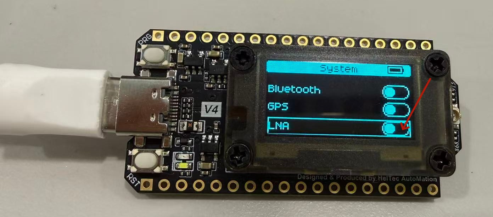
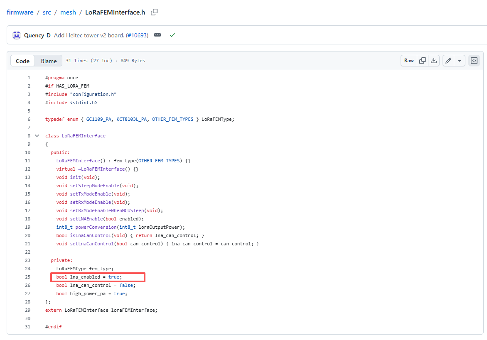
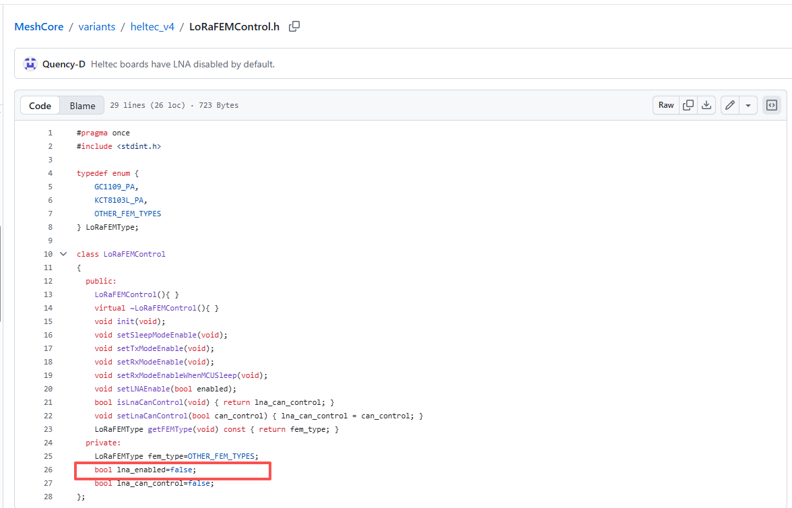
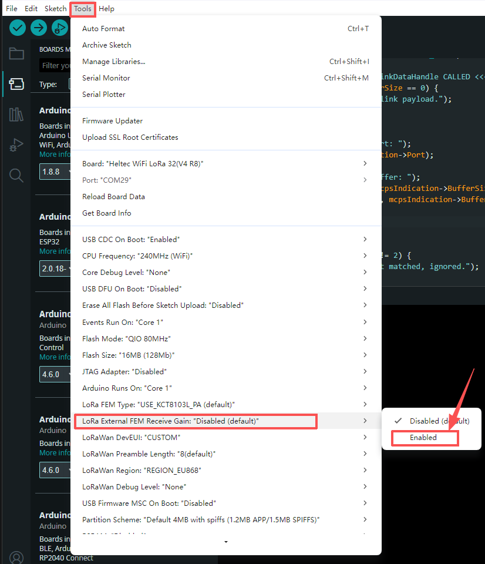

# How to Properly Use LNA?

>Our latest products, including [WiFi LoRa 32 V4](https://heltec.org/project/wifi-lora-32-v4/), [Tracker V2](https://heltec.org/project/wireless-tracker-v2/), and [Mesh Node T096](https://heltec.org/project/t096/), integrate LNA functionality to improve weak signal reception performance. In practical applications, users may have questions about when to enable LNA and how to configure it properly. This article introduces the basic working principles of LNA and provides configuration recommendations for different wireless environments to help users make better use of the LNA function.

## What is an LNA?

An LNA (**Low Noise Amplifier**) is a critical RF component located at the receiver front end. Its primary purpose is to amplify weak RF signals from the antenna while maintaining a low noise figure. By providing low-noise amplification and increasing the signal level before further processing, the LNA helps minimize the impact of subsequent stages on overall receiver performance and improves receiver sensitivity.




---

### Why Does the Signal Need to Be Amplified as Early as Possible?

In wireless communication systems, the RF signals received by the antenna are usually extremely **weak**.

- **Long-range WiFi communication:** The received signal may be as low as -80 to -100 dBm
- **Long-range LoRa communication:** The received signal may reach -120 dBm or even lower
- **GPS satellite signals:** The received signal is typically close to the receiver noise floor

When these weak signals enter the receiver, they are not an ideal ***clean signal***. the signal processed by the receiver can be expressed as:

```
Received Signal = Desired Signal + External Noise/Interference + Receiver Noise
```

The theoretical thermal noise density of a receiver is approximately: `-174 dBm/Hz`
  
The actual receiver noise power can be expressed as: 


**-174 dBm/Hz + 10 × log<sub>10</sub>(B) + NF**


- **B: Receiver bandwidth (Hz)**     
- **NF: Receiver noise figure (dB)**


This noise level determines the minimum signal strength that the receiver can detect, which is known as the receiver sensitivity.


Therefore, the key challenge in weak-signal reception is not simply to “amplify the signal”, but to: Preserve the original signal-to-noise ratio (SNR) as much as possible before the signal enters the subsequent processing stages.


---

### Why Must the LNA Be Placed at the Front End of the Receiver?

**The simplified block diagram of the receiver is shown below :**



When a weak signal enters the receiver, it has only one chance to maintain the best possible signal-to-noise ratio (SNR). If the first-stage circuit introduces excessive noise, it cannot be removed by later stages. Even with further amplification, the receiver can only amplify the already degraded signal and noise together.


<span style={{ backgroundColor: '#536bd4', padding: '2px 4px' }}>Therefore, the receiver front end determines signal quality, while the first-stage device determines the overall noise performance of the system.</span>

**The Friis formula is an important equation used to describe the noise performance of a receiver.**

A receiver typically consists of multiple cascaded stages, and its overall noise factor can be calculated using the Friis formula:



- **`F₁: Noise factor of the first stage`**
- **`G₁: Gain of the first stage`**

A lower noise factor F means the device introduces less additional noise and causes less SNR degradation.

**The Friis formula shows that:**

>The noise factor of the first stage **F₁** has the greatest impact on the overall receiver noise performance;
A higher first-stage gain **G₁** reduces the contribution of noise from subsequent stages.

Therefore, the receiver front end typically uses a low-noise, high-gain LNA (Low Noise Amplifier) to:

Reduce the overall noise figure Minimize the impact of subsequent stages, Improve weak signal detection capability.

Ultimately, the ability to receive weak signals depends on how much noise is introduced by the receiver front end.


---


### Higher LNA Gain Is Not Always Better

Although an LNA improves weak signal reception by increasing signal amplitude, excessive gain can also introduce problems.

In strong interference environments, **such as urban areas, near base stations, or with multiple active wireless devices**, the LNA amplifies not only the desired signal but also noise and interference. When the input power is too high, it may cause:

- Front-end overload: The amplifier enters the nonlinear region, causing signal distortion and intermodulation interference.
- Reduced dynamic range: Strong interference makes weak signal demodulation more difficult.

LNA design requires a balance between low noise, sufficient gain, and high linearity, rather than simply maximizing gain.


---

## How to Select the LNA Gain Mode?

:::tip
Based on our testing and typical application scenarios, we recommend selecting the LNA mode according to the wireless environment. The following guidelines can be used as a reference.
:::

**Weak signal, low interference environment:** <span style={{color: "red"}}>Enable LNA</span>

Enabling the LNA increases signal amplitude, reduces the impact of subsequent-stage noise, and improves receiver sensitivity.

Typical scenarios:

- **Open areas**
- **Long-range LoRa communication**
- **Weak GPS signal reception**

**Strong interference environment:** <span style={{color: "red"}}>Disable LNA </span>

By disabling the LNA amplification path, the receiver can avoid front-end overload and achieve better dynamic range and interference immunity.

Typical scenarios:

- **Dense urban areas**
- **Environments with multiple active wireless devices**
- **Locations close to high-power transmitters**


---

## How to Configure the LNA Mode on the Device?

### F&T System

When using our **F&T system**, LNA can be configured directly through the device **UI**. The LNA is **Disabled** by default, and users can enable it based on their actual application requirements.

The following example uses **WiFi LoRa 32 V4** to demonstrate how to enable LNA in the F&T system:

1. After flashing the F&T firmware, double-click the **PNG button** to enter the function selection menu.
2. Click the **PNG button** to select **System**.
3. Long-press the **PNG button** to enter the system settings.
4. Click the **PNG button** to scroll down and find the **LNA** option.
5. Long-press the **PNG button** to enable LNA.



---

### Meshtastic

In the current Meshtastic firmware, LNA is **Enabled** by default. To disable LNA, users currently need to modify the relevant settings in the source code.

File location: `meshtatic/firmware/src/mesh/LoRaFEMInterface.h`

:::tip
Currently, Meshtastic only allows LNA configuration through source code modification. We have submitted this feature request to the Meshtastic team, and future firmware versions are expected to support direct LNA configuration through the UI.
:::



- **bool lna_enabled = true;**   LNA Enabled (default)
- **bool lna_enabled = false;**  LNA Disabled

---

### MeshCore

In the current MeshCore firmware, LNA is **Disabled** by default. To enabled LNA, users currently need to modify the relevant settings in the source code.


File location (example for WiFi LoRa 32 V4): `MeshCore/variants/heltec_v4/LoRaFEMControl.h`

*For other devices, such as Mesh Node T096, please modify the corresponding `LoRaFEMControl.h` file under the relevant hardware variant directory.*

:::tip
Currently, MeshCore only allows LNA configuration through source code modification. We have submitted this feature request to the MeshCore team, and future firmware versions are expected to support direct LNA configuration through the UI.
:::



- **bool lna_enabled = true;**   LNA Enabled 
- **bool lna_enabled = false;**  LNA Disabled (default)


---


### Arduino

:::note
For users developing with the **Arduino** environment, the LNA can be configured more conveniently when using the official **Heltec LoRa library**. The LNA setting is available directly through the `Tools` menu.
:::

In the board configuration options, find: `LoRa External FEM Receive Gain`

This option is set to **Disabled** by default. To enable the LNA receive gain function, simply select **Enabled** from the menu. After enabling this option, the library will automatically configure the external FEM control logic, allowing the device to use the LNA path during reception and improve weak signal reception performance.



---

:::warning
If the official Heltec LoRa library is not used, the LNA can be enabled or disabled by manually controlling the FEM control pins.

Taking **LoRa 32 V4, Tracker V2, and Mesh Node T096** as examples, these devices use an external FEM (**Front-End Module**) to control the RF signal path for both transmission and reception.
:::

### FEM Control Pins


The FEM operation is controlled by three pins. The pin definitions for different devices are shown below:

| Pin | Description | Control Method | WiFi LoRa 32 V4.3 | WiFi LoRa 32 V4 R8 | Tracker V2 | Mesh Node T096 |
| --- | --- | --- | --- | --- | --- | --- |
| **VFEM_Ctrl** | FEM power control. Connected with a pull-up resistor and enabled by default. | Hardware pull-up | GPIO7 | GPIO7 | GPIO7 | GPIO7 |
| **PA_CSD** | FEM chip enable control (Chip Shutdown) | Software control | GPIO2 | GPIO2 | GPIO4 | P0.12 |
| **PA_CTX** | Transmit path control | Software control | GPIO5 | GPIO5 | GPIO5 | P1.09 |
| **PA_CPS** | FEM mode control pin. Connected to SX1262 DIO2. The SX1262 automatically controls this pin. | Automatically controlled by SX1262 | DIO2 | DIO2 | DIO2 | DIO2 |

During SX1262 operation:
- In **TX mode**, DIO2 outputs a high level to enable the PA path.
- In **RX mode**, DIO2 outputs a low level to enable the LNA path.

The FEM operating mode is determined by the combination of **PA_CSD, PA_CTX, and PA_CPS:**

| PA_CSD | PA_CTX | PA_CPS | Operating Mode | Description |
| :-: | :-: | :-: | --- | --- |
| 1 | 1 | 1 | TX Mode | Transmit mode, enabling the PA (Power Amplifier) path |
| 1 | 0 | X | RX LNA Mode | Receive mode, enabling the LNA (Low Noise Amplifier) path <span style={{color: "red"}}>The official Meshtastic firmware use this mode by default</span>|
| 1 | 1 | 0 | RX Bypass Mode | Receive mode, bypassing the LNA path,<span style={{color: "red"}}>The official MeshCore firmware use this mode by default</span> |
| 0 | X | X | Shutdown Mode | FEM disabled/sleep mode, not recommended for normal operation |

:::tip
In the configuration table, 0 represents a low logic level, 1 represents a high logic level, and X indicates that the pin level is irrelevant to the operating mode.
:::


**For more details about the pin connections, please refer to the corresponding schematic:**

- [WiFi LoRa 32 v4.3](https://resource.heltec.cn/download/WiFi_LoRa_32_V4/Schematic/HTIT-WB32LAF_V4.3.pdf)
- [WiFi LoRa 32 V4 R8](https://resource.heltec.cn/download/WiFi_LoRa_32_V4-R8/Schematic/HTIT-WBR8H_V4.3.2.pdf)
- [Tracker V2](https://resource.heltec.cn/download/Wireless_Tracker_V2/Schematic/HTIT-Tracker_V2.3.pdf)
- [Mesh Node T096](https://resource.heltec.cn/download/Mesh_Node_T096/Schematic/Mesh_Node_T096_V0.2.pdf)


