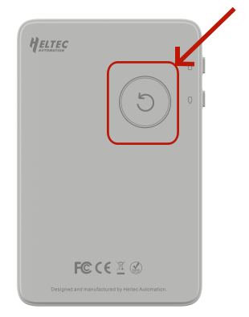
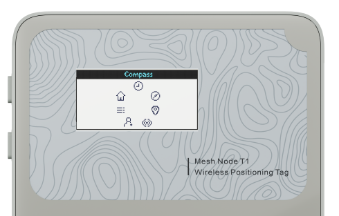
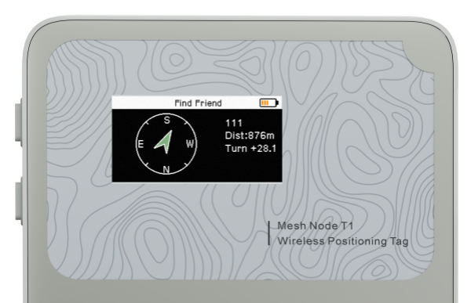
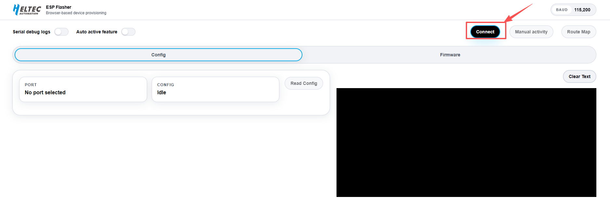
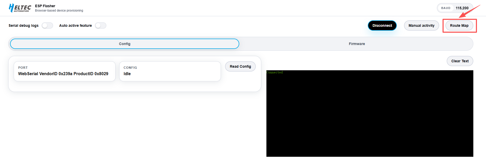

>F&T is a MeshCore-based communication firmware system that supports device-to-device communication, real-time location sharing, target guidance, route tracking, and distance alert functions. This document describes the quick start guide for using the F&T system on the Mesh Node T1 device.

## Charging

:::tip
When using the device for the first time, the battery may be low. It is recommended to charge the device using a 5V USB power supply to ensure proper startup and stable operation.
:::

## Power On/Off

Press the button on the back of the device once; when the white indicator light turns on, the device is powered on. Press the same button on the back of the device once again to power off the device.

After powering on, the device will enter the default interface, which displays the device ID, MSG information, and the PIN required to connect to MeshCore.

## Function Selection

**Double-press** the lower-left button to open the function selection menu, which contains seven available functions.

- Press the `Button1` once to move the selection to the left.
- Press the `Button2` once to move the selection to the right.
- After selecting the desired function, press and hold the button to confirm and enter the corresponding function screen.

| Function | Description |
|----------|-------------|
| **Home** | Return to the main screen and view basic device information |
| **Recent** | View recent messages |
| **Radio** | Access radio communication functions |
| **Compass** | Display the current compass heading and orientation information |
| **Find Friend** | Locate a target device and provide direction guidance |
| **GPS** | View current GPS positioning information |
| **System** | Device System Settings |

---

## System Setup

>- Press the `Button1` once to move the selection up.
>- Press the `Button2` once to move the selection down.
>- Press and hold the button to confirm the selected option.

**When using the device for the first time, please complete the following basic settings:**

1.Enter the system settings interface

2.Configure the LoRa `Region`

3.Set the screen sleep timeout duration

4.Verify `Bluetooth` and `GPS` status (enabled by default to support positioning and connectivity functions)

---

## Target Search

The target search feature in F&T is divided into two modes:

### Friend Search Mode

1.In System Settings: Click  **Find Mode --> Friend --> Friend --> target device**

2.After selecting the target device, `double-click Button2` to enter the **Find Friend interface**. 

3.The system will then display the real-time direction, distance, and ID of the target device.

### Camp Mode

1.In System Settings: Click  **Find Mode --> Friend --> Waypoint --> Use current GPS/Enter lat,lon**

- Select Use Current GPS : mark current location as camp
- select Enter Lat/Lon : manually input camp coordinates

2.After confirming the camp location, `double-click Button2` to enter the **Find Friend interface**. 

3.The system will then display the real-time direction and distance to the camp.

:::note

The target device needs to enable **Location Share** in System Settings.

If disabled, the MeshCore system will fall back to periodic location broadcasting with a fixed interval. This may reduce real-time accuracy and responsiveness. Enabling Location Sharing is recommended for better real-time performance.

:::

---

## Track Recording

1.Enable the **GPS Track** feature in the system settings.

2.Connect the device to a computer via a USB cable.

3.Open the [DevRemote](https://devremote.heltec.org/) tool.

4.Click the **Connect** button.

5.Select the paired serial port.

6.Click **Route Map**, and the system will automatically detect the number of recorded track points stored on the device.

:::tip
Current logging rule: one point is recorded approximately every 50 meters of movement, Up to 600 track points can be stored.
:::

