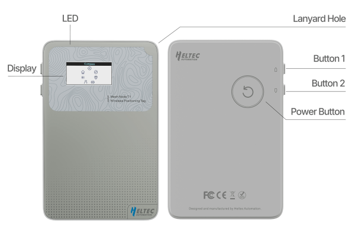

import Tabs from '@theme/Tabs';
import TabItem from '@theme/TabItem';
import styles from '@site/src/css/styles.module.css';
import DocCard from '@theme/DocCard';

  

Mesh Node T1 is a compact LoRa terminal based on the nRF52840 and SX1262, featuring BLE/LoRa dual-mode connectivity, integrated GNSS and 9-axis IMU for positioning and motion awareness. It offers ultra-low power consumption (11 µA sleep), 1850 mAh battery capacity, and IP67 protection for extended outdoor use. Compatible with Meshtastic and MeshCore, it also supports Arduino-based customization.

{

  <a href=" https://heltec.org/project/mesh-node-t1/" className={styles.btnLink1}>
    Product Page
  </a>

}

## Product characteristicss

- nRF52840 (BLE) + SX1262 (LoRa) with 0.96inch TFTLCD
- 11µA Ultra-Low Power, 1850mAh Long Battery Life
- IP67 Industrial-Grade Protection
- Highly integrated LoRa terminal with GNSS, 9-axis IMU, and buzzer.

## Important parameters
| [parameters](https://resource.heltec.cn/download/Mesh_Node_T1/Datasheet)         | Mesh Node T1   |
|--------------------|----------------------------|
|Master and LoRa Chip      |	    nRF52840 +  SX1262              |
|Memory|  	1M ROM; 256kB SRAM            |
| Battery     |   	1850mA Lithium battery               |
| Bluetooth         | 	Bluetooth 5, Bluetooth mesh, BLE           |
|Power Consumption       |  	Deep Sleep 11uA   |
| Dimensions         |   		85 * 55 * 9.5 mm   |

## Important Resources
- [Datasheet](https://resource.heltec.cn/download/Mesh_Node_T1/Datasheet)
- [Schematic diagram](https://resource.heltec.cn/download/Mesh_Node_T1/schematic)
- [nRF Development Framework](https://github.com/HelTecAutomation/Heltec_nRF52)
- [Related links](https://resource.heltec.cn/download/Mesh_Node_T1)

## Product Usage Guide

**The following documentation will help you get started quickly with the product**
- [Install development environment](/docs/devices/open-source-hardware/nrf52840-series/nrf52840-series-quick-start?nrf52840=nrf52840)
- [Applied to LoRaWAN](/docs/devices/open-source-hardware/nrf52840-series/nrf52840-series-quick-start?nrf52840=lorawan)
- [Applied to Meshtatic](/docs/devices/open-source-hardware/nrf52840-series/nrf52840-series-quick-start?nrf52840=meshtastic)
- [How to use license](/docs/devices/general-docs/how_to_use_license)

