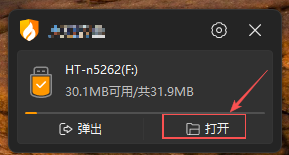
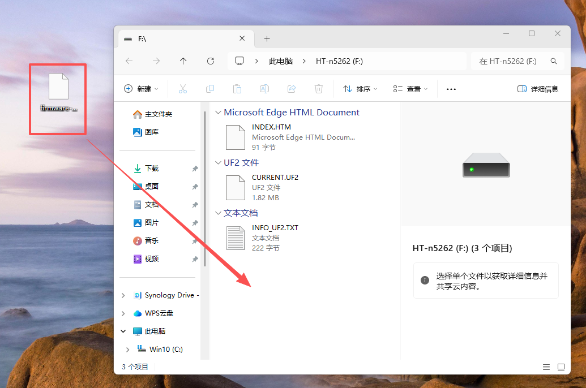

## Charging

:::tip
When using the device for the first time, the battery may be low. It is recommended to charge the device using a 5V USB power supply to ensure proper startup and stable operation.
:::

## Power On/Off

Press the button on the back of the device once; when the white indicator light turns on, the device is powered on. Press the same button on the back of the device once again to power off the device.

After powering on, the device will enter the default interface, which displays the device ID, MSG information, and the PIN required to connect to MeshCore.

## Button Instructions

- Button 1

  - Short press: Select the next option or wake up the display.
  - Long press: Confirm and select the current option.

- Button 2

  - Short press: Select the previous option or wake up the display.
  - Long press: Directly enter the Long Fast interface.

## Flash Firmware

1.Double-click the **Power Button** on the back of the device to enter UF (Firmware Update) mode.

2.Copy the downloaded Firmware file to the device storage that appears in UF mode.

- [Meshtastic](https://resource.heltec.cn/download/Mesh_Node_T1/firmware/Meshtastic)

3.After the file transfer is completed, the device will automatically start and complete the firmware flashing process.

 

