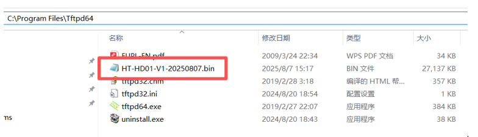
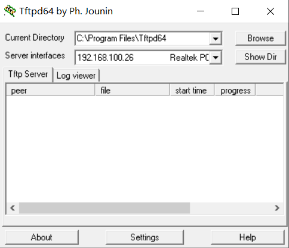
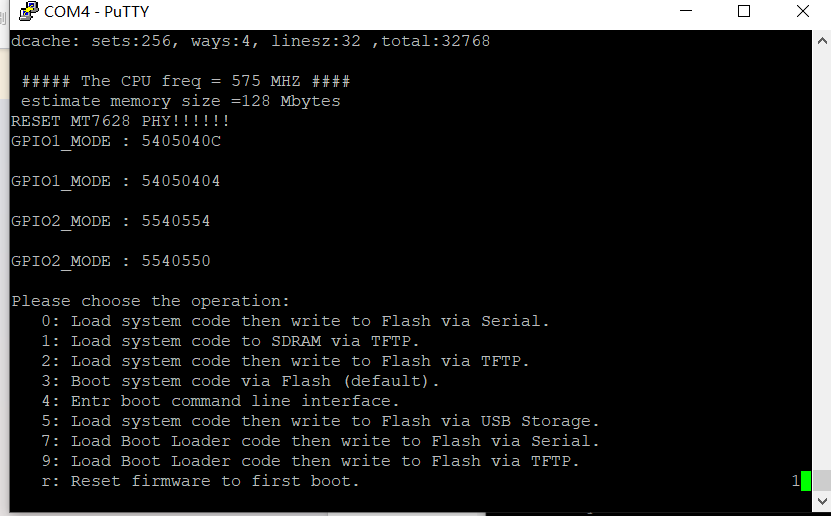
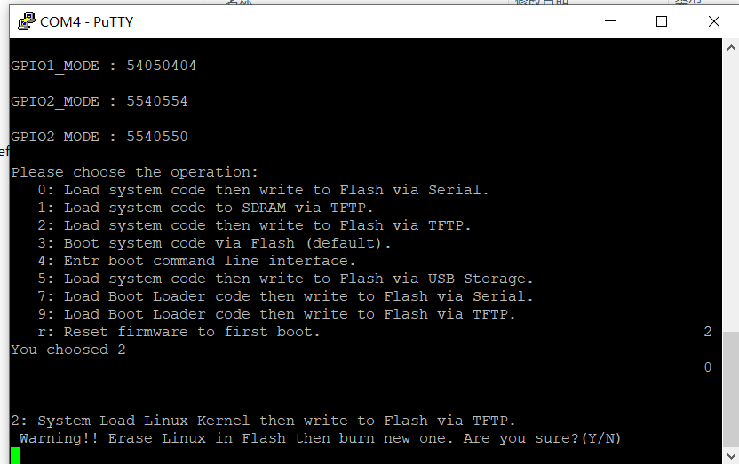
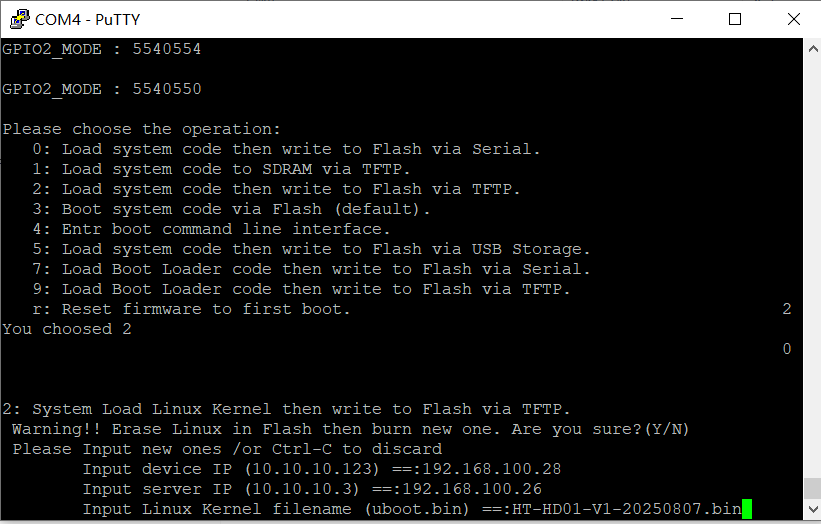
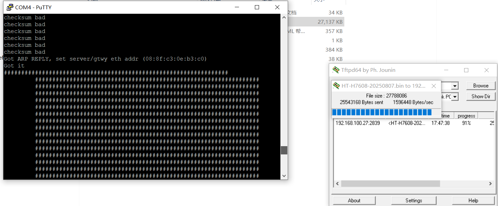
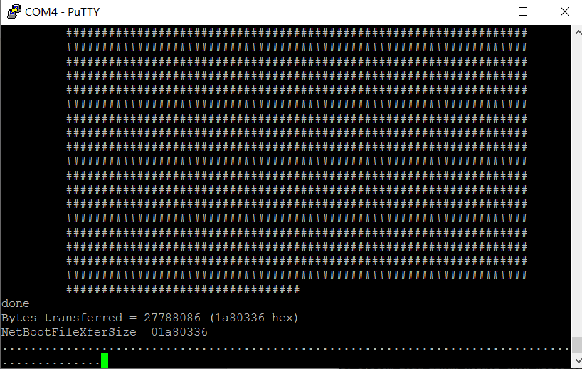

**If the firmware cannot be downloaded via the OTA configuration page, follow the steps below to manually obtain and install it.**

## Preparation

- Computer
- Type-C power cable
- Ethernet cable
- USB-to-UART module
- 2.54 mm Dupont wires
- [Firmware package](https://resource.heltec.cn/download/HT-H7608_V2/firmware)
- Serial debugging tool (e.g. [PuTTY](https://resource.heltec.cn/download/tools/putty.zip))
- [Tftpd64](https://resource.heltec.cn/download/tools/Tftpd64-4.64-setup.zip)

## Operation steps
1. Download the [corresponding firmware](https://resource.heltec.cn/download/HT-H7608_V2/firmware/openwrt-2.6.6-20260117-h7608-v2.bin) and record the file location

2. Set the computer IP to a fixed IP

3. Open Tftpd64. Set **Current Directory** to the folder containing the firmware, and select the PC’s IP address under **Server interfaces**.

4. Connect the USB-UART module to the device, then open the corresponding `COM Port` using a serial terminal.

:::note
Ensure that the USB-UART module is connected correctly.
:::

5. Power on the device. During startup, the following log is displayed. Before the countdown expires, press the `2 key` to select option 2. If the countdown expires before you make a selection, press the `RST button` to reset the device and try again.

6. After selecting option 2, the following prompt will appear. `Enter Y` using the keyboard.

---

7. As shown in the figure below, enter the required information in the following order, pressing Enter after each entry.

- **Device IP** : The IP address assigned to the device. It can be any available address within the same subnet as the server IP (the PC's IP address).
- **Server IP** : The static IP address configured on the PC.
- **Linux Kernel filename** : The name of the firmware file to be flashed.

8. After all required information has been entered, the following screen is displayed if the configuration is correct, indicating that the firmware is being transferred from the PC to the device.

9. After the firmware upload is completed, the following interface is displayed, indicating that the firmware is being written to the device.
Once the serial terminal outputs normal logs and no longer displays **……………**, the flashing process is considered complete. At this point, the Ethernet cable and USB-UART module can be disconnected.

