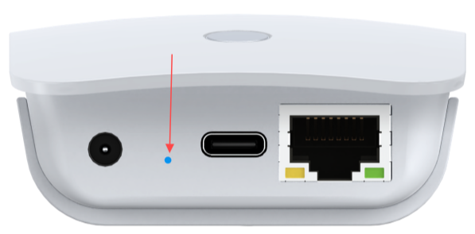

# Getting Started

## H7608 LED Indicator Description
**The description may vary depending on the firmware version.**

| **LED Indicator**                   | **Description**                                         |
| ----------------------------------- | ------------------------------------------------------- |
| 🔴 **Red (blinking)**               | Device is booting                                       |
| 🔴 **Red (steady on)**              | Button pressed                                          |
| 🟡 **Yellow (steady on, 3s hold)**  | Enter configuration mode                                |
| ⚪ **White (steady on, 7s hold)**    | Restore factory settings                                |
| 🟢🟡 **Green & Yellow alternating** | Configuration mode (WiFi + Ethernet)                    |
| 🔵🟡 **Blue & Yellow alternating**  | Configuration mode (WiFi + USB)                         |
| 🟢 **Green (blinking)**             | STA mode using Ethernet, HaLow not connected            |
| 🟢 **Green (steady on)**            | STA mode using Ethernet, HaLow connected successfully   |
| 🔵 **Blue (blinking)**              | STA mode using USB, HaLow not connected                 |
| 🔵 **Blue (steady on)**             | STA mode using USB, HaLow connected successfully        |
| 🩵 **Cyan (blinking)**              | AP mode using Ethernet, network input not connected     |
| 🩵 **Cyan (steady on)**             | AP (Ethernet) — Network connected                       |
| 🟣 **Purple (blinking)**            | AP mode using USB, network input not connected          |
| 🟣 **Purple (steady on)**           | AP mode using USB, network input connected successfully |

## Hardware connection

Connect the device power, the device RGB light is red, indicating that the device is starting, which takes about 1~2 minutes.

## First Enter Configuration Page

After the initial power-on, when the device's red light turns off and transitions to a state of alternating yellow and green blinking, it indicates that the device has successfully booted up and entered configuration mode.

:::tip
If your device fails to enter setup mode, press the button with the SIM needle for 3 seconds until the yellow light is on and release it.
:::

There are two ways to access the configuration page—you can choose either one:

#### Via Ethernet

1. Connect your H7608 to PC (laptop) using Ethernet cable.  
2. Enter `10.42.0.1` in your browser to navigate to the configuration page, the default account is `root` and password is `heltec.org`.

#### Via Wi-Fi

:::warning
Do not enter Wi-Fi configuration page while connected to a network cable. If you do this accidentally, disconnect the power and reconnect.
:::

1. Using the configuration tool (PC or mobile), find the WiFi named `HT-HXXX-xxxx-2G` and connect to it. The default password is `heltec.org`.  
     

2. Enter `10.42.0.1` in your browser to navigate to the configuration page, the default account is `root` and password is `heltec.org`.  
   

## Configuration

HT-H7608 has three typical working modes, please configure according to the specific use mode.

Click on the following link to get the configuration instructions for the corresponding mode:

- [Gateway (AP) Setup Guide](/docs/devices/wifi-halow/ht-h7608/gateway)  
- [Client (STA) Setup Guide](/docs/devices/wifi-halow/ht-h7608/station)  
- [Mesh Gate Setup Guide](/docs/devices/wifi-halow/ht-h7608/mesh_gate)  
- [Mesh Point Setup Guide](/docs/devices/wifi-halow/ht-h7608/mesh_point)  

## USB-Based Ethernet Mode

1.Use a SIM ejector pin to press and hold the LED button until the indicator turns solid blue/cyan, indicating Ethernet mode.
                
- Blue steady on: **STA** mode using USB, HaLow connected successfully
- Cyan steady on:	**AP** Ethernet — Network connected     

2.Connect a USB Ethernet adapter to the USB port.

3.Open the [configuration page](/docs/devices/wifi-halow/ht-h7608/usage-guide#first-enter-configuration-page) and complete the setup as required.

## View and Modify H7608's Configuration

**After "First Configuration" you can view the device's own information, downstream device information, and modify device settings on the device's configuration page.**

There are many ways to access the configuration page. Here are two common methods:

### IP-Based Connection

1. Connect the PC (Laptop) to the same LAN as the device, and go to the router configuration page. Find the IP address of the corresponding device.

:::tip
If you don't know the IP address of the target device, you can check the configuration (management) page of its upstream device.  
If the upstream device is in Bridge mode, you will need to check the next upstream device instead.  

For example, to locate a HaLow AP device, check the management page of its upstream router. Similarly, to find a HaLow STA device, check the upstream AP's management page—but if that AP is in Bridge mode, you must then check the router above it.
:::

2. Visit this IP address, default account `root`, default password `heltec.org`.

### Via AP Remote Access

1. Connect the PC (Laptop) to the device 2.4G AP. The default SSID is `HT-XXXX-xxxx`, and the default password is `heltec.org`.  
     

2. Enter `192.168.100.1` in the browser. Default account `root`, default password `heltec.org`.

:::tip
Some early versions might be `192.168.1.1`.  
In None traffic mode, the default IP is `10.42.0.1`. 
:::

