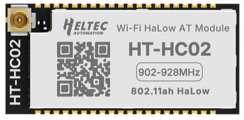

import styles from '@site/src/css/styles.module.css';

  

The HC02 Wi-Fi HaLow module, based on the ESP32-S3 and MM6108Q, supports UART AT command control without an SDK and operates in the license-free Sub-1 GHz band, providing up to 1–2 km range and data rates of up to 32.5 Mbps for IoT applications.

{

  <a href="" className={styles.btnLink1}>
    Product Page
  </a>

}

## Product characteristics
- Based on ESP32-S3FN8 + MM6108IQ
- UART AT command control, no SDK required
- Sub-1 GHz Wi-Fi HaLow (902–928 MHz), up to 1 km range
- High data rate up to 32.5 Mbps (single-stream PHY)
- Compact 1.27 mm stamp-hole design, wide operating temperature (-40°C to 85°C)

## Important parameters
| [parameters](https://resource.heltec.cn/download/HT-HC02/Datasheet/HT-HC02_Datasheet-1.0.0.1.pdf)        | HT-HC02        |
|--------------------|----------------------------|
|MCU + Chip    |	   ESP32-S3FN8 + MM6108IQ             |
|Power Supply  |     	 3.3V, ≥500mA            |
|Wi-Fi Standard     |   	IEEE 802.11ah           |
|Band Width       | 		1/2/4/8MHz       |
|Max.outputpower         |  	 21±1dBm|
|Dimensions       |   	32*15*2.7mm |

## Important Resources

- [Datasheet](https://resource.heltec.cn/download/HT-HC02/Datasheet/HT-HC02_Datasheet-1.0.0.1.pdf)
- [Reference Design](https://resource.heltec.cn/download/HT-HC02/Guide/Reference_design.PDF)
- [AT Command User Manual](https://resource.heltec.cn/download/HT-HC02/AT/HT-HC02_AT_USER_MANUAL_0.2.pdf)
- [Resource Station](https://resource.heltec.cn/download/HT-HC02)

For further design documentation for the module, please contact us at [**support@heltec.cn**](https://heltec.org/about/contact/).
