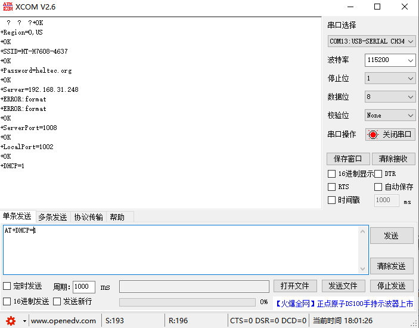
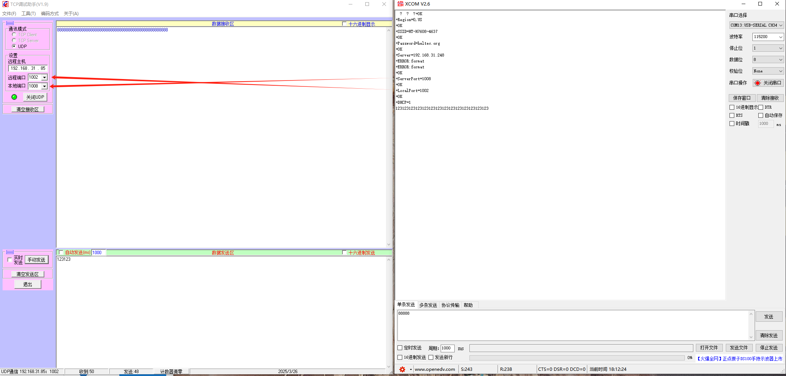

# HC02 Wireless Communication Test Program

## Preparation

- Ensure the upstream HaLow gateway is operating normally.
- Serial port tool: [XCOM V2.6](https://resource.heltec.cn/download/tools/XCOM%20V2.6.zip)
- TCP debug assistant: [TCP Debug Tool](https://resource.heltec.cn/download/tools/TCP_Debugging_Assistant.rar)

## Configuration

1.Refer to the following table to correctly connect the relevant pins (RX, TX), and set GPIO10 to high level to put HC02 into configuration mode.

| Pins    | Type | Function           | Description |
|---------|------|--------------------|-------------|
| GPIO10  | DI   | Mode Determination | "1": Configuration Mode, "0": Transparent Mode. The baud rate in configuration mode is fixed at 115200. When changing from 1 to 0, if there is a configuration modification, the device will restart and reconnect to the HaLow AP. |
| GPIO11  | DI   | Wake-up Pin        | "1": Wake up, "0": AUTO-Sleep. |
| GPIO12  | DO   | Connection Status  | "0": Connected, "1": Disconnected. |
| GPIO16  | I/O  | TX                 | - |
| GPIO17  | I/O  | RX                 | - |

2.Open the serial port tool and configure via AT commands. For specific commands, please refer to the [AT Command Guide](https://resource.heltec.cn/download/HT-HC02/AT/HT-HC02_AT_USER_MANUAL_0.2.pdf).

**Important Serial Port Configuration Notes:**
- **Region**: Must be consistent with the gateway.
- **HaLow gateway connection credentials**: SSID and password.
- **Server address**: Set to the test computer's IP address within the local area network.
- **Additional settings**: Configure port, IP mode, and other relevant parameters.

3.Enter Transparent Transmission Mode，Disconnect Pin 10 (set to low level) and set Pin 11 to high level.

## Establish Communication
1.Connect the computer to the same local network as the HaLow gateway. 
2.Open the TCP debug tool. 
3.Configure the tool as follows:
- Communication Mode: Select "UDP" (using UDP as an example).
- Remote Host: Enter the IP address of the HaLow gateway.
- Remote Port: Enter the "Local Port" configured in the AT module.
- Local Port: Enter the "Server Port" configured in the AT module.

## Initiate Communication

 Start the UDP connection. Two-way communication can now be established between both ends!

