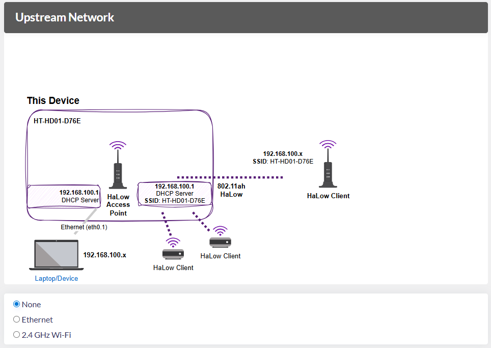
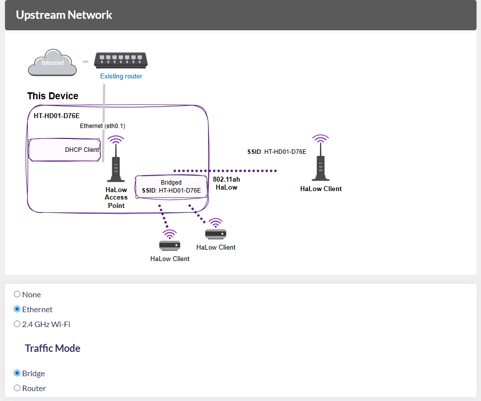
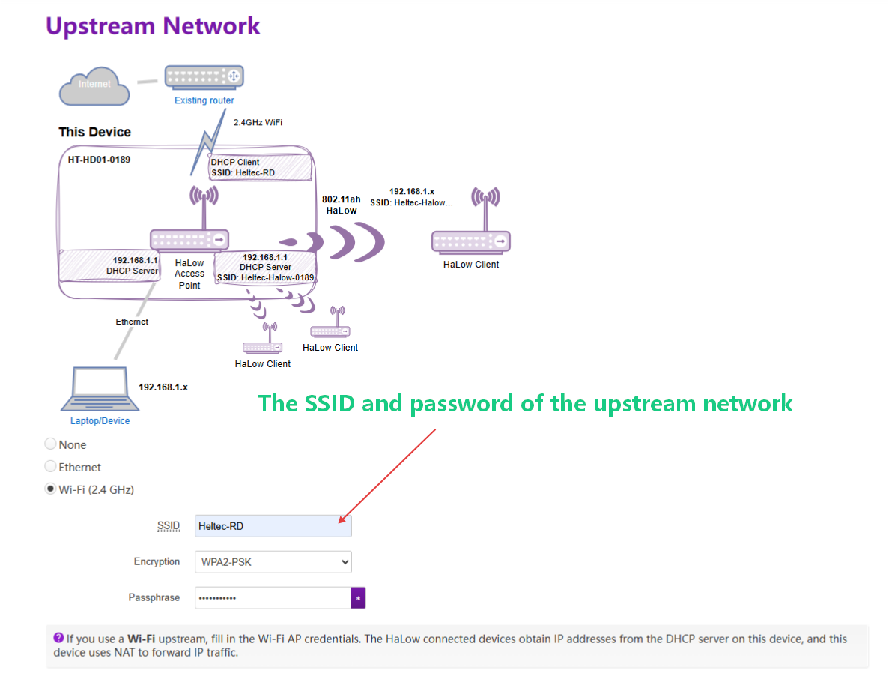
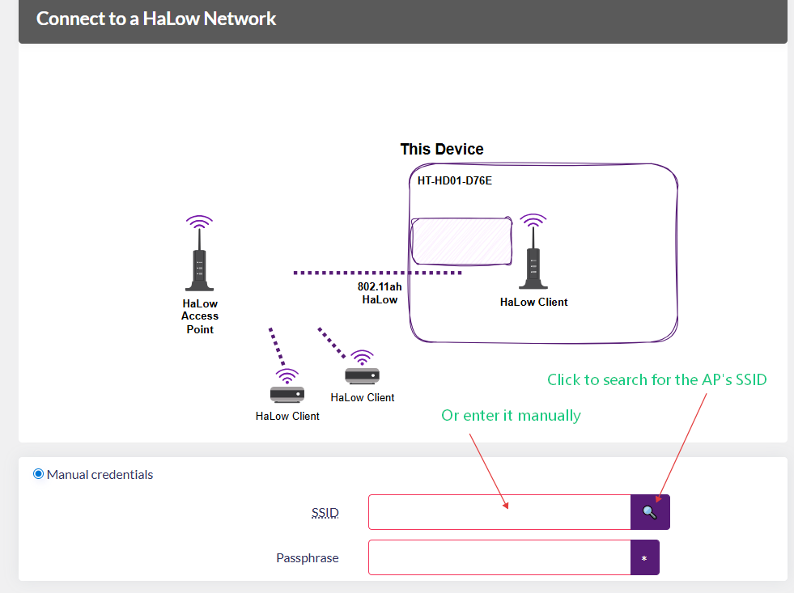

import Tabs from '@theme/Tabs';
import TabItem from '@theme/TabItem';
import styles from '@site/src/css/styles.module.css';

# HT-HD01 AP-STA Setup Guide (P-to-P & Point-to-Multipoint)
Any HD01 device can be configured as either AP or STA mode, enabling peer-to-peer or point-to-multipoint networking.

This chapter provides step-by-step instructions for configuring an HD01 as AP or STA to achieve flexible networking.

<Tabs
groupId="ap"
queryString="ap"
defaultValue="ap"
className={styles.customTabs}
values={[
{label: 'AP Setup Guide ', value:'ap'},
{label: 'STA Setup Guide ', value:'sta'},
]}>

<TabItem value="ap">

1. **Unplug the Ethernet cable first, then power on the device**. The device's indicator light will turn **red** at this point, and you will need to wait approximately 1-2 minutes for the device to boot up.  
2. After the device has started, use a pin to **press and hold the device button for three seconds** until the indicator turn yellow, Release the pin. At this point, the indicator light will start flashing alternately between yellow and green/blue, indicating that the device has entered configuration mode.

    

    :::tip
    If the device is already showing alternating yellow and green/blue flashing lights after booting, skip this step and proceed directly to the next one.
    :::

3. At this point, locate the device's Wi-Fi network and connect to it. The network name is HT-HD01-XXXX, and the default password is "heltec.org."  
4. Once connected to the Wi-Fi, open a browser and navigate to the configuration IP for HD01: "**10.42.0.1**" The default username is "**root**," and the default password is "**heltec.org**"  
    :::tip  
    If you cannot access the IP address
    - Try reconnecting to the Wi-Fi.   
    - Check if you forgot to unplug the Ethernet cable. If it is still connected, unplug it, and then reconnecting the power. 
    ::: 
5. After access configuration page, the following parameters must be set:
    - **Country**, Only devices with the same Country/Frequency setting can communicate with each other.
    - **Hostname**, It refers to the device's name on the network, such as its name on the upstream router. 

    

    :::tip
    Don’t worry if this step doesn’t pop up. After the configuration is complete, you can modify these options by accessing the device’s IP address.
    :::

6. For AP-STA Mode, select "**Standard WiFi HaLow**", click `next`.

    

7. Select `Access Point` mode and click `Next`.

    

8. Set the parameters for the HaLow hotspot and click `Next`.

    

    - **SSID**: Wi-Fi HaLow hotspot name. The STA must establish connectivity through it.
    - **Password**: Wi-Fi HaLow hotspot password.
    - **Bandwidth**: Different bandwidth configurations affect signal coverage, data transfer rate, and interference resistance. Narrower bandwidths (e.g., 1 MHz) offer better coverage and lower power consumption, while wider bandwidths provide higher data rates but have shorter range and higher power consumption.
    - **Channel**: Each bandwidth has specific frequencies as its channels. When there are other Wi-Fi HaLow devices in the area, you can reduce interference by setting different channels.

6. Select the **Upstream Network**.You can choose from the following three upstream network modes:

    

----------------------------------

<Tabs
groupId="none"
queryString="none"
defaultValue="none"
className={styles.customTabs}
values={[
{label: 'None', value:'none'},
{label: 'Ethernet', value:'ethernet'},
{label: 'Wi-Fi', value:'wifi'},
]}>

<TabItem value="none">
In None mode, your device will have a static IP address: **192.168.100.1**, and run a DHCP server on all interfaces, the HaLow and non-HaLow networks will be isolated from each other.

    

</TabItem>
<TabItem value="ethernet" >

When selecting Ethernet as the upstream network, you need to connect the device to a network capable of assigning IP addresses, such as a regular router.

    

You also need to choose a **Traffic Mode**: Bridge or Router, which determines how IP addresses are allocated to the downstream network.
- In **Bridge** mode, this device and the HaLow-connected devices obtain IP addresses from your current upstream network.
- In **Router** mode, the HaLow-connected devices obtain IP addresses from the DHCP server on this device, and this device uses NAT to forward IP traffic. Only use this mode if you intend to connect to a trusted network, as this admin interface will be accessible on the upstream network.
connection method and **Traffic Mode**. The upstream network determines the device's internet access method, while **Traffic Mode** governs how downstream devices obtain IP addresses. Regardless of your selection, the topology diagram and on-screen instructions will dynamically update to reflect your configuration. 

    :::warning
    The RJ45 cable is indicated by cyan, while the USB-C cable is indicated by purple. If the LED color doesn't match your selected cable type, press the function button to toggle between modes.
    :::

</TabItem>
<TabItem value="wifi" >

If you use a Wi-Fi upstream, fill in the Wi-Fi AP credentials. The HaLow connected devices obtain IP addresses from the DHCP server on this device, and this device uses NAT to forward IP traffic.

</TabItem>
</Tabs>

-----------------------------------------

10. This HaLow device is also capable of 2.4 GHz Wi-Fi. If you **enable a 2.4 GHz Wi-Fi Access Point**, you will be able to connect 2.4 GHz Wi-Fi clients to this device. You can set the SSID, password, and encryption for the 2.4G network here.

    

11. Click "Apply" to complete the device configuration.

  <a href="https://wiki.heltec.org/docs/devices/wifi-halow/ht-hd01/ap" className={styles.btnLink1}>
    📘
    Click to view the STA setup guide.
  </a>

</TabItem>
<TabItem value="sta" >

1. **Unplug the Ethernet cable first, then power on the device**. The device's indicator light will turn **red** at this point, and you will need to wait approximately 1-2 minutes for the device to boot up.  
2. After the device has started, use a pin to **press and hold the device button for three seconds** until the indicator turn yellow, Release the pin. At this point, the indicator light will start flashing alternately between yellow and green/blue, indicating that the device has entered configuration mode.

    

    :::tip
    If the device is already showing alternating yellow and green/blue flashing lights after booting, skip this step and proceed directly to the next one.
    :::

3. At this point, locate the device's Wi-Fi network and connect to it. The network name is HT-HD01-XXXX, and the default password is "heltec.org."  
4. Once connected to the Wi-Fi, open a browser and navigate to the configuration IP for HD01: "**10.42.0.1**" The default username is "**root**," and the default password is "**heltec.org**"  
    :::tip  
    If you cannot access the IP address
    - Try reconnecting to the Wi-Fi.   
    - Check if you forgot to unplug the Ethernet cable. If it is still connected, unplug it, and then reconnecting the power. 
    ::: 
5. After access configuration page, the following parameters must be set:
    - **Country**, Only devices with the same Country setting can communicate with each other.
    - **Hostname**, refers to the hostname of your device in the Wi-Fi HaLow network. 

    

6. Select "**Standard WiFi HaLow**", click `next`.

    

4. Select `Client` mode and click `Next`.

    

5. Click `Manual credentials`, scan or manually enter the SSID and password of the HaLow-AP, and click `Next`.

    

5. Select **Traffic Mode**, which determines the downstream network mode provided by this STA device. Regardless of your selection, the topology diagram and on-screen instructions will dynamically update to reflect your configuration. 

    
    - In **None** traffic mode, non-HaLow and HaLow networks are isolated. This device will use a static IP address 10.42.0.1, and run a DHCP server on the non-HaLow interface.
    - In **Bridge** traffic mode, non-HaLow devices obtain IPs from HaLow AP, If the AP is in Bridge mode, it will obtain an IP address from an upstream device.
    - In **Extender** traffic mode, non-HaLow devices obtain IPs(10.42.0.x) from the DHCP server on this device, and this device uses NAT to forward IP traffic.
7. Enable/Disable "2.4GHz WiFi AP", Set the SSID and password for the 2.4GHz hotspot, then click **Next**. This 2.4GHz access point is configured for your terminal devices. The hotspot must remain enabled, otherwise its Wi-Fi functionality will be unavailable.

    

-------------------

  <a href="https://wiki.heltec.org/docs/devices/wifi-halow/ht-hd01/sta" className={styles.btnLink1}>
    📘
    Click to view the AP setup guide.
  </a>

</TabItem>
</Tabs>
