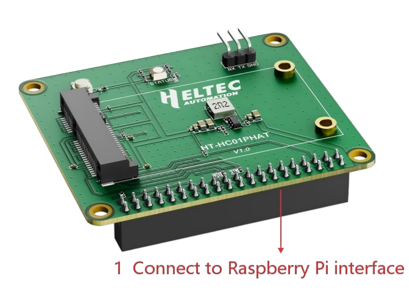
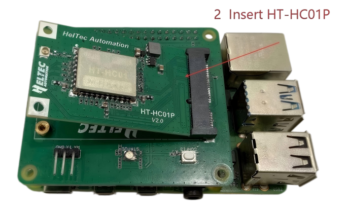
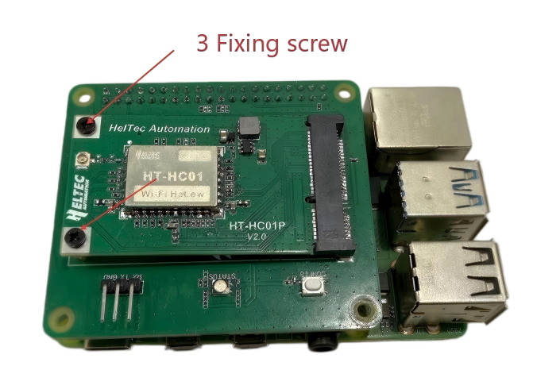
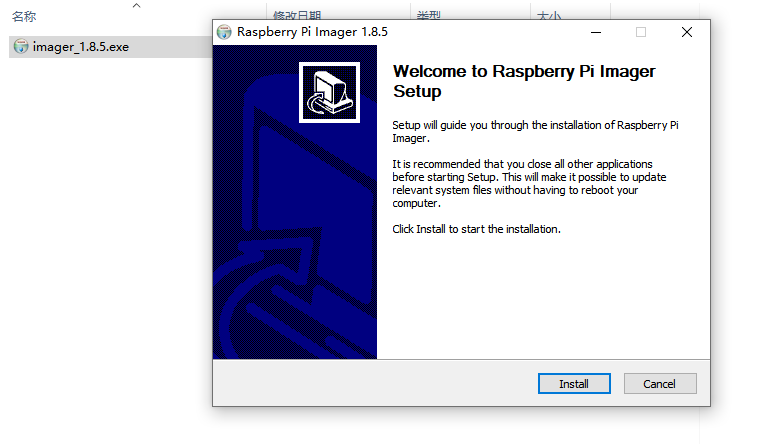
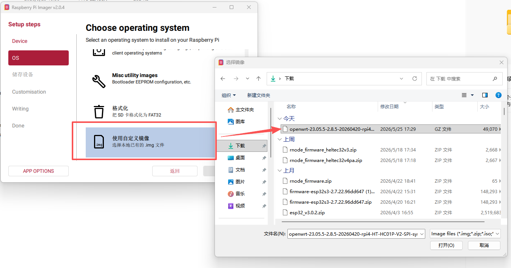
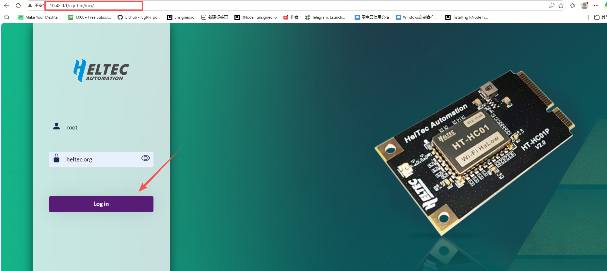

import styles from '@site/src/css/styles.module.css';

### Hardware

#### Hardware Preparation
- [HT-HC01P V2 Raspberry Pi HAT]( https://heltec.org/project/ht-hc01p-hat/)
- [WiFi HaLow Module Mini PCIe Interface](https://heltec.org/project/ht-hc01p/)
- Raspberry Pi 1/2/3/4
- Micro SD card
- SD card reader
- Computer running Windows, Linux, or macOS

#### Hardware Installation

Follow the steps shown below to install and connect the device.

| 1| 2| 3|
|---|---|---|
|  |  |  |

#### Power

HC01P is powered by Raspberry PI, so it is sufficient to connect the Raspberry PI power supply.

### Install firmware

1. Download the [HC01P_V2_Firmware](https://resource.heltec.cn/download/HT-HC01P_V2/Raspiberry%20firmware) and [Raspberry Pi Imager](https://www.raspberrypi.com/software/).
2. Insert the SD card into the card reader and connect it to your computer.
3. Install and run the **Raspberry Pi Imager tool**.

4. Select the appropriate Raspberry Pi model. Select `Use custom`. Then choose the **HC01P_V2_Firmware** you just downloaded.

5. Click `NEXT` and complete the firmware installation.
6. Remove the SD card from the card reader and insert it into the Raspberry Pi.

### Setup and Use

1. Powering on the device, the red indicator light should turn on, indicating that the device is starting up (takes a few dozen seconds).
2. Connect your Raspberry PI to your computer with an Internet cable.

3. Open the web browser on your computer and go to `10.42.0.1`.

- Default username: **root**  
- Default password: **heltec.org**

5. Select the mode you want to run and configure it accordingly.  
 
- [Wi-Fi HaLow Gateway(AP) Mode](/docs/devices/wifi-halow/ht-h7608/gateway)
- [Wi-Fi HaLow Client(STA) Mode](/docs/devices/wifi-halow/ht-h7608/station)
- [Wi-Fi HaLow Mesh Gate Mode](/docs/devices/wifi-halow/ht-h7608/mesh_gate)
- [Wi-Fi HaLow Mesh Point Mode](/docs/devices/wifi-halow/ht-h7608/mesh_point)

