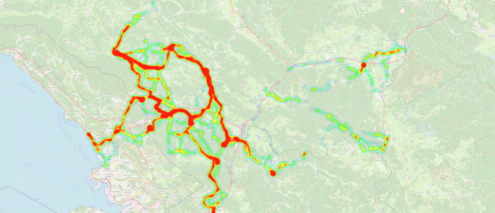
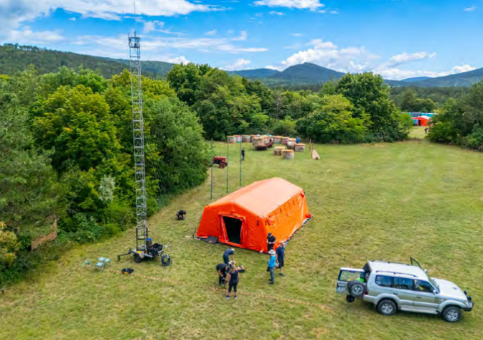
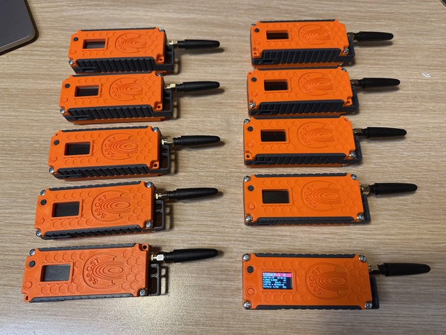
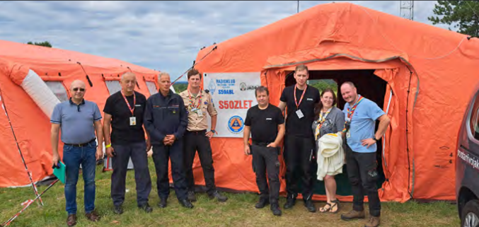
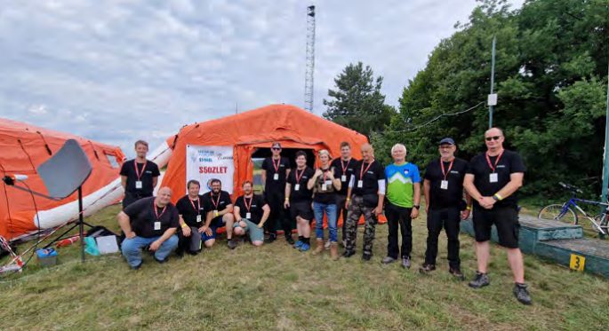
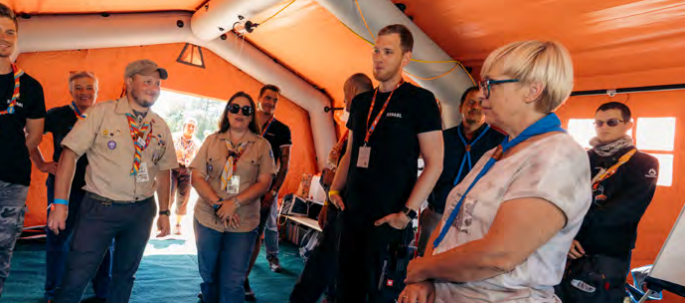
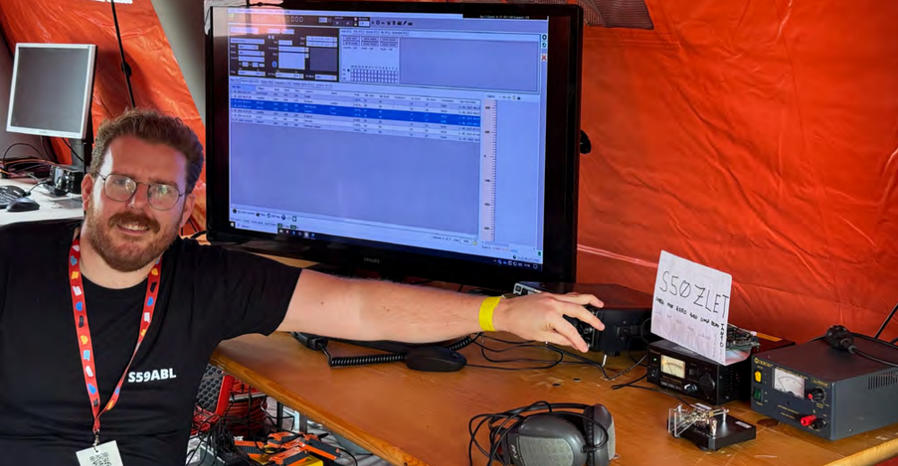
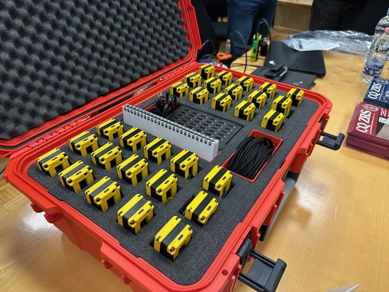

ZLET is the largest scouting gathering in Slovenia, bringing together scouts from across the country and offering a wide range of activities focused on nature, sports, creativity, and learning. The event takes place every four years, with each edition hosted in a different location throughout Slovenia.

In addition to supporting the event infrastructure, we assisted the scouts in deploying a wireless internet network across the campsite, enabling more efficient organization and communication throughout the various activities.

As part of the technical program, our amateur radio team prepared a series of activities focused on modern radio technologies. During the camping program, we conducted **field testing of LoRa APRS tracking devices**. For this occasion, we specially prepared the trackers for ZLET using [**Heltec Wireless Tracker**](https://heltec.org/project/wireless-tracker/) modules and custom 3D-printed enclosures. We assembled 30 trackers, while an additional 10 units were provided by Radio Club Koper.

In total, 40 scout teams were equipped with trackers, allowing us to monitor their locations in real time. This provided participants with hands-on experience of radio-based position tracking in an environment without internet infrastructure, demonstrating the practical value of LoRa and amateur radio technologies in the field.

**On Saturday, August 2, 2025**, we organized two workshops: an introduction to amateur radio and a practical demonstration of Amateur Radio Direction Finding (ARDF), commonly known as “Fox Hunting.” The ARDF workshop was led by S57CT (Franci Žankar).

Participants were also introduced to satellite communications through amateur radio satellites and Slow Scan Television (SSTV). Every attendee had the opportunity to make their first amateur radio contact, gaining direct experience with radio communications and developing a deeper understanding of the technology through hands-on practice.

The workshops were scheduled across four sessions, each with approximately 20 registered children. Due to adverse weather conditions, one session had to be canceled. Despite this, around 120 scouts participated in the activities overall.

Throughout the event, we operated under the special callsign S50ZLET and established numerous HF radio contacts, further promoting amateur radio to participants and visitors alike.

We also had the opportunity to present our work to several distinguished guests, including Dr. Nataša Pirc Musar, President of the Republic of Slovenia; Borut Sajović, Minister of Defence; Members of Parliament Lucija Tacer and Andreja Živic; Sandi Curk, Civil Protection Commander for the Notranjska Region; Aleš Klemenc, Head of the Notranjska Civil Protection Office; Andrej Sila, Mayor of Sežana; and Vanja Jelen, Deputy Mayor of Sežana.

During these presentations, we highlighted our key activities, emphasized the importance of self-sufficient communications, and demonstrated how amateur radio systems can remain operational with only a reliable power source. Using EcoFlow batteries and solar panels, we showcased our ability to operate independently, including in emergency and off-grid situations.

Participation in ZLET 2025 made a significant contribution to promoting amateur radio among young people and the broader public. The event also reinforced the role of amateur radio operators as a technically skilled, community-oriented, and socially valuable group while demonstrating how technologies such as the **Heltec Wireless Tracker** can support education, outdoor activities, and resilient communications in real-world environments.