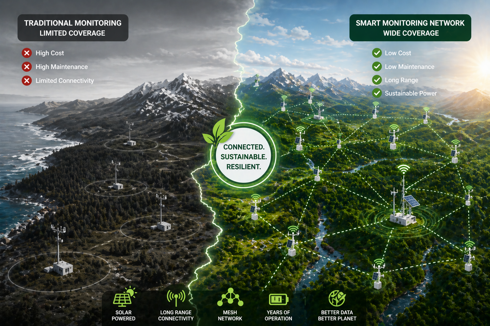
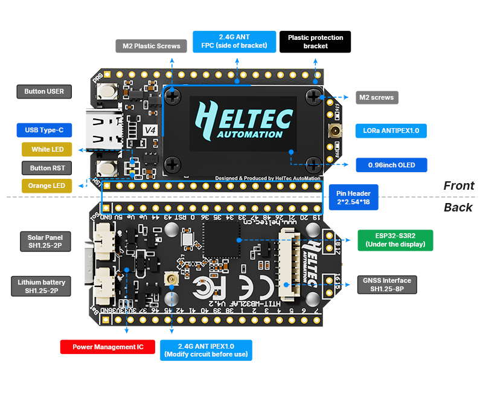
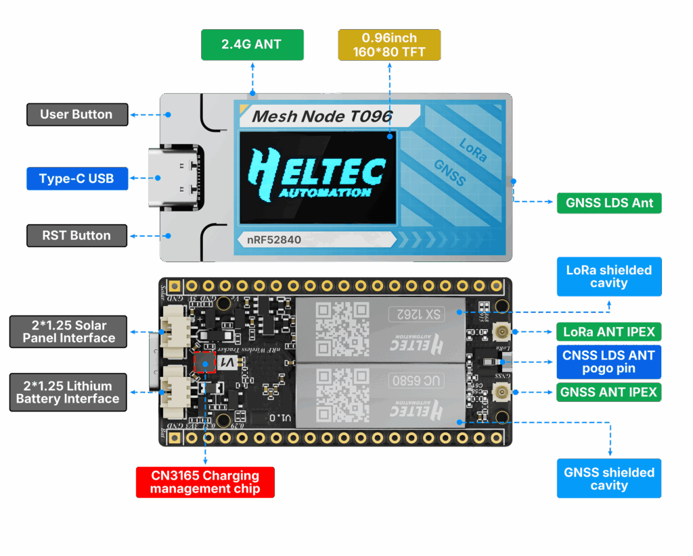
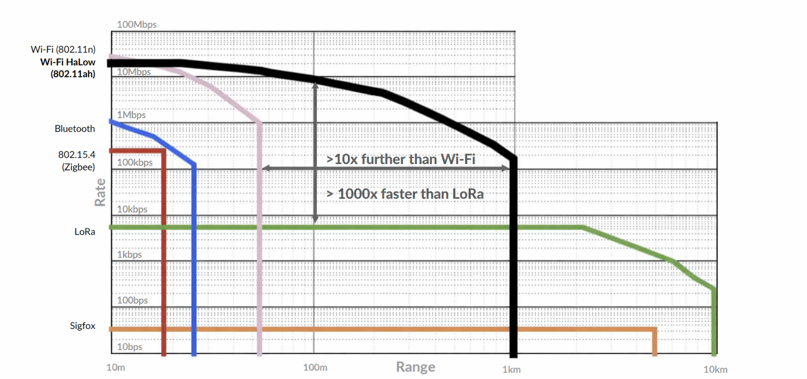
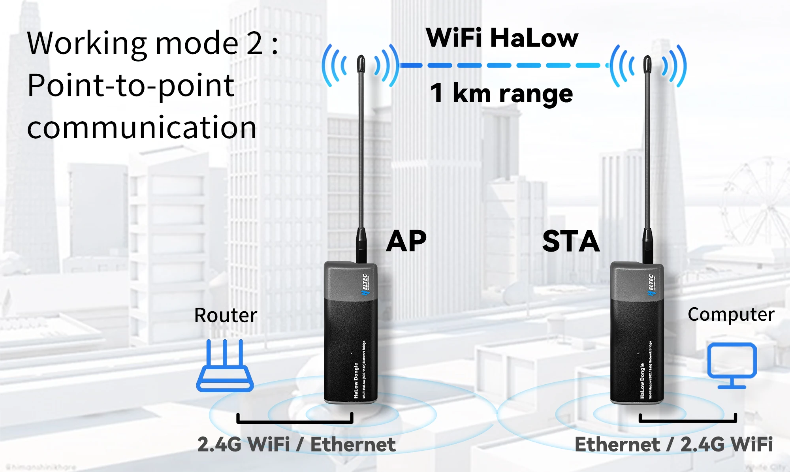
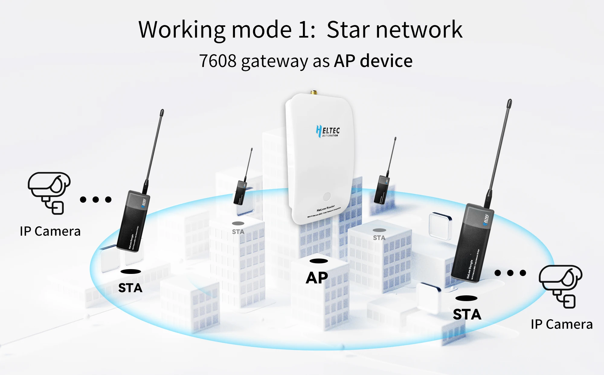
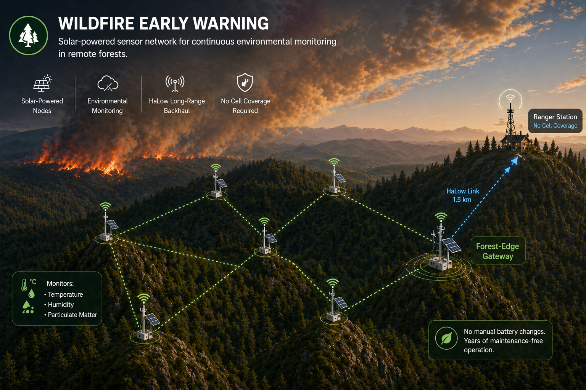
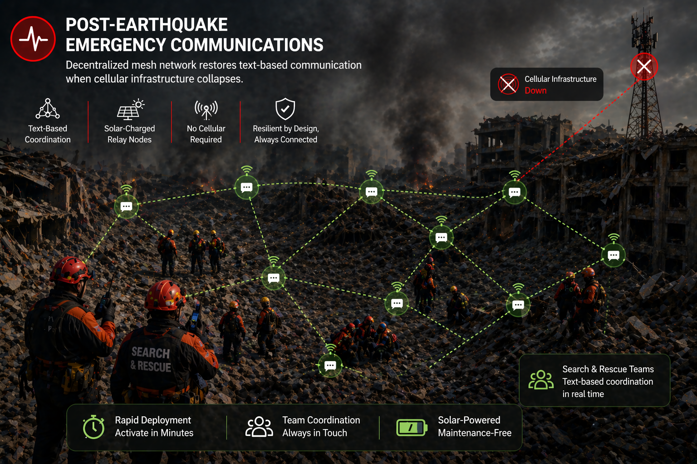
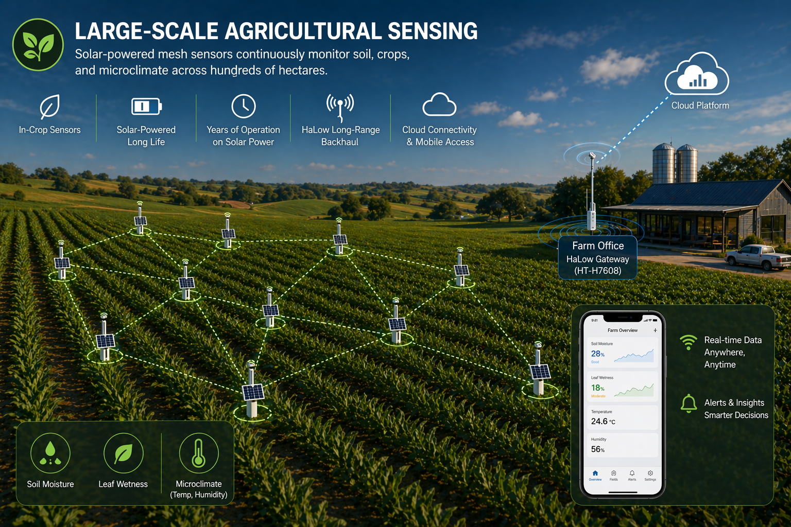
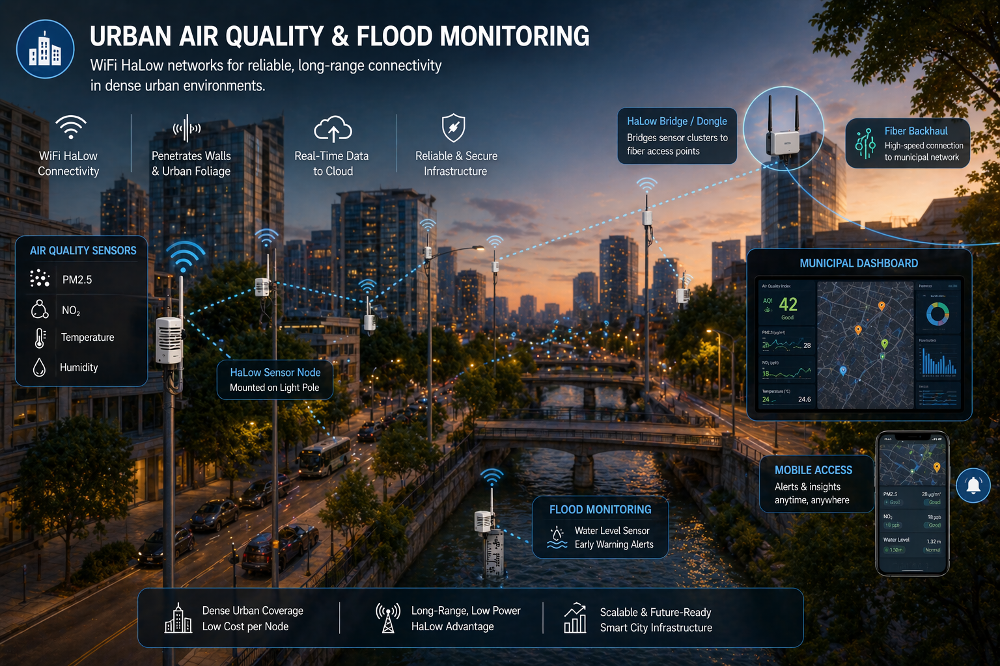

---


Every April 22nd, the world pauses to reflect. But the planet doesn't pause — forests burn, sea levels rise, and the data we need to understand our changing environment often simply doesn't exist. The gap between awareness and action is, fundamentally, an **infrastructure problem**.

IoT technology has long promised to close that gap. Wireless sensors scattered across forests, coastlines, and farmland could continuously feed environmental data to researchers, governments, and communities. The challenge has always been practical: how do you power a sensor in a remote wetland? How do you transmit data from a mountaintop without cellular coverage? How do you keep a monitoring network running for years without maintenance visits?

These are engineering problems. And they have engineering solutions.

---

## Why Traditional Monitoring Falls Short

Conventional environmental monitoring networks rely on a few high-cost, high-maintenance stations connected by cellular or wired infrastructure. This works in cities and agricultural belts — but it fundamentally fails in the places that matter most: remote forests, coastal margins, high-altitude terrain, and disaster-prone zones.

| Metric | Reality |
|---|---|
| Earth's land surface lacking dense sensor coverage | ~70% |
| LoRa communication range in open terrain | Up to 15 km |
| WiFi HaLow backhaul range (line-of-sight) | 1–2 km |
| Target node lifespan on solar + battery | > 3 years |

The core bottleneck isn't sensor technology — it's **energy and connectivity**. Traditional nodes need grid power and cellular backhaul that simply don't exist in remote areas. This leaves massive blind spots in our understanding of living ecosystems.



---

## The Heltec Approach: A Multi-Layer Wireless Stack

At Heltec, we've built a portfolio of devices covering three complementary wireless technologies — **LoRa**, **Meshtastic mesh networking**, and **WiFi HaLow** — that together form a complete field-deployable monitoring infrastructure. No single radio solves every range-power-bandwidth tradeoff; the right architecture uses each where it excels.

> *"The planet generates data constantly. The question is whether we have the infrastructure to listen."*

```
[Sensor Node]  →  [LoRa Mesh]  →  [WiFi HaLow Backhaul]  →  [Cloud / MQTT]
  T096 / V4        Meshtastic        HT-HD01 / HT-H7608        Dashboard
```

---

## Hardware for the Field: Current Lineup

### [**WiFi LoRa 32 V4**](https://heltec.org/project/wifi-lora-32-v4/) — The Versatile Development Platform



The WiFi LoRa 32 V4 is the latest generation of Heltec's most popular development board, now built on the **ESP32-S3R2** paired with the **Semtech SX1262** LoRa transceiver. It's the fastest path from prototype to deployed environmental node.

Key upgrades over V3 include amplified LoRa output (up to **28 dBm** on the high-power variant), 2 MB PSRAM and 16 MB external Flash for data buffering and UI applications, and a newly added **SH1.25-2Pin solar panel interface** plus **SH1.25-8Pin GNSS connector** — making solar-powered, GPS-tagged deployments possible without external modules.

The protected 0.96" OLED display and fully backward-compatible form factor mean existing V3 enclosures and codebases migrate with minimal rework.

| Spec | Value |
|---|---|
| MCU | ESP32-S3R2 (dual-core LX7, 240 MHz) |
| Memory | 2 MB PSRAM + 16 MB Flash |
| LoRa chip | Semtech SX1262 |
| TX power | High-power: 28 ± 1 dBm / Low-power: 22 dBm |
| Connectivity | LoRa + WiFi 802.11 b/g/n + BLE 5 / BT Mesh |
| Solar input | SH1.25-2Pin, 4.7–6 V |
| GNSS interface | SH1.25-8Pin (individually power-controllable) |
| Deep sleep current | < 20 µA |
| Firmware | Meshtastic, MeshCore, LoRaWAN, Arduino, ESP-IDF |

**Best suited for:** base stations, solar relay nodes with OLED status display, LoRaWAN sensor endpoints, prototyping field hardware.

---

### 🔋 [**Mesh Node T096**](https://heltec.org/project/t096/) — Ultra-Low Power with nRF52840



The T096 represents a deliberate architectural shift: swap the ESP32 for **Nordic Semiconductor's nRF52840**, drop WiFi, and build exclusively for **maximum battery efficiency and mesh reliability**. At **12 µA sleep current**, it is Heltec's lowest-power field node to date.

The radio stack is identical in strength to the V4: an SX1262 with integrated PA delivering **28 ± 1 dBm** transmit power. The T096 also integrates a **UC6580 dual-band GNSS chip** and a color TFT display — in a footprint of just 52 × 25.4 mm.

Both Meshtastic and MeshCore firmwares are officially supported out of the box.

The nRF52840 architecture matters for sustainability deployments specifically because it excels in **duty-cycled, battery-first applications** — the kind that need to sit unattended in a field for months, waking up to transmit sensor readings and sleeping for the rest.

| Spec | Value |
|---|---|
| MCU | Nordic nRF52840 |
| LoRa chip | Semtech SX1262 + integrated PA |
| TX power | 28 ± 1 dBm |
| GNSS | UC6580 dual-band (LDS antenna onboard) |
| Connectivity | LoRa + Bluetooth 5 / BT Mesh |
| Sleep current | ~12 µA |
| Solar input | Yes (onboard connector) |
| Display | Color TFT |
| Dimensions | 52 × 25.4 mm |
| Price | ~$29.90 |
| Firmware | Meshtastic, MeshCore, Arduino |

**Best suited for:** long-duration battery-powered field nodes, portable mesh relays, tracker endpoints where WiFi connectivity is not required.

> **V4 vs T096 — choosing the right node:**
> Use the **V4** when you need WiFi uplink, complex firmware (ESP-IDF, MicroPython), or a larger development ecosystem. Use the **T096** when the priority is battery longevity and range, with BLE as the local interface. They are complementary, not competing.

---

### 📡 WiFi HaLow (802.11ah) — The Long-Range Data Backhaul



LoRa mesh carries sensor readings over long distances at low data rates. But how does aggregated data get from a remote gateway back to the internet? This is where **WiFi HaLow** (IEEE 802.11ah) fills a critical gap.

WiFi HaLow operates in the **sub-1 GHz band (902–928 MHz)**, giving it two key advantages over conventional WiFi: dramatically longer range and superior wall/vegetation penetration. Heltec's HaLow lineup includes:

#### [**HT-HD01 V2 — WiFi HaLow Dongle**](https://heltec.org/project/ht-hd01/)



A plug-and-play long-range wireless bridge supporting **1–2 km line-of-sight transmission** with 27 dBm RF output. Connect via USB-C, Ethernet, or 2.4 GHz WiFi. Two dongles can be paired point-to-point for a transparent Ethernet extension across a field site or forest deployment — no cellular SIM required.

#### HT-H7608 V2 — [**WiFi HaLow Router / Gateway**](https://heltec.org/project/ht-h7608/)



A wall-mountable dual-band gateway (HaLow + 2.4 GHz WiFi) supporting AP, STA, and Mesh networking modes. Manages large numbers of simultaneous HaLow client devices with high-speed data rates up to **32.5 Mbps @ 8 MHz channel**. Designed for permanent installation at a field station or building edge.

| Feature | HT-HD01 V2 (Dongle) | HT-H7608 V2 (Router) |
|---|---|---|
| Protocol | IEEE 802.11ah | IEEE 802.11ah |
| Frequency | 902–928 MHz | 902–928 MHz |
| TX power | 27 ± 1 dBm | 27 dBm |
| Range (LOS) | 1–2 km | 1–2 km |
| Max data rate | 32.5 Mbps @ 8 MHz | 32.5 Mbps @ 8 MHz |
| Interfaces | USB-C / Ethernet / 2.4G WiFi | Ethernet + 2.4G WiFi |
| Networking modes | P2P Bridge / AP / STA | AP / STA / Mesh |
| Use case | Field-to-field bridge | Central station gateway |

**Why this matters for environmental monitoring:** A LoRa mesh can collect sensor data across 5–10 km of terrain. A WiFi HaLow link then bridges that gateway back to the nearest building or internet connection — across distances and obstacles that conventional WiFi cannot reach. Combined, these two technologies cover the entire last-mile problem without any cellular contract.

---

## Why Mesh Beats Star Topology for Sustainability Applications

Most commercial environmental sensor systems use **LoRaWAN star topology** — every node talks directly to one gateway. This works in urban campuses. It fails in terrain where you can't guarantee gateway line-of-sight to every node.

| Feature | LoRaWAN (Star) | **Heltec Mesh (Meshtastic)** | Cellular (NB-IoT) |
|---|---|---|---|
| Infrastructure required | Fixed gateway per coverage zone | None — nodes relay for each other | Cell tower coverage |
| Remote area coverage | Limited by gateway placement | ✅ Excellent — self-extending | Poor / costly |
| Resilience (node failure) | Gateway down = zone offline | ✅ Self-healing routing | Carrier-dependent |
| Power consumption | Very low | ✅ Very low (deep sleep) | Higher (cell sync overhead) |
| Deployment cost | Medium (gateway hardware + placement) | ✅ Low — no gateway needed | High (SIM + data costs) |
| Open source community | Partial | ✅ Meshtastic — globally active | Proprietary |

For wildfire monitoring, wildlife corridors, or post-disaster communication, mesh architecture isn't a nice-to-have — it's the only viable option. Every Heltec node added to the network is simultaneously a new relay, naturally extending coverage as the deployment grows.

---

## Real-World Deployment Scenarios

### 🌲 Wildfire Early Warning *(Forest & Remote)*



A distributed mesh of T096 nodes — solar-charged, positioned on hilltops and ridgelines — continuously monitors temperature, humidity, and particulate levels. Meshtastic routes sensor data hop-by-hop to a forest-edge gateway, which then uses a HaLow link to reach the nearest ranger station 1.5 km away. No cell coverage required. No manual battery changes needed.

### 🚨 Post-Earthquake Emergency Communications *(Disaster Response)*



When cellular infrastructure collapses, Meshtastic mesh networks restore text-based coordination between search-and-rescue teams. V4 boards pre-deployed as solar-charged relay nodes in public infrastructure become critical communication infrastructure the moment the disaster occurs. This is Heltec's most unique positioning versus LoRaWAN — decentralized, community-operated, and resilient by architecture.

### 🌾 Large-Scale Agricultural Sensing *(Smart Farming)*



T096 nodes distributed across hundreds of hectares report soil moisture, leaf wetness, and microclimate data continuously. The nRF52840's sleep architecture means sensors can be placed in-crop for an entire growing season without maintenance. A single HT-H7608 HaLow gateway at the farm office provides connectivity back to the cloud — and to the farmer's phone.

### 🏙️ Urban Air Quality & Flood Monitoring *(City Infrastructure)*



Dense WiFi HaLow networks cover city blocks where LoRa mesh density would be expensive to maintain. HT-HD01 dongles bridge sensor clusters to fiber access points through building walls and urban foliage. V4 boards with ESP-IDF firmware stream PM2.5, NO₂, and water level data to municipal dashboards in near-real-time.

---

## Power Architecture: Sizing a Solar Node

The combination of solar harvesting and LoRa radio works because their energy profiles are ideally matched. A typical node transmits for ~200–500 ms per cycle, then deep-sleeps at microamp levels for minutes at a time.

Key figures for system sizing:

- **V4 TX current** (28 dBm): ~120 mA for the transmission window
- **V4 deep sleep current**: < 20 µA
- **T096 sleep current**: ~12 µA — significantly lower, critical for small-panel deployments
- **Practical self-sufficiency**: A 2–5W solar panel with a 2000–3000 mAh LiPo covers most temperate latitude deployments year-round
- **Target unattended operation**: 3+ years with correct sizing

Compared to NB-IoT modems (which consume far more power during network registration and data sessions), LoRa's efficiency advantage translates directly into smaller, lighter, and cheaper solar installations — changing the economics of entire monitoring programmes at scale.

---

## Getting Started: Prototype to Permanent in Weeks

1. **Prototype** — Flash Meshtastic firmware to a WiFi LoRa 32 V4 via USB-C and the [web flasher](https://flasher.meshtastic.org). Verify range and mesh routing with the Meshtastic iOS/Android app.

2. **Add sensor logic** — Develop custom sensor firmware in Arduino or PlatformIO. The V4 and T096 share the same LoRa/Meshtastic SDK abstractions.

3. **Test solar sizing** — Connect a small solar panel to the SH1.25-2Pin interface on the V4, or the solar connector on the T096. Measure real-world duty cycle and battery buffer requirements for your site.

4. **Deploy backhaul** — Install a HT-HD01 pair or HT-H7608 gateway for the field-to-internet link. Configure via web UI in minutes; OTA firmware updates keep it current.

5. **Connect to cloud** — Data flows via MQTT to any backend: InfluxDB, Grafana, ThingsBoard, or custom dashboards. Heltec hardware is cloud-agnostic.

---

## The Community Multiplier

Heltec hardware runs **Meshtastic** — the world's largest open-source off-grid mesh firmware project, with tens of thousands of active nodes globally. Every deployment benefits from shared firmware improvements, community-tested configurations, and open mapping of mesh coverage.

This is Heltec's fundamental advantage over proprietary monitoring platforms: the network grows itself, and the firmware improves itself, through a global commons of engineers, researchers, and enthusiasts who share a common goal.

---

## Build the Network the Planet Needs

Environmental monitoring only works when it is permanent, autonomous, and everywhere. Solar-powered mesh LoRa networks built on open firmware are not a future technology — they are deployable today, with hardware that costs less, lasts longer, and reaches further than any cellular alternative.

The planet generates data constantly. The question is whether we're listening.

**[Explore Heltec Hardware →](https://heltec.org)**  
**[Join the Meshtastic Community →](https://meshtastic.org)**  
**[WiFi HaLow Products →](https://heltec.org/product-category/halow/)**