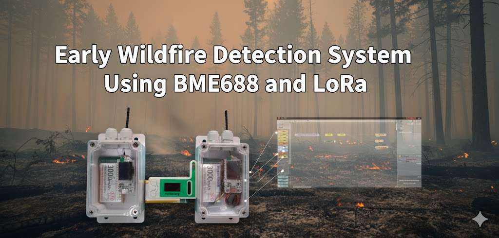
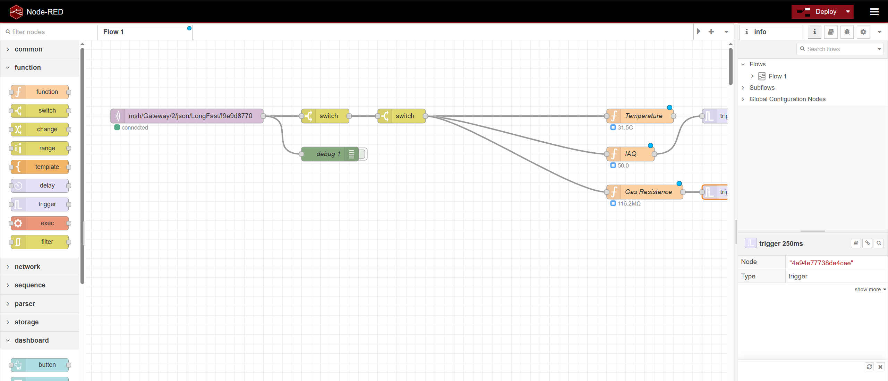
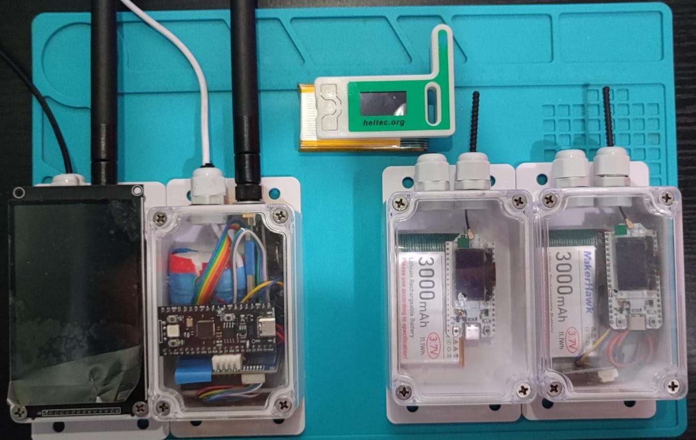

# Your project story

This project was created as a response to the recurring problem of wildfires in my country, Honduras. Every year, thousands of hectares are lost, and one of the most affected areas is La Tigra National Park. Beyond being a protected biodiversity zone, La Tigra is the main water source for the capital city, so early detection of fire activity is critical.

The project aims to show the viability of a low-cost LoRa-based mesh network capable of monitoring air quality in real time across forested areas. The goal is to detect the early signs of a fire before it becomes large enough to cause irreversible damage.

The idea began with an earlier prototype based on an RP2040, an RTC module, traditional LoRa point-to-point communication, and a Sharp GP2Y smoke sensor. The prototype demonstrated that early smoke detection was possible, but it lacked the characteristics needed for a real deployment: energy efficiency, long communication range, and mesh networking. This led to the new design using the Heltec V3 and the BME688 sensor, which better fits the requirements of a forest-scale deployment.

# Preparation

Below is the list of items required for the project, with the exact quantities used and the purchase links for replication.

Heltec LoRa WiFi V3 (3-pack)  
https://www.amazon.com/dp/B0DMN28TRW

BME688 gas sensor modules  
https://www.amazon.com/dp/B0BZ76H645

3000 mAh lithium batteries  
https://www.amazon.com/dp/B0D3LP6F8G

SONOFF IP66 waterproof case  
https://sonoff.tech/products/sonoff-ip66-waterproof-case

Deployment used:  
1x Heltec V3 Sensor Node  
1x Heltec V3 Router  
1x Heltec V3 Gateway

# Implementation process

The project uses one Heltec V3 configured as a sensor node, another as a router, and a third as the receiving gateway. Meshtastic version 2.5.4.8d288d5 was used for the sensor node because it allows shorter telemetry intervals required for this application.

The BME688 sensor is read by the sensor node using the Meshtastic I²C direction pins (GPIO 41 for SDA and GPIO 42 for SCL). The sensor node transmits telemetry over LoRa. The router relays the packets deeper into the mesh, and the gateway node forwards the packets to a local Mosquitto MQTT server. Node-RED processes the incoming data.

Two improvements are proposed for future versions, and these are optional approaches:

Modify Meshtastic firmware to support a pretrained BSEC model on the BME688, trained on clean air and smoke.

Add a secondary microcontroller dedicated to smoke detection logic, sending only the relevant alerts to the V3 via UART.

A third proposal is to replace Meshtastic entirely across the entire system. This would allow the use of a very low-power custom firmware and a communication strategy focused strictly on meeting long-term energy requirements, rather than depending on Meshtastic’s operational model.

Below are the measured average current consumption values:

Router node:  
Standby: 11.1 mA  
Window after data reception (every 1–3 seconds): approximately 130 mA  
During active packet reception: 174 mA

Sensor node:  
Standby: 98 mA  
During LoRa transmission: 170 mA

All measurements were taken using default Meshtastic roles without deep firmware modifications.

# Finished project showcase / Summary

Although the system is still under development, The current implementation demonstrates that BME688 gas measurements, can be transmitted through a local LoRa mesh, and forwards the data to an MQTT server for processing. Although the current implementation is simple, it demonstrates that a distributed private mesh can operate reliably in forest environments to support early detection of fire activity.

The main areas for future improvement include:

Replacing the default Heltec antennas with higher-performance long-range models suitable for forest terrain.

Replacing the Heltec V3 with the Mesh Node T114, which offers significantly better energy efficiency and direct solar-panel support.

Implementing intelligent smoke-detection logic using either a modified Meshtastic firmware or independent microcontroller firmware.

A watchdog-like mechanism that detects silent nodes and automatically triggers a fallback alert if communication is lost.

The Node-RED flow is expected to provide visualization of system states, warnings, and alarms, helping users understand environmental changes in real time and act if needed.

The project shows that early wildfire detection using low-cost mesh networks is achievable and practical. With further optimization and better energy management, these systems can be deployed across large protected areas to help prevent major environmental losses.

