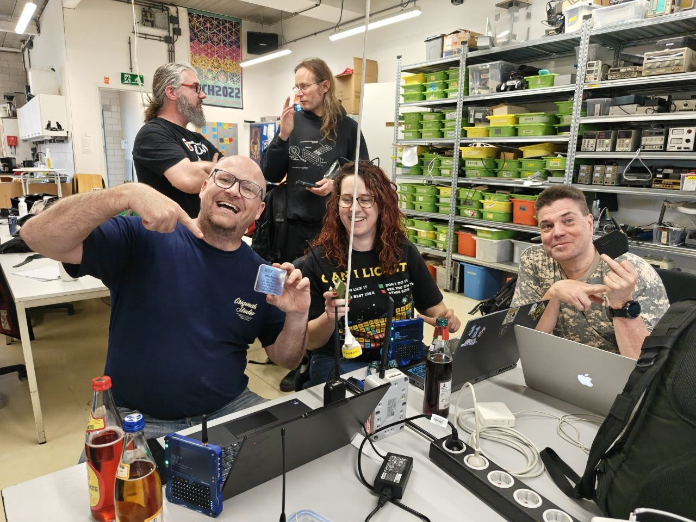
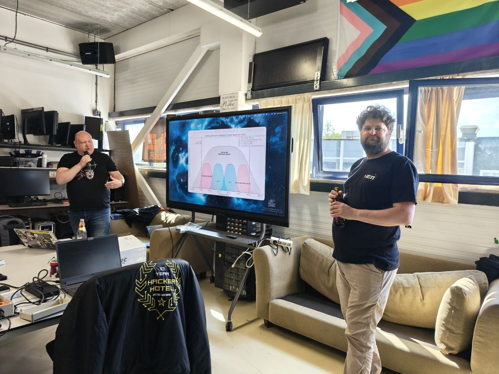
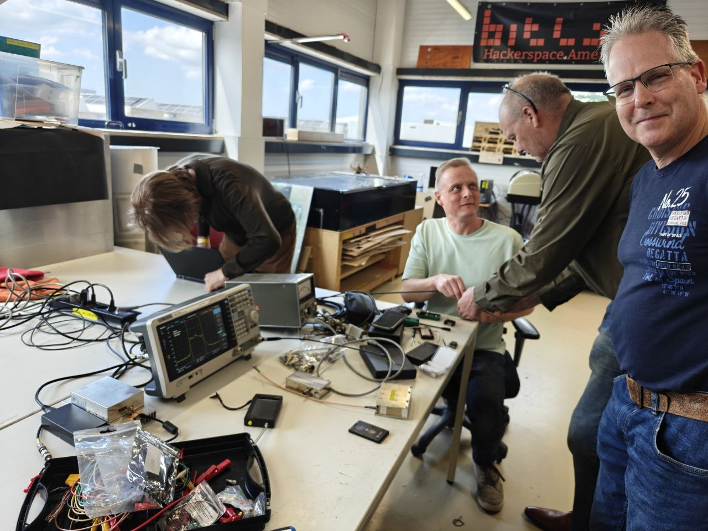
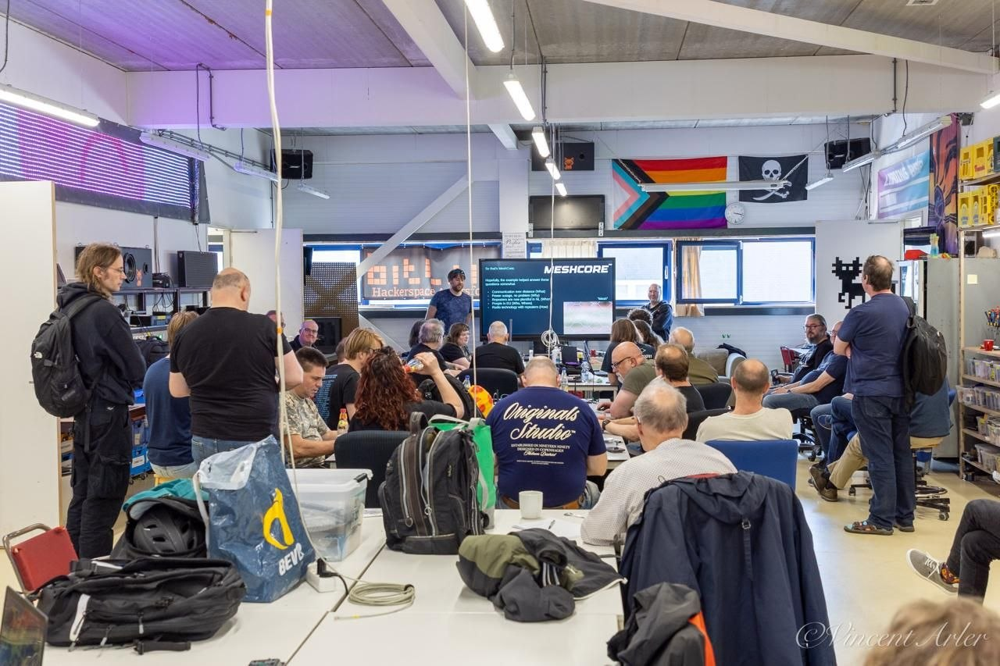
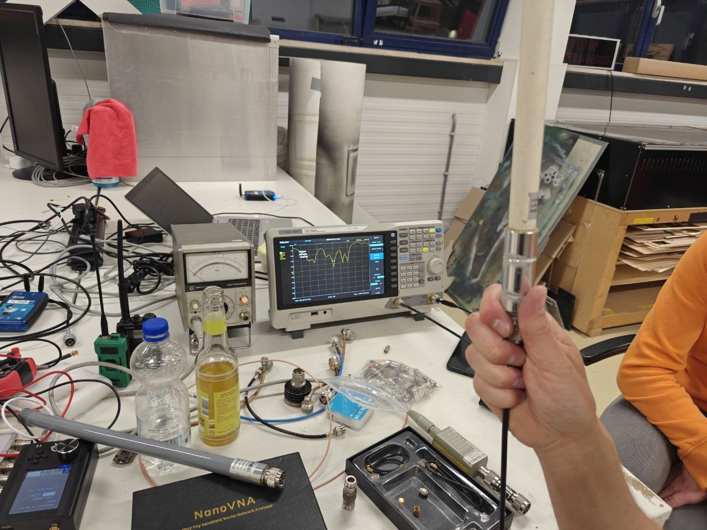

### Amersfoort, the Netherlands — May 2026
Heltec Automation recently supported a MeshCore community meetup held at Bitlair Hackerspace in the Netherlands, where local radio, LoRa, and mesh-networking enthusiasts gathered to exchange knowledge, test hardware, and discuss the future of decentralized communication networks.

The meetup was organized by members of the Dutch MeshCore community and attracted strong interest from local users. Before the event, organizers reported more than 50 expected participants, reflecting the fast growth of MeshCore activity in the Netherlands and the role of hackerspaces in accelerating real-world adoption. During the event, participants discussed a wide range of MeshCore and LoRa-related topics, including MeshCore basics, Companion flashing, radio fundamentals, LoRa transmission, channels, room servers, OTA router updates, local RF regulations, sensors over LoRa, network scalability, and practical outdoor deployments. 

A key focus of the meetup was hands-on testing and technical validation. Community members brought professional RF test equipment, including VNAs, a spectrum analyzer with a rubidium reference, precision power meters, and SDR radios. These tools were used to evaluate antenna resonance, LoRa frequency accuracy, output power, and filter performance. 
Heltec supported the meetup by providing hardware for demonstration and community testing. Around 30 kits based on Heltec V3 and V4 hardware were also prepared by community members for participants who needed additional devices for experimentation and deployment. Heltec also provided a dedicated discount code for meetup attendees to support further community adoption. 

The event also coincided with the Dutch community’s move toward SF7 / CR5 configuration, giving participants an opportunity to configure devices together and discuss performance in a real local mesh environment. 
For Heltec, the meetup provided valuable first-hand feedback from experienced users. In addition to positive community engagement, participants shared technical observations from RF and antenna testing. Heltec has forwarded this feedback to its internal engineering team for further review and will continue to use real-world community data to improve hardware documentation, accessories, and future product design. 
“Real community deployments are extremely important to us,” said Heltec Automation. “Events like this help us understand how users actually build, configure, test, and improve mesh networks in the field. We are grateful to the Dutch MeshCore community for their openness, technical depth, and willingness to share practical feedback.”

The Netherlands has become one of the active regions for MeshCore experimentation, with new repeaters and community-led deployments continuing to appear. According to the organizers, future meetups are expected to continue every few months, helping keep the local mesh community active and connected. 
Heltec will continue supporting community-led events, workshops, and real-world testing efforts around LoRa, MeshCore, Meshtastic, and decentralized IoT communication.

    