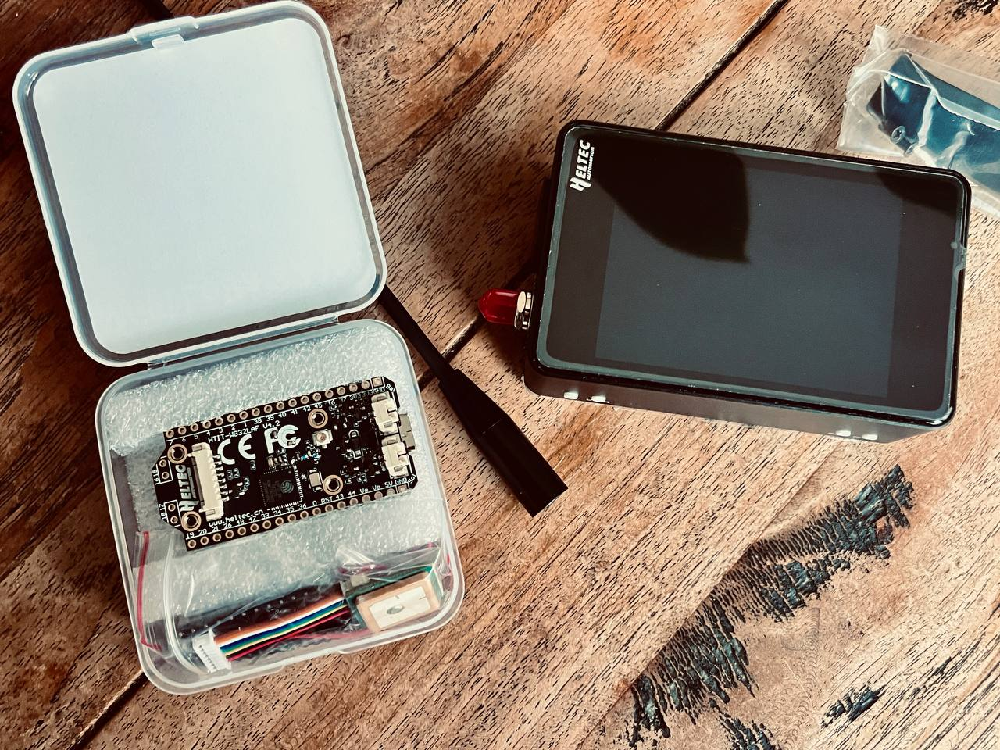
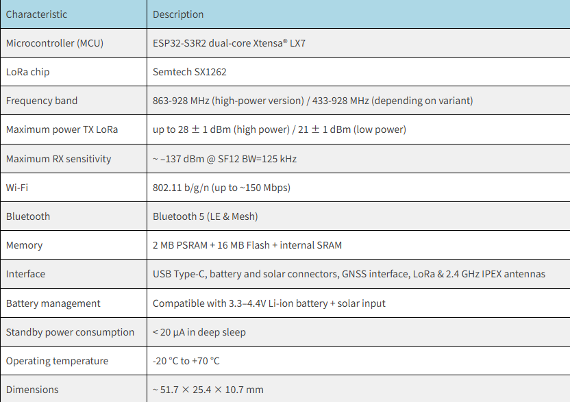
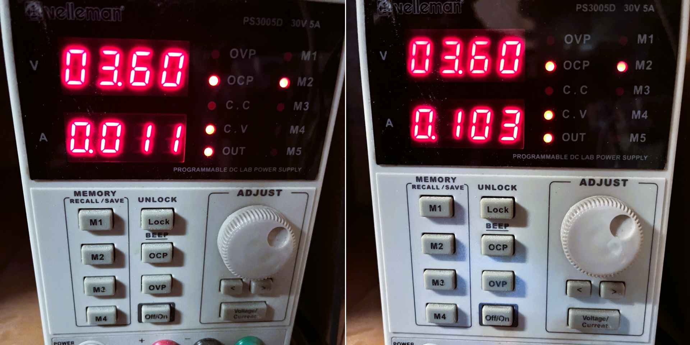
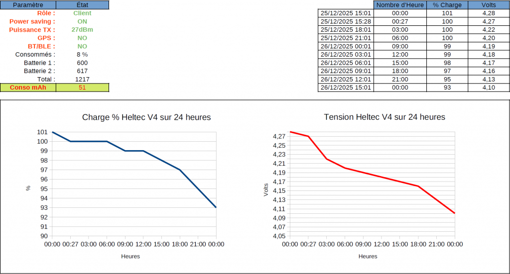
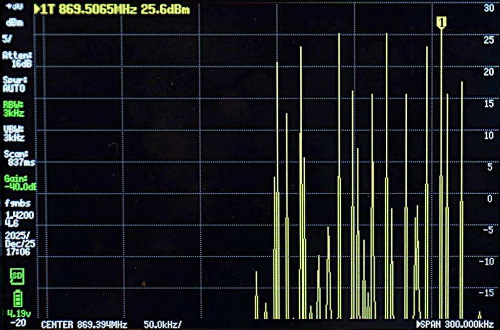

For some time now, we've been exploring the potential uses of [**Meshtastic**](https://meshtastic.org/) and how this type of network can enhance our autonomy. To delve deeper, it's essential to examine the hardware that makes these communications possible. The [**Heltec LoRa 32 V4**](https://heltec.org/project/wifi-lora-32-v4/) is one of the newcomers to the market, and it deserves to be put through its paces.
The goal here is not to offer a quick opinion, but to understand what this node truly brings to the table: radio architecture, transmission power, sensitivity, power consumption, thermal behavior, and results obtained in the field. We will compare the technical specifications with real-world applications to determine under what conditions this module can become a relevant choice for a resilient Meshtastic network.
In other words, we will test, measure and analyze (with enough technical expertise to inform decisions, but without unnecessarily complicating things).

### 1. On paper, the Heltec V4
The [**Heltec V4**](https://heltec.org/project/wifi-lora-32-v4/) uses the [**Semtech SX1262**](https://www.semtech.fr/products/wireless-rf/lora-connect/sx1262) radio chip paired with **an external power amplifier ( PA GC1109 ).** This combination theoretically allows it to reach up to **28 ± 1 dBm** on the European LoRa band, a significant improvement over older modules based on the SX127x series with a typical output power of **21 ± 1 dBm** . The theoretical advantage of this architecture is the ability to transmit over longer distances when needed, while maintaining very low power consumption when the equipment is in standby mode.

In practice, the external amplifier only really consumes power during high-power transmissions; as long as the node is listening or in standby mode, the energy demand remains moderate. However, it should be kept in mind that regularly transmitting at 27 dBm increases power consumption and can cause some internal heating of the module, which may temporarily affect observed values ​​such as RSSI or SNR ( **RSSI** simply indicates how strong the signal is at the antenna, while **SNR** shows how well it stands out from the noise. If either one degrades, the communication becomes less reliable).

Where the SX1262 chip also excels is in signal quality. Its more precise oscillator and reduced phase noise improve frequency stability and make communications more reliable, even in environments where obstacles degrade reception. This is where another key component comes in: the **LNA** (Low Noise Amplifier). Unlike the **power amplifier, which is used to "speak louder ,"** the **LNA is located on the receiving side and is used to "hear better ."** It amplifies very weak signals while adding as little noise as possible, which improves the overall sensitivity of the receiver and increases the chances of decoding distant or weak messages. In other words, the PA helps to reach further when transmitting, while the LNA enhances listening capabilities (both contributing to a more stable effective range).

The SX1262's flexibility also allows for easy adjustment of radio parameters, enabling a balance of range, throughput, and power consumption depending on the scenario [**( Meetstastic Presets )**](https://meshtastic.org/docs/configuration/radio/lora/). Its very fast switching between receive and transmit improves network responsiveness and reduces collisions, while its sensitivity, which can reach down to approximately -148 dBm in certain configurations, allows it to pick up extremely weak signals. **In theory, all of this translates to better range and fewer lost packets** , provided that attention is paid to the heat generated at high power and that real-world performance is validated through field measurements.

> **[**Heltec V4**](https://heltec.org/project/wifi-lora-32-v4/) radio architecture (LNA + PA GC1109)**

The Heltec V4 is based on a separate radio architecture for reception and transmission, optimized for range and reliability.

**Reception (RX):**

Low noise amplifier (LNA) dedicated to reception. Theoretical sensitivity SX1262: up to **–148 dBm** (SF12 / BW125 kHz). Practical effect: better reception of weak signals and more stable communications.

**Emission (TX):**

SX1262 base power: up to 22 dBm . Fixed hardware attenuation: approximately -17 dB . External amplifier: PA GC1109 . Maximum advertised power: up to 28 dBm (depending on settings and conditions).  In France, the maximum must not exceed 27 dBm ( 500 mW ERP = 27 dBm EIRP ).

### 2. Test bench
**2.1 Analysis of the energy consumption of the Heltec V4**

Following a series of comparative tests carried out both via USB-C and via the Vin battery input (with 2 [**Li-Ion model 18650 batteries**](https://www.la-resilience.fr/2025/10/tout-savoir-sur-les-batteries-18650/)  in parallel), with a strictly identical configuration:
[**Gaulix**](https://www.la-resilience.fr/2025/10/meshtastic-vs-gaulix-4-4/) configuration (LM, SF:11, CR:4/8, BW:125kHz) Customer Role **Power Saving** activated. Transmission power set at 27 dBm, GPS declared as **NOT_PRESENT** **Bluetooth disabled** .

Once the test conditions were stabilized and reproducible, laboratory measurements revealed a floor current consumption of approximately **12 mA in deep standby** . During radio standby, the consumption exhibited transient spikes to approximately **115 mA for about ten seconds** , corresponding to the system's wake-up and the LoRa transceiver's reactivation.

During transmission, with the power set to 27 dBm, current draw becomes significantly more pronounced, with peaks **approaching 1 A for approximately one second** . This behavior is consistent with the activation of the power amplifier (GC1109) and the characteristics of the SX1262 when the RF stage is operating at full power.

After 24 hours, the Heltec v4 node in the minimalist configuration mentioned above:

The goal was to **measure the cumulative weighted energy consumption** of the Heltec V4 over 24 hours during its various phases: deep sleep, receive, and transmit. This consumption is heavily influenced by the **duty cycle** and radio conditions, including retransmissions, collisions, and acknowledgments (ACKs). It's important to note that the node was naturally exposed to [**Meshtastic/Gaulix**](https://www.la-resilience.fr/2025/10/meshtastic-vs-gaulix-4-4/) traffic , relayed by my MQTT gateway, which adds a real and dynamic context to the measurements. This approach provides a practical view of average consumption under usage conditions similar to those of a local mesh network.

### Consumption with Bluetooth enabled

I ran another series of tests with Bluetooth enabled. During my previous tests, the difference between Bluetooth enabled and disabled seemed unusual. To eliminate any doubt, I therefore ran a new complete batch, this time letting the Heltec V4 reach its breaking point and reboot.

It appears that below **3.45V** , operation becomes erratic: a slightly high current draw (acknowledgment, telemetry, RF burst, etc.) is enough to trigger a reboot of the ESP32. In my specific case, the reboot occurred at **3.40V** , or about **18% battery charge** , after **46 hours and 40 minutes** of continuous operation.

:::note P.S.
During this period, the actual capacity used was approximately **4429 mAh** , corresponding to an average consumption of around **95 mA** . This is roughly **double the consumption measured with Bluetooth disabled** , confirming the significant impact of BLE on energy consumption.😊
:::

**Operational context of the test**
Power supply: **2 x 18650 3000 mAh batteries in parallel** Bluetooth: **enabled** permanent exhibition at my MQTT gateway ( **Fr_Blabla** ) **active periodic telemetry** approximately a dozen **BLE connections** approximately **thirty LoRa TX messages**

In summary: Bluetooth remains usable, but its energy cost is real. For long-term battery deployment, it should be considered a premium service, to be activated only when needed.

**2.2 Measurement of effective power**

To measure the actual power emitted by the Heltec V4, I used a [**TinySA Ultra Plus spectrum analyzer**](https://www.passion-radio.fr/appareils-mesure-rf/tiny-sa-ultra-2543.html) with a [**40 dB / 10 Wmax attenuator**](https://www.amazon.fr/dp/B0F7R2FXRP/r?th=1&linkCode=sl1&tag=laresiliencef-21&linkId=99e99da7f4378daef387b8bd25523240&language=fr_FR&ref_=as_li_ss_tl) inserted between the transmitter and the device to protect it from an excessively strong signal. The screenshot below shows a measured power of **25.6 dBm** , with an accuracy of ±2 dBm. It also shows the **power peaks corresponding to the module's actual emissions** , allowing for a concrete visualization of the signal dynamics during transmissions and verification of its behavior under real-world conditions.

Considering the calibrated reality of the attenuator and the margin of accuracy of the analyzer, with this measurement, the officially announced power level can be considered real.

<iframe width="740" height="315" 
        src="https://www.youtube.com/embed/WIeO5guPn-w" 
        title="Instructional Video" 
        frameborder="0" 
        allow="accelerometer; autoplay; clipboard-write; encrypted-media; gyroscope; picture-in-picture" 
        allowfullscreen>
</iframe>

:::note P.S.
Competitive position: Today , on the market, the Heltec V4 is one of the few Meshtastic nodes offering such high output power . No other module certified for Europe combines both Meshtastic compatibility and this level of transmission power, making the Heltec V4 the preferred choice for those seeking a node that is both high-performing and compliant with existing standards.
:::

### 3. Evaluation of the trial period

Through measurements and tests, the Heltec V4 is gradually establishing itself as a credible platform for deploying autonomous Meshtastic nodes powered by battery and solar panels. Despite its notoriously power-hungry ESP32 microcontroller and an RF stage reaching 27 dBm, its energy consumption remains surprisingly manageable. Sleep phases, radio wake-ups, and transmission peaks follow a reproducible pattern, allowing for more confident prediction of actual power consumption and thus proper sizing of the power supply chain.

:::note 
As an order of magnitude, going from a node configured at 22 dBm to a Heltec V4 at 27 dBm does not represent “a small step up”, but about **three times more emitted power** .
:::

In this context, the Heltec V4 is no longer limited to purely experimental use. When properly configured, installed correctly, and connected to a coherent power system, it can reliably fulfill its role as an infrastructure node while providing robust radio coverage. Adding an external, Meshtastic-compatible RTC clock, such as the PCF8563, would further enhance this capability: by stabilizing time management during deep sleep phases, it optimizes wake-ups, avoids unnecessary activations, and directly contributes to preserving battery life.

In summary, what appears on paper as a powerful but power-hungry card turns out, in reality, to be a platform surprisingly well-suited to off-grid scenarios (provided that energy is approached as a component of the system in its own right, and not as a simple accessory).

### 4. Deployment outlook

Let's take a concrete example. Imagine a Meshtastic node based on a Heltec V4, installed outdoors, and powered by a small 10W solar panel combined with two 21700 Li - ion batteries (e.g., 2 x 4800mAh) mounted in parallel.

In this configuration, the two 21700s act as a true buffer. Their higher capacity and low internal resistance allow them to easily handle the near 1 A peaks generated during 27 dBm transmissions, while preventing the sudden voltage drops that can cause the node to restart. Meanwhile, the 10 W panel doesn't attempt to power the system in real time; it recharges gradually, as sunlight becomes available.

On a typical day, solar production can be sufficient to replenish the energy consumed, especially if the software configuration limits unnecessary wake-ups and optimizes standby periods. And when the weather deteriorates—overcast skies, snow, partial shade—the dual 21700 battery pack ensures continuity, significantly delaying the drop to the critical threshold around 3.2V. The system then functions as a coherent whole: the panel recharges gradually, the battery absorbs fluctuations, and the node maintains its radio availability.

Because the cells are connected in parallel, the voltage remains stable, the solar controller operates within a comfortable range, and the average depth of discharge decreases, thus extending battery life. This example illustrates a simple yet robust architecture: a Heltec V4, two 21700s, an [**MPPT**](https://en.wikipedia.org/wiki/Maximum_power_point_tracking) , and a 10W panel form a realistic basis for a truly self-sustaining Meshtastic infrastructure node.

### 5. And then

The measurements presented here constitute a first step. They will be **supplemented by real-world field** tests to compare theoretical and laboratory data with the constraints of the outside world. Furthermore, a **dedicated article will soon be published on the integration of the Heltec LoRa 32 V4 into the "Mobile" expansion kit** , the **WiFi LoRa 32 Expansion Kit** ( [**Heltec link**](https://heltec.org/project/wifi-lora-32-v4-expansion-housing/) ), allowing exploration of mobile applications and the hardware expansion possibilities offered by this module.

### Some radio basics & LoRa specifics

### dBm – Power

A unit that expresses power in milliwatts on a logarithmic scale. It describes **the electrical energy actually sent by the device to the antenna** .

>0 dBm = 1 mW  10 dBm = 10 mW  20 dBm = 100 mW: Each **+10 dBm multiplies the power by ten** . This is the base value from which everything else is calculated.

### dBi – Antenna Gain

The unit expressing the gain of an antenna relative to an [**ideal isotropic antenna**](https://en.wikipedia.org/wiki/Isotropic_radiator) . The dBi does not create **any additional power** ; it **directs and concentrates energy in certain directions to improve effective range**. A high-gain antenna is not "more powerful," it is more directional .

### RSSI – Received Signal Strength Indicator for LoRa

> The strength of the signal actually received by the device, expressed in dBm (always negative). This is the **“perceived power”** on the receiving side.
-30 to -60 dBm : excellent -60 to -90 dBm : acceptable / reliable -90 to -120 dBm : reception limit, strongly dependent on the spreading factor and the band used

### SNR – Signal-to-Noise Ratio and LoRa features

Ratio between the received signal and the surrounding noise, expressed in dB. Unlike other radio technologies, **LoRa can decode a signal even with a negative SNR** , thanks to its **chirp spread spectrum (CSS)** modulation .
**Typical SNR LoRa beach:**

> 0 dB : very good signal 0 to -10 dB : weak but usable signal -10 to -20 dB : decodable according to the spreading factor (SF) < -20 dB: almost impossible
**Example minimum SNR per SF (Semtech SX126x)**: SF7 → –7.5 dB | SF8 → –10 dB | SF9 → –12.5 dB | SF10 → –15 dB | SF11 → –17.5 dB | SF12 → –20 dB
The higher the SF, the better LoRa can recover a signal buried in noise.

### SF – Spreading Factor (LoRa only)

The **Spreading Factor** defines **the number of symbols used to encode each bit** in the LoRa CSS modulation.
The higher the SF , the more each bit is spread over several symbols, which lengthens the frame duration . A longer frame increases the range and allows decoding of signals even with a negative SNR , but reduces the throughput . Typical values ​​range from SF7 to SF12 , with SF12 offering the maximum range but the minimum throughput.

### EIRP – Equivalent Isotropic Radiated Power
The EIRP corresponds to **the theoretical power** radiated by the "transmitter + antenna" system. It is calculated as follows: **EIRP = Power (dBm) + Antenna Gain (dBi) – losses (cables, connectors)**.
This is the value used by regulations because it reflects the actual effect of the antenna in space.

### PAR / ERP – [**Apparent Radiated Power**](https://en.wikipedia.org/wiki/Effective_radiated_power)

An alternative version of EIRP, based not on an isotropic antenna but on a half-wave dipole . In practice, we consider: PAR or ERP = EIRP – 2.15 dB.
The logic remains the same: it is an estimate of the actual radiated power, but with a different reference.

### Why do these concepts really matter?

Because they allow us to distinguish:

> what the device actually emits (dBm), what the antenna does with this energy (dBi), what the other device receives (RSSI), in what “cleanliness” it receives it (SNR, LoRa only), the duration and range of the frames (SF, LoRa only), and what power is actually sent into the environment (PIRE/ ERP).

From a regulatory perspective, most LoRa regions manage devices based on the maximum EIRP.

### Application to Meshtastic in band 869.4–869.65 MHz
The region setting in Meshtastic is primarily used to adjust the frequency and duty cycle rules, but it does not limit the module's transmission power. To comply with regulations, you must therefore manually adjust the power based on the antenna and signal loss.

In the European Union, and therefore in France, Decision 2006/771/EC as amended (band no. 54) authorizes:
500 mW PAR = 27 dBm WORSE EIRP

This means that:

If your antenna has a gain of 2 dBi And that your cable loses 0.5 dB → Your module output power should be set to around 25.5 dBm to comply with 27 dBm EIRP.
