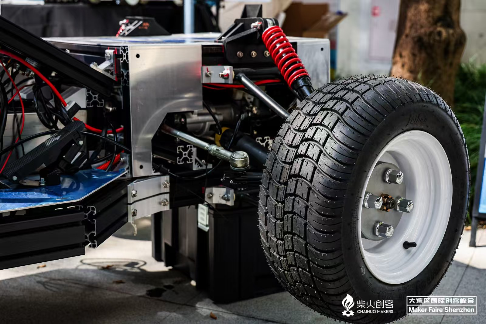
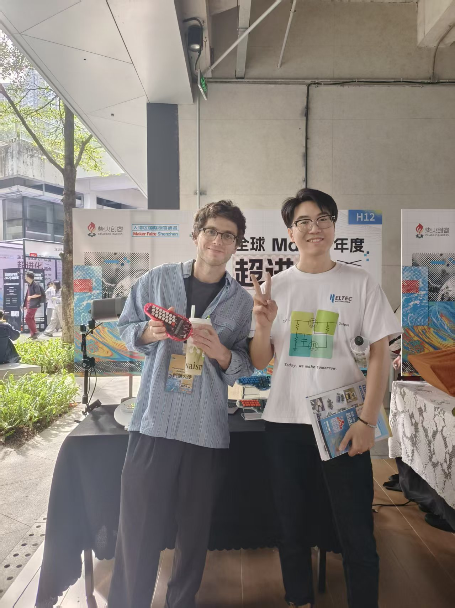
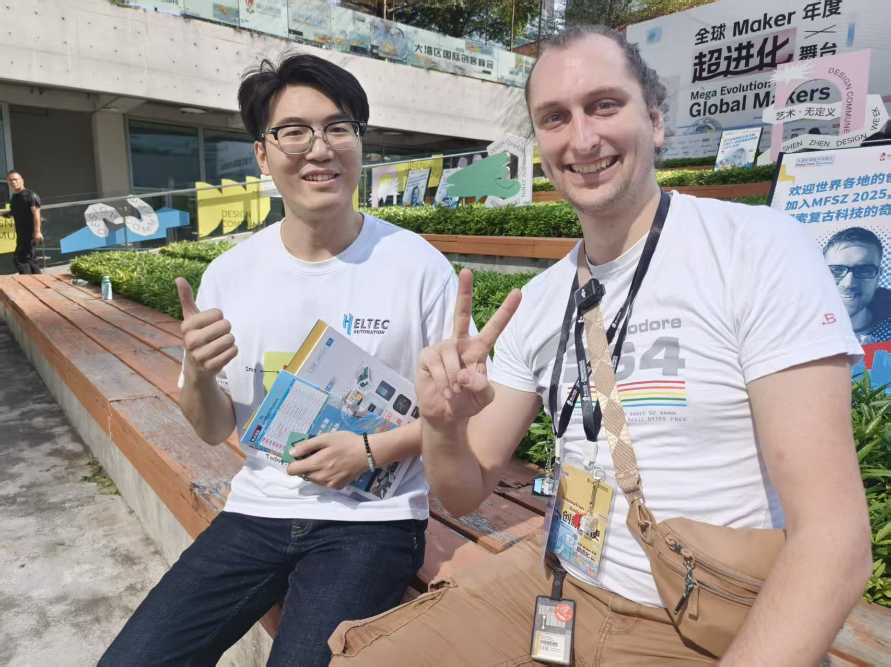
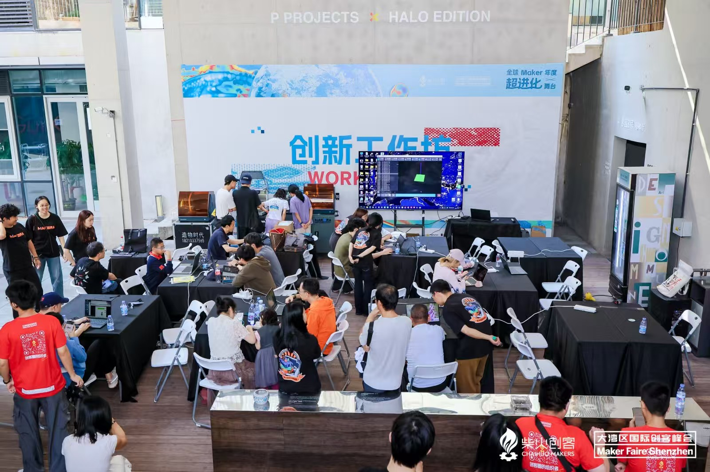

**Shenzhen, China – November 15–16, 2025** – The Heltec team recently attended **Maker Faire Shenzhen 2025**, one of Asia’s most influential gatherings for makers, innovators, and technology enthusiasts. The event brought together hundreds of exhibitors from across the globe, showcasing advancements in robotics, AI, embedded systems, sensing technologies, and next-generation hardware.

<!-- truncate -->

### **A Multi-Dimensional World Requires Multi-Dimensional Solutions**

One of the strongest impressions from this year’s Maker Faire is that today’s technology landscape is increasingly **diverse and integrated**. No single feature or standalone product can fully meet modern customer expectations. The industry is clearly moving toward *cross-disciplinary innovation, interoperability, and system integration*.

Throughout the exhibition, we observed that products are now valued not only for individual features but for their ability to **connect, communicate, and collaborate** with other systems—a philosophy that perfectly aligns with Heltec’s product vision.

### **A Showcase of Cutting-Edge Innovation**

The Heltec team explored numerous maker booths representing a wide range of technologies, including:

- **Artificial Intelligence and Large-Scale Computing**
- **Bionic Robotics and Advanced Mechatronics**
- **Novel Sensor Technologies**
- **Low-Power Wireless Communication and IoT Solutions**
- **Maker Tools and Rapid Prototyping Platforms**

What excited us most was not just the technologies themselves, but the **creativity and imagination** they enable. With easier access to hardware and AI, more makers than ever are turning ideas into functioning prototypes—and even production-ready products.

This perfectly reflects Heltec’s mission:
 **to make advanced IoT and wireless technologies accessible, flexible, and empowering for innovators worldwide.**

### **Meaningful Industry Conversations**

During the event, the Heltec team engaged in productive discussions with companies, open-source communities, and hardware developers. These exchanges provided valuable insights into industry needs, potential collaborations, and emerging application scenarios, ranging from outdoor communication networks to AI-driven sensing systems.

These conversations reinforced our belief that innovation thrives when knowledge is shared, challenges are embraced, and communities collaborate openly.

### **Special Thanks to Chaihuo Maker Space**

We sincerely thank **Chaihuo Maker Space**, the official organizer of Maker Faire Shenzhen, for their professionalism and community-driven approach. The event was vibrant, well-structured, and full of energy, creating a platform where creativity, engineering, and the maker spirit could flourish.

### **Looking Ahead**

Maker Faire Shenzhen 2025 was more than just an exhibition—it was a reminder of the rapid evolution of technology and the people driving it. Heltec leaves the event inspired, with fresh ideas and renewed commitment to integrating innovation into upcoming products.

We look forward to participating as exhibitors next year, sharing our cutting-edge wireless and IoT solutions with the global maker community, and presenting our vision for the future of intelligent connectivity.