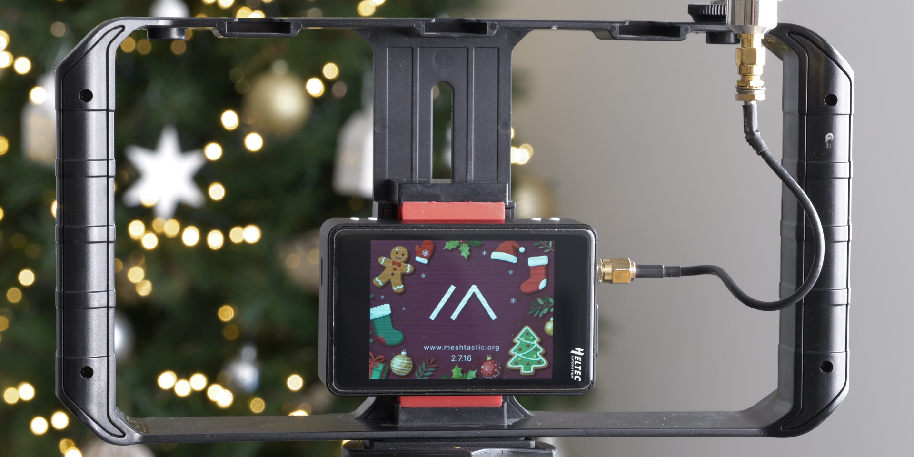
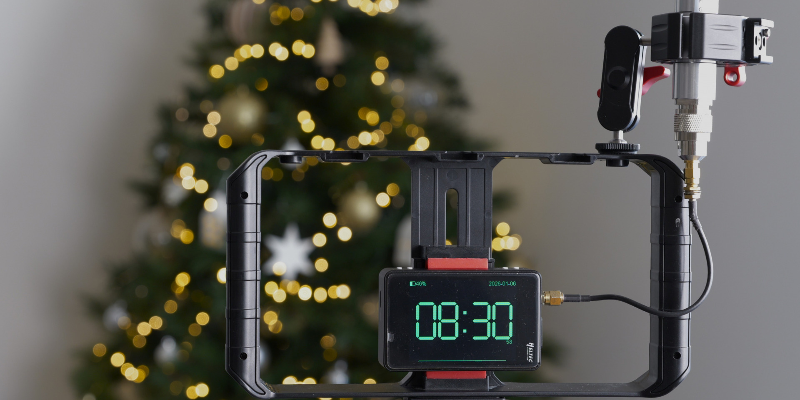
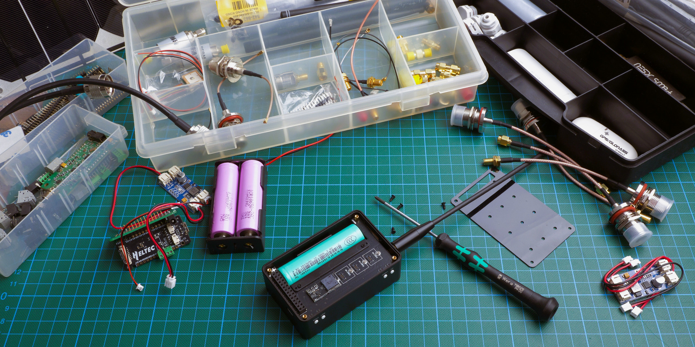
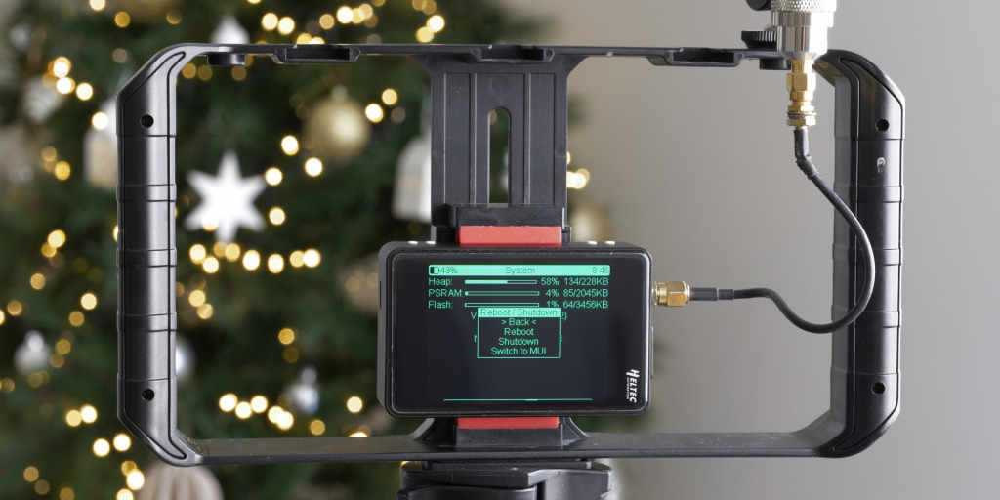
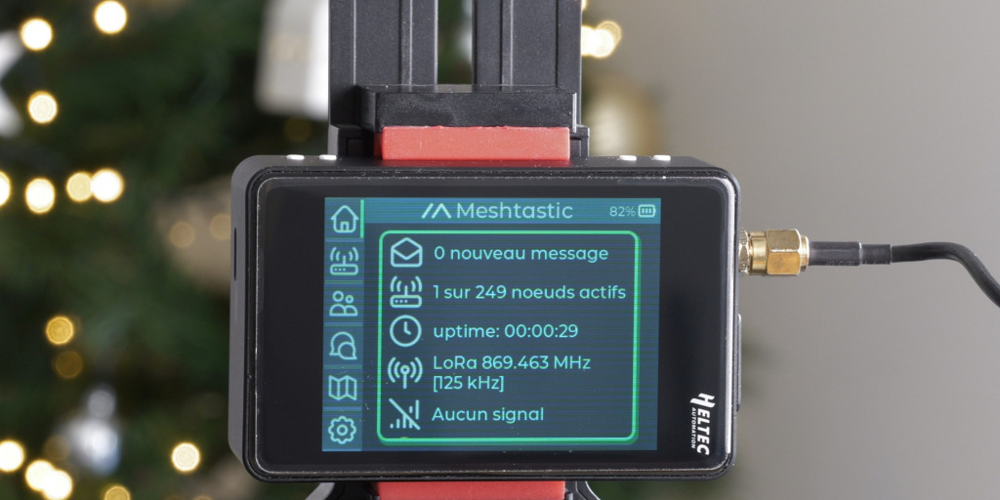
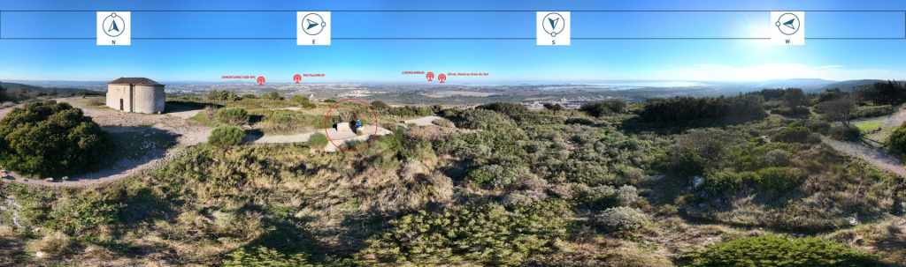
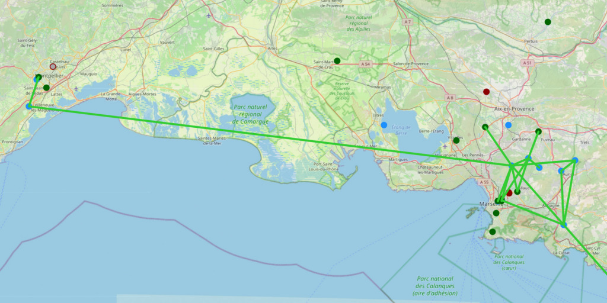

In my previous article on the [**Heltec LoRa 32 V4 test result**](https://wiki.heltec.org/news/heltec-v4-test-result/heltec-v4-test-result), I subjected this Meshtastic node to a description, but more importantly, to a series of rigorous technical tests: radio architecture, transmission power, reception sensitivity, energy consumption, and real-world performance. I demonstrated that this platform, equipped with an **ESP32-S3R2** microcontroller and an **SX1262** chip with an external amplifier, can achieve useful power levels (up to ~27 dBm in a configuration compliant with European standards) while maintaining relatively low power consumption during standby and wake-up phases.

These results showed that the V4 performs well in terms of connectivity and Meshtastic stability , and that it provides a reliable foundation for network deployments. However, its "experimental" form factor and ergonomics remain those of an electronic assembly board: if I want to use it in the field, in mobile situations, or for practical applications, certain limitations therefore arise.

For this purpose, the [**Heltec WiFi LoRa 32 Expansion Kit**](https://heltec.org/project/wifi-lora-32-v4-expansion-housing/) exists: it doesn't modify the V4's performance, but offers a version adapted for practical and mobile use, with a more accessible interface and improved ergonomics. This article presents this kit [**( Unboxing )**](https://gaulix.fr/%f0%9f%93%a6-wifi-lora-v4-expansion-board-deballage-mise-en-route/) focusing on **its field utility, ergonomics, interface, and concrete benefits for a Meshtastic user** . Its role isn't to add obscure features: it serves to transform a high-performance module into a **mobile tool** , ready to be carried in a backpack, deployed on a ridge, a high point, an improvised mast, or a suitable tripod.

This article therefore presents this kit by focusing on its field utility, its ergonomics, **its interface and the concrete benefits for a Meshtastic user** .

### Mobility and autonomy

The first thing that strikes you about the Expansion Kit is its **ability to be used immediately, without complex installation .** The integrated battery allows for several hours to a full day of operation without an external power supply, and the rigid yet lightweight casing makes the node easily portable with its belt clip. It can be slipped into a bag, placed on a flat surface, or held in your hand to control the Meshtastic network. This portability transforms a technical module into an **operational tool** , usable right out of the bag. Like its competitors, it boasts a relatively compact size and weight.

### Interface and user experience (UX/UI)

One of the major advantages of the Expansion Kit is that it allows the use of a Meshtastic node **without constantly relying on a computer or phone .** The kit actually offers **three complementary** interaction methods , covering both rapid diagnostics and routine operation.

#### 1️⃣Standalone use with the native firmware interface

The Meshtastic firmware already includes a minimalist interface, designed to work:

with the physical buttons , . with touchscreens , depending on the type of screen, . via short presses / long presses to access essential functions. . This interface allows you to: without any further assistance.

check the node status, . check the network connection, . display simple information (messages, neighbors, radio status), . trigger certain basic actions.
In practice, this addresses a simple need: To be able to **control the node and understand what it is doing , even if the smartphone remains in the bag or has no battery.**

It's not visually spectacular, but it's reliable, understated, and sufficient for most usage scenarios.

#### 2️⃣MUI: A richer, fully touch-sensitive interface

The MUI (Meshtastic User Interface) mode provides an additional layer, more modern, more readable and designed for the kit's touch screen.

The display now reads:

more graphic,. better structured,. closer to a small embedded application.

MUI allows, in particular:

smooth navigation between menus,. a clearer visualization of nodes and messages,. a better understanding of network activity.

The benefit is twofold:

Immediate understanding : we “see” what is happening more quickly.. Field decision : we can decide to move the node, adjust a position, or simply check that everything is rotating correctly.

In practice, MUI truly transforms the kit into a **portable monitoring terminal** , usable without mediation.

#### 3️⃣ Connexion Bluetooth via l’application smartphone

Third option: Bluetooth connection with the Meshtastic app. Here, the kit becomes the heart of the system, but it relies on the smartphone for:

manage messages,. configure the node,. view history,. manipulate advanced settings.

The advantage is obvious: When you need to go further, everything is done from the application, wirelessly, and without having to plug anything in.

Bluetooth therefore allows:

a finer configuration. comfortable typing. and extensive control.

The kit retains its autonomy, but the smartphone becomes a **control tablet .**

### Survey and range tests: First concrete results

To put the [**Heltec WiFi LoRa 32 Expansion Kit to the test**](https://heltec.org/project/wifi-lora-32-v4-expansion-housing/) , I wanted to move beyond theory and conduct a real-world trial. So I climbed to a high point, around 200 meters above sea level, located approximately ten kilometers from one of my modules. The objective was simple: to verify whether, under favorable conditions, the Heltec V4 equipped with the expansion kit remained truly usable for significant long-distance communication.

The result was more than convincing. From this elevated position, I was able to communicate easily with my residential module. Messages were transmitted quickly, without any unusual delays, and the communication remained perfectly smooth. This confirms that with minimal clearance, the system's practical range becomes very impressive, even without an optimized fixed installation.

But the experiment didn't stop there. By observing the grid, I also began to detect several distant nodes. From the Hérault region, I saw modules appear located in the Vaucluse, the Gard, and the Bouches-du-Rhône.

This is not a scientific measurement campaign, but rather a concrete indicator : The Meshtastic/Gaulix network exists, it is alive, and it becomes visible as soon as you gain a little altitude.

These observations highlight one key point: the range is highly context-dependent. A few extra meters of altitude radically change the experience. One becomes not only able to communicate with a module some ten kilometers away, but also to perceive the larger network structure—in this case, the Gaulix radio mesh —as it operates and propagates across the territory.

### Conclusion: A powerful platform, finally usable in the field

With the Expansion Kit, the Heltec WiFi LoRa 32 V4 takes on a whole new dimension. In my previous article, I demonstrated that this module was already remarkable from a technical standpoint: high transmission power, efficient radio sensitivity, stability, and reasonable power consumption. In other words, the V4 has a real performance reserve, capable of supporting Meshtastic exchanges in sometimes demanding environments.

What the kit offers isn't "more power" or "more range." The radio itself remains the same, with its inherent qualities. The difference is that this performance finally becomes useful for everyday mobility .

Thanks to the casing, integrated battery life, onboard interfaces, and Bluetooth, I can truly utilize this radio capability in the field: testing, observing, exchanging information, climbing to a high point, and understanding how the network behaves. It's no longer just a laboratory module; it's an operational tool.

In the future, I will continue testing — particularly with finer measurements (RSSI, SNR, link regularity) and in **varied environments.**

:::note P.S.
The original article was written by a French user, and we have obtained permission to republish it.
If you would like to read the original article in French, you can view it [**here**](https://www.la-resilience.fr/2026/01/heltec-wifi-lora-32-expansion-kit/).
:::
