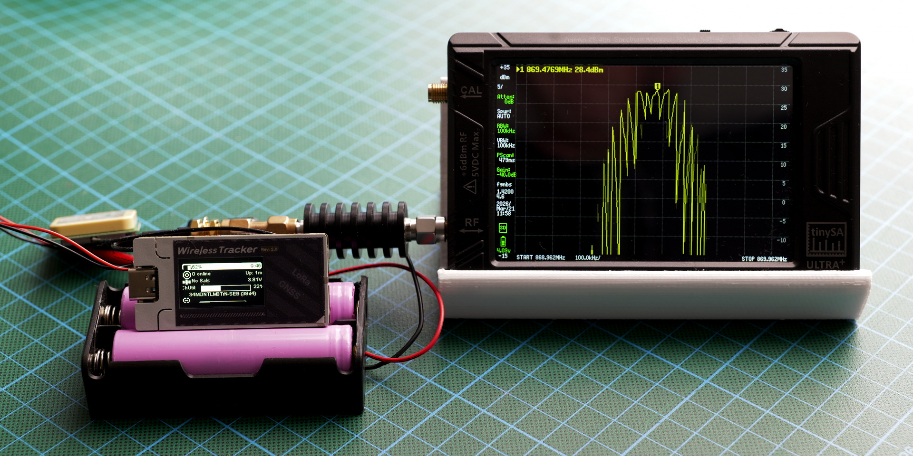
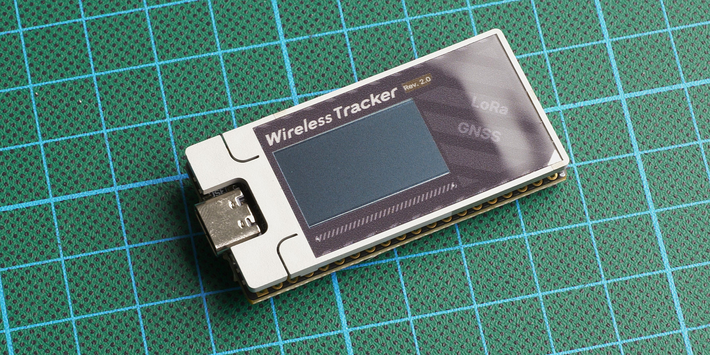
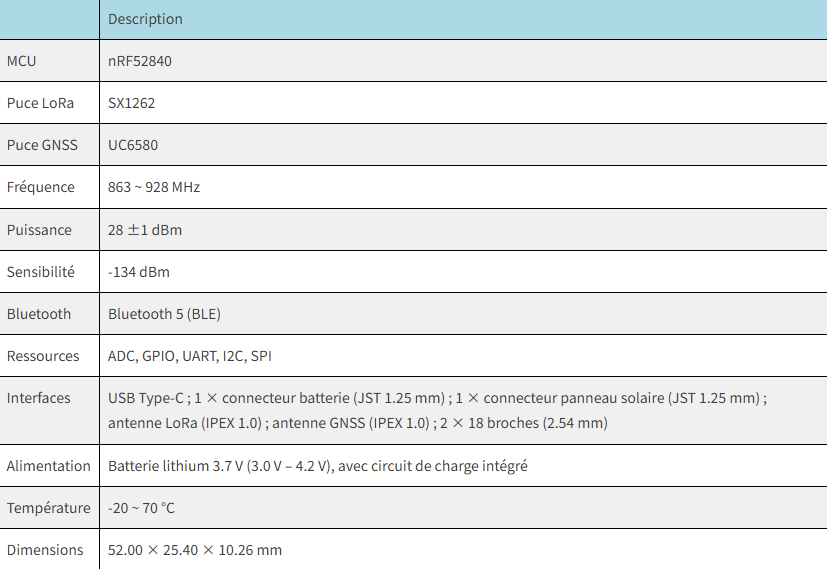
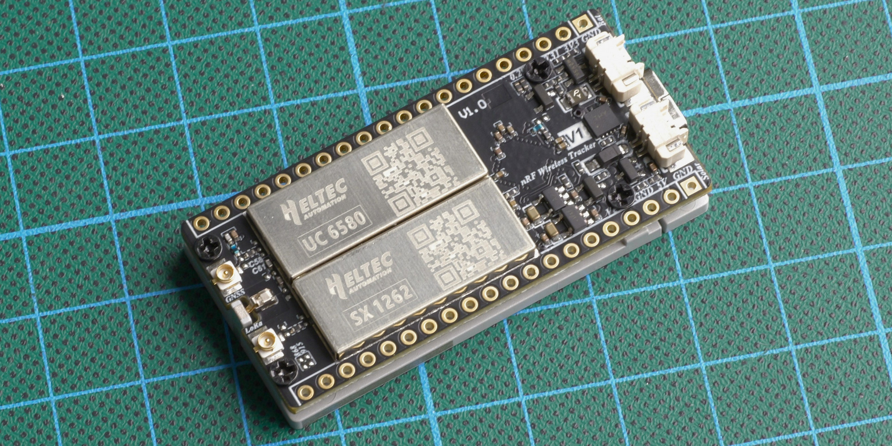
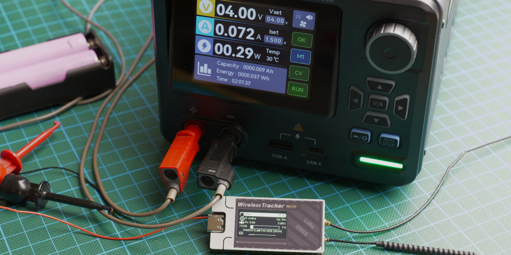
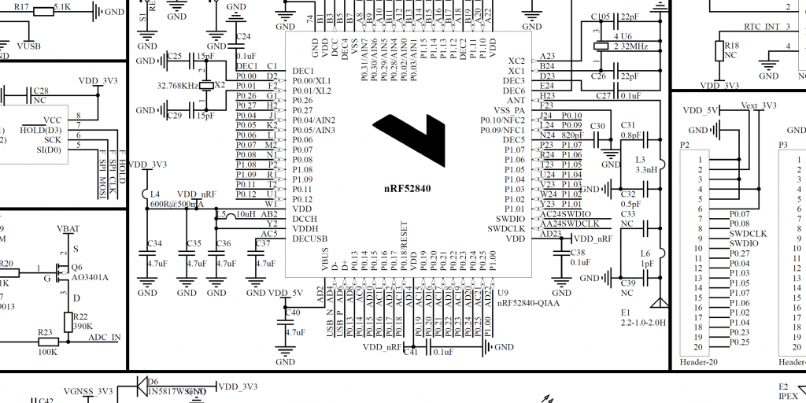
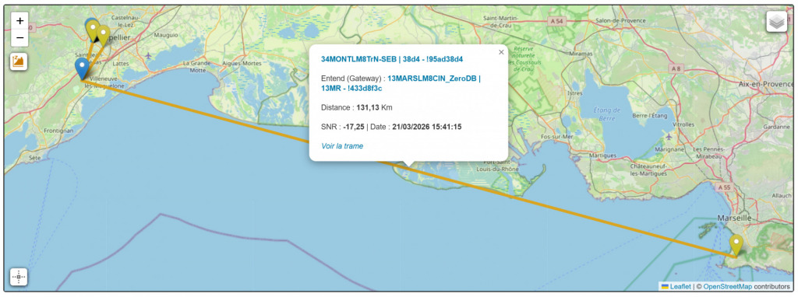

What can the [**Heltec Wireless Tracker v2**](https://heltec.org/project/wireless-tracker-v2/) be used for ? In situations of disruption (unavailable cellular network, infrastructure overload, loss of coordination), the main problem is not just communication, but knowing the whereabouts of family members, friends, or clans. A LoRa/Meshtastic tracker provides a simple solution to this need: it allows for a **basic awareness of location, without relying on a mobile network operator .**

In practical terms, it becomes a distributed coordination tool . **A group can track the movements of its members, visualize relative positions (azimuth), identify delays, deviations from the trajectory, or when a regrouping point has been reached .** Whereas voice radio requires being available at the right time and manually plotting the position on a paper map, the tracker sends very precise and regularly updated information to the local Meshtastic network on your private channel.

It also makes perfect sense in a context of retreat and mobility. During a move to a safe location, or within a multi-site strategy (plans A, B, C), it allows confirmation that an individual or team has indeed reached a given area, without the need for lengthy or energy-intensive exchanges. **This is particularly relevant if communications must remain brief, discreet, or infrequent .**

Discreet use: A tracker can be configured to transmit periodically without human intervention. In case of a problem (incident, loss of contact, immobilization), the last known position becomes usable information. It's not a miracle solution, but it's often the only data available when everything else has failed.

Finally, in a mesh network like Meshtastic, the tracker doesn't work alone. It relies on a lightweight infrastructure of fixed or mobile nodes to relay information. This enables the creation of a collaborative location capability that is inherently resilient because it is distributed and without a central point.

Ultimately, the value of a tracker in a resilience strategy is not technological. It is operational: reducing uncertainty about people's locations and maintaining a minimum level of coordination when traditional methods fail.

### The Wireless Tracker v2 (nRF52840)

When [**Heltec Automation**](https://heltec.org/) offered me the opportunity to test their new tracker in advance, I saw it as the perfect opportunity to move beyond simple “classic node” use and explore a much more specific role: that of a field tracker .

Testing a product before its release is always interesting. But here, the idea was mainly to go beyond the technical specifications: to understand how this type of node performs in real-world conditions, what it actually brings to the field… and above all, where its limitations lie.

So I accepted without much hesitation, with one question in mind: can this add value to our resilient preparations?

### Feature

### Energy balance

> Measurement from scratch: 50 mA in standby/idle, 70 mA in current consumption and 850 to 950 mA at TX/Burst transmission.

## A. Operational context of the test with the Meshtastic Client role:
Power supply:  2 × 18650 2600 mAh batteries in parallel. Bluetooth:  enabled. permanent exhibition at my local MQTT gateway [**( Gaulix Canal Fr_Blabla )**](https://www.la-resilience.fr/2025/10/meshtastic-vs-gaulix-4-4/). approximately ten BLE connections during the test period (12 hours). approximately twenty LoRa TX messages were sent during the test period (12 hours).

:::note
The average consumption of the Client node over the period is `58 mAh` 
:::

## B. Operational context of the test with the Meshtastic Tracker role:
Power supply:  2 × 18650 2600 mAh batteries in parallel Bluetooth:  enabled permanent exhibition at my local MQTT gateway ( Gaulix Canal Fr_Blabla ) approximately ten BLE connections during the test period (12 hours) approximately five LoRa TX messages during the test period (12 hours)

:::note
The average power consumption of the tracker node over the period is `37 mAh` 
:::

### In terms of power

To measure the actual power output of the **Heltec Wireless Tracker v2 (nRF52840)** , I used a [**TinySA Ultra Plus spectrum analyzer**](https://www.passion-radio.fr/appareils-mesure-rf/tiny-sa-ultra-2543.html) with a 40 dB / 10 Wmax attenuator placed between the transmitter and the device to protect it from an excessively strong signal. The screenshot below shows a measured power of **28.4 dBm** , with an accuracy of ±2 dBm. Considering the attenuator's actual calibration and the analyzer's margin of error, this measurement confirms that **the advertised power level has been achieved .**

> ### Legislative reminders – Application to Meshtastic in the 869.4–869.65 MHz band
> 
> The region setting in Meshtastic is primarily used to adjust the frequency and duty cycle rules...
> 
> **500 mW PAR = 27 dBm WORSE EIRP**
> 
> This means that:
> - If your antenna has a gain of 2 dBi
> - And that your cable loses 0.5 dB
> - → Your output power module should be set to around **25.5 dBm**

Following the mid-March launch of the [**ESP32-S3 version of the Wireless Tracker V2**](https://heltec.org/project/wireless-tracker-v2/) , the next [**version will adopt an nRF52840 microcontroller**](https://www.la-resilience.fr/wp-content/uploads/2026/03/Mesh_Node_T096_V0.2.pdf), **chosen to reduce power consumption while maintaining the same basic hardware architecture. LoRa communication relies on the SX1262 chip**, accompanied by a KCT8103L amplifier front-end (PA/LNA) that stabilizes the signal and optimizes transmission and reception.

**The UC6580 GNSS/GPS module** provides positioning by utilizing multiple satellite constellations **( GPS, GLONASS, BeiDou, Galileo )**, reducing positioning times and improving reliability in urban or wooded areas. Its optimized power consumption and intelligent sleep mode perfectly align with the nRF52840's design philosophy, ensuring that geolocation does not significantly impact the device's overall battery life.

Power management is handled by the **CN3165** controller , which oversees the charging and powering of the battery and other components. The whole system forms a relatively coherent platform: a less power-hungry nRF52840 MCU, operational LoRa radio, active geolocation, and controlled battery life, all while remaining simple and robust in terms of hardware. However, the integration of this controller into the architecture is inherently limited to the use of a low-power solar panel (approximately 3 watts).

:::note
Note that even though the system can benefit from more advanced energy management by delegating control to an additional module [**( such as an MPPT )**](https://en.wikipedia.org/wiki/Maximum_power_point_tracking), it's important to remember that this node is primarily designed for integrated tracking, for example in vehicles, where it will be highly autonomous. In standalone, autonomous use, its operation will remain dependent on the initial capacity of its battery.
:::

🌿**CN3165**

A significant limitation of integrating the CN3165 into this type of node is the lack of intelligent power management. The circuit offers neither true load sharing (distribution between external power supply and battery) nor power path management. In practical terms, even with solar power available, the system relies directly on the battery to operate. Furthermore, unlike a more advanced BMS incorporating [**Schmitt trigger**](https://fr.wikipedia.org/wiki/Bascule_de_Schmitt) logic (for example, shutting down at 3.0V and restarting only at 3.5V), the CN3165's behavior is based on a single implicit threshold. As a result, the system can become stuck in an unstable state, unable to restart properly when the battery recharges slowly, particularly in degraded solar conditions.

🌿**KCT8103L**

Heltec Automation's choice to switch to the KCT8103L chip is simply explained by a better compromise between useful radio performance and power consumption.

In terms of performance, the gain doesn't come from higher transmission power, but from cleaner reception. The KCT8103L introduces less noise and improves sensitivity, which increases the truly usable signal-to-noise ratio (SNR). In LoRa, this parameter determines the effective range and stability of the transmission. In practical terms, a node picks up weak signals better and decodes more reliably, which has a much greater impact than a few extra dBm in transmission power.

In terms of power consumption, the difference is clear. Power-oriented solutions like the [**GC1109**](https://wiki.heltec.org/news/heltec-v4-test-result/heltec-v4-test-result) draw high currents during transmission, resulting in lower overall efficiency. The more balanced KCT8103L reduces power consumption while maintaining superior performance on the actual link. The result is a better range-to-energy ratio, essential for autonomous nodes, and the risk of low battery charge during transmission no longer triggers a node reboot.

In summary, Heltec has abandoned a "transmit louder" logic for a **better transmission logic**, simultaneously improving link quality and energy efficiency.

### Conclusion

At the end of this test, it's important to place this node in its true category: it's not a "turnkey" product, ready to use right out of the box, but rather a maker- oriented platform . The **Heltec Wireless Tracker V2 (nRF)** requires understanding, adaptation, and integration. It's clearly aimed at those willing to get their hands dirty with configuration, power supply, and sometimes even hardware optimization.

It is precisely in this context that it becomes interesting. For behind this unfinished approach lies real technical potential. The radio performance is particularly attractive, with a transmission power of up to **28 dBm** , combined with the sensitivity provided by the **KCT8103L RF front-end** . In the field, this is clearly demonstrated: during my tests with an **8dBi antenna** , an uplink was established over **130 km**  with a **signal-to-noise ratio (SNR) of -17.25** , which remains perfectly usable in LoRa. This type of result clearly illustrates the node's ability to maintain long-distance communications under real-world conditions and clearly places it above many other nodes in terms of raw radio performance.

However, this node requires some choices. Powering it, especially with solar power, quickly reveals its limitations if a "plug and play" approach is used. The lack of advanced energy management necessitates a holistic approach to its integration, taking into account the specific usage context.

It is precisely from this perspective that I see the value of this tracker. Rather than considering it as a universal standalone device, I see it as a **component to be integrated into a larger system** . For my part, it will naturally find its place in my van, with a fixed power supply, where I can control the available energy and fully utilize its radio capabilities.

In this type of integration, its limitations become secondary, and its strengths take precedence: compactness, energy efficiency, and above all, radio performance. Ultimately, this node is a highly technical niche product, but a tool that reveals its full potential when used in an environment designed for it.