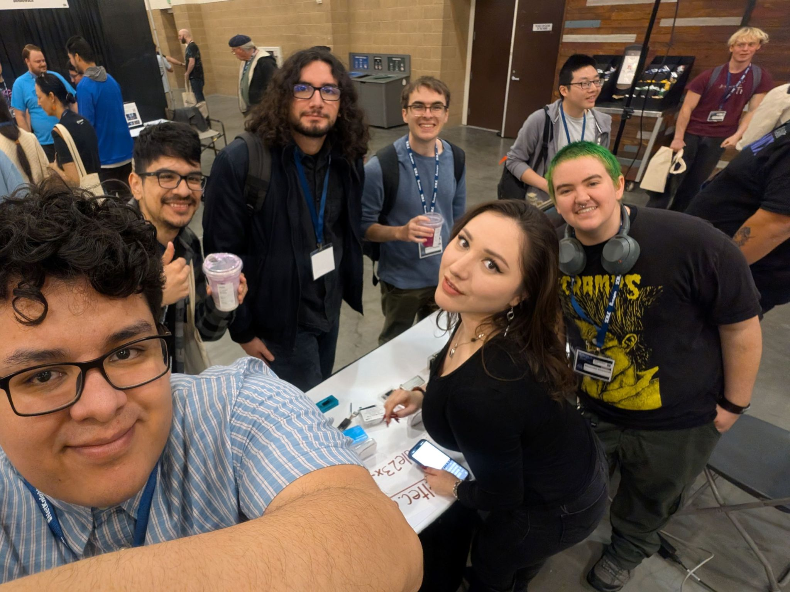
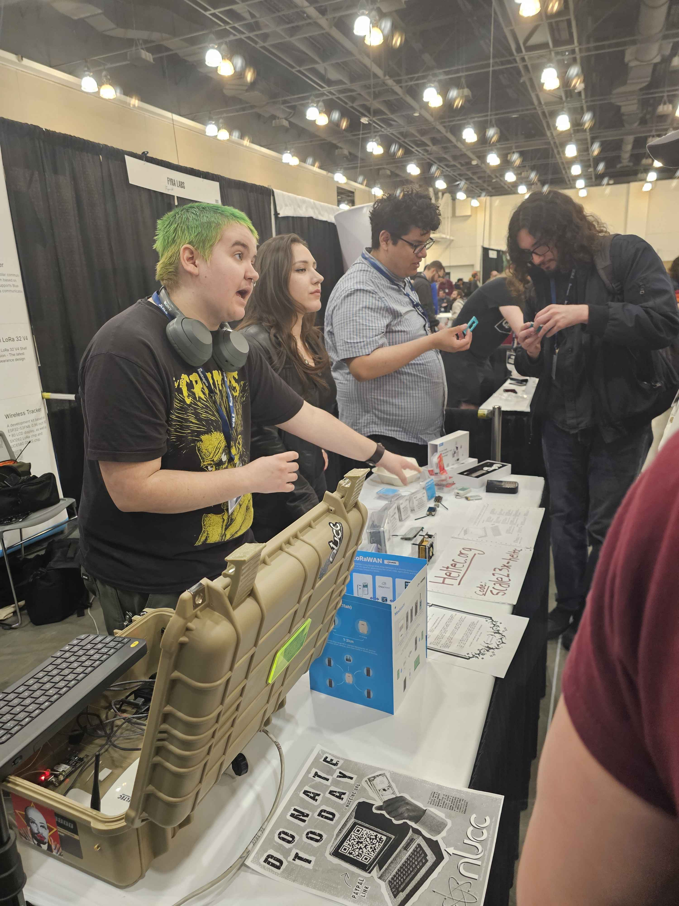
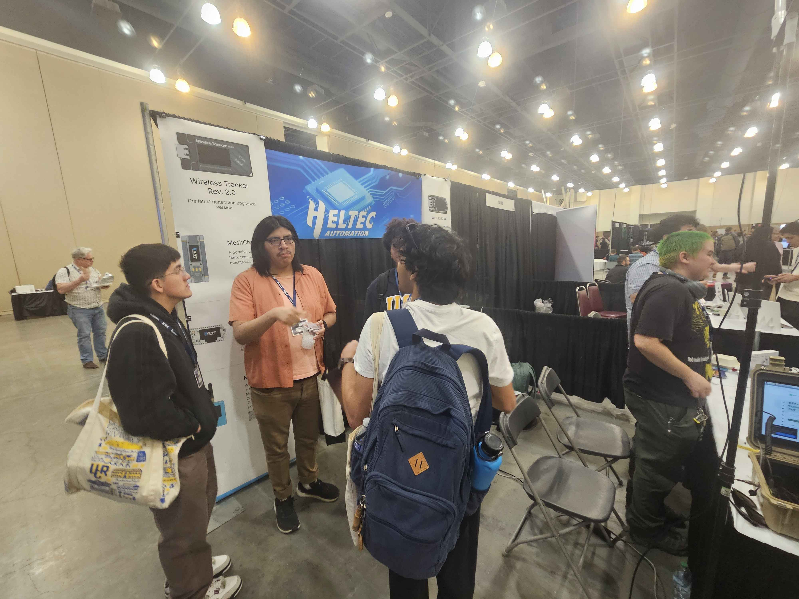
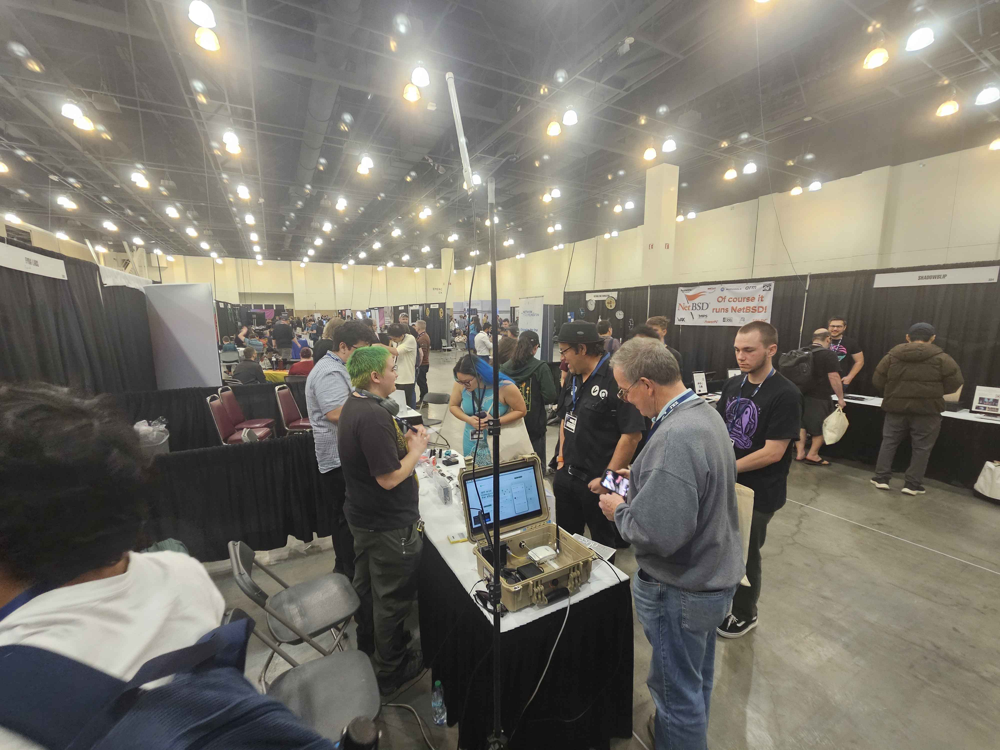

PASADENA, Calif., March 17, 2026 /PRNewswire/ -- Heltec, a global leading enterprise specializing in IoT and smart hardware, today announced the successful conclusion of its participation in the [**Southern California Linux Expo (SCALE)**](https://www.socallinuxexpo.org/scale/23x), held in Pasadena, California, USA. With comprehensive on-site volunteer support from top university cybersecurity societies and professional industry organizations, Heltec showcased its complete matrix of core products at the event, delivering strong results in expanding brand influence, engaging with clients and industry peers, and building its technical reputation within the North American market. The company’s booth emerged as one of the most popular and highly visited attractions throughout the expo.

As a pivotal industry exchange platform in North America, SCALE centers on embedded technologies, IoT applications, and cybersecurity. The annual event brings together global industry vendors, technical experts, enterprise clients, and university research communities, serving as a core channel for technology implementation, business matchmaking, and cross-sector industry collaboration. During the expo, Heltec leveraged its dedicated booth to present a comprehensive display of its full portfolio, including embedded development hardware, LoRa communication modules, and IoT terminal devices, alongside tailored vertical industry solutions for industrial IoT, smart hardware development, and device security protection. The showcase fully demonstrated the company’s core competitive strengths in IoT hardware R&D, low-power communication technologies, and device security adaptation.

Notably, Heltec received professional volunteer on-site technical support from the [**Offensive Security Society (OSS)**](https://www.osscsuf.org/), a student-led organization based at [**California State University, Fullerton (CSUF)**](https://www.fullerton.edu/). As a student-run group focused on practical cybersecurity offensive and defensive techniques, technical knowledge sharing, and tech talent development, OSS follows a long-standing philosophy of hands-on technical learning. We actively promote cybersecurity culture across academic and industry circles through a wide range of initiatives, including educational workshops, industry competitions, and bug bounty programs.

Additional hands-on volunteer technical support was provided by [**Cyber@UCR**](https://cyber.cs.ucr.edu/), the official cybersecurity technical team affiliated with the [**University of California, Riverside (UCR)**](https://www.ucr.edu/). Committed to advancing knowledge sharing and technical research in the computer security field through hands-on competitive events and laboratory experimentation, the Cyber@UCR team delivered expert volunteer assistance for Heltec’s live product demonstrations, as well as professional consultation on embedded technologies and device security for attendees throughout the expo. This support helped the Heltec booth maintain the highest standards of professionalism and responsiveness in its on-site technical services.

In addition, volunteer support for exhibition content planning and promotional outreach was provided by the [**National Upcycled Computing Collective (NUCC)**](https://www.nuccinc.org/), a professional organization dedicated to advancing computing and cybersecurity research and education. With core project layouts in distributed computing, fuzzing testing, hardware technology and robotic process automation, NUCC boasts extensive hands-on experience in industry event operation, having delivered professional workshops and training programs at top global cybersecurity events including DEF CON and SparkleCon, as well as running active technical communities across Southern California. Its volunteer team leveraged deep industry resources and event operation expertise to support Heltec’s exhibition planning and audience reach throughout the expo.

Further volunteer assistance with promotional coordination was provided by [**Nationstateactor**](https://Nationstateactor.com), a leading industry platform focused on cutting-edge cybersecurity and hardware technology. This collaborative volunteer support significantly amplified the visibility of Heltec’s participation across the North American industry ecosystem.

As a leading global provider of IoT hardware and end-to-end solutions, Heltec remains steadfastly focused on addressing end-user needs through in-depth technology research and development, as well as market-oriented services. The company’s participation in SCALE not only delivered better-than-expected results in North American market expansion but also built valuable, long-term connections with North American academic communities and industry organizations.

Moving forward, Heltec will continue to deepen its cultivation of the North American market, delivering products and services tailored to the unique needs of local customers and developers. The company will continue to engage with academic and industry partners across the region.