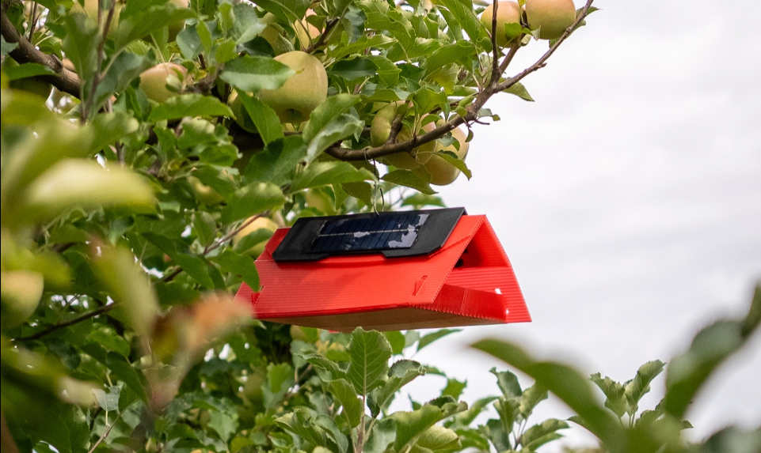
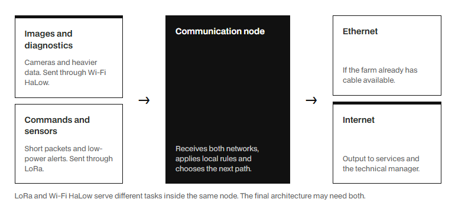
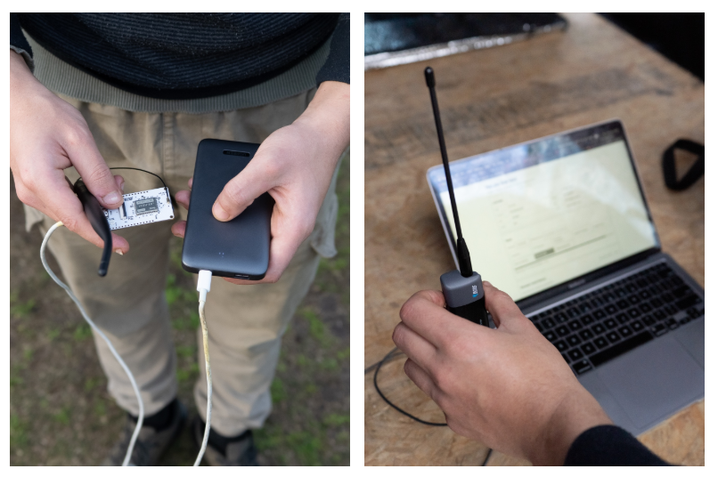
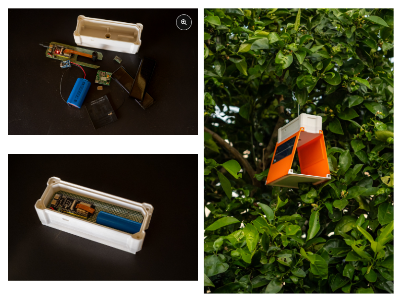
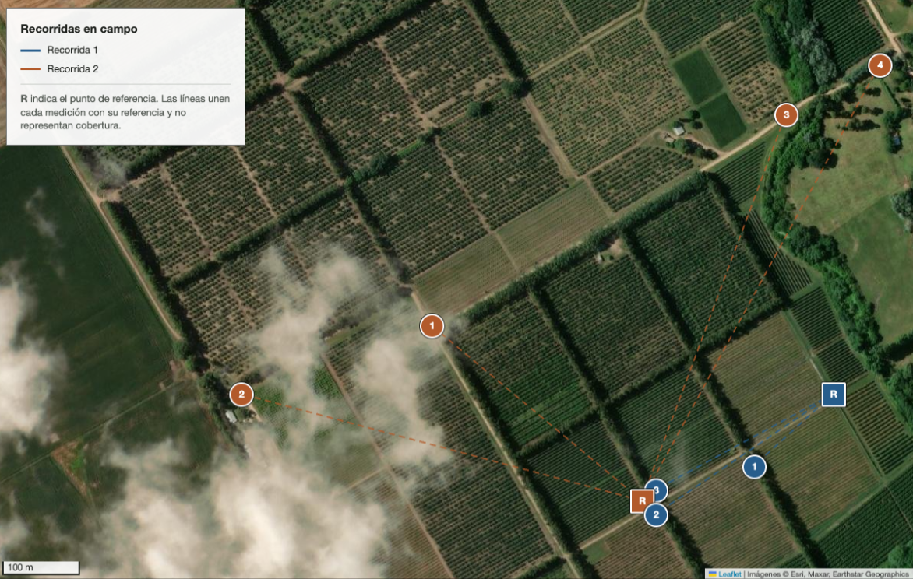
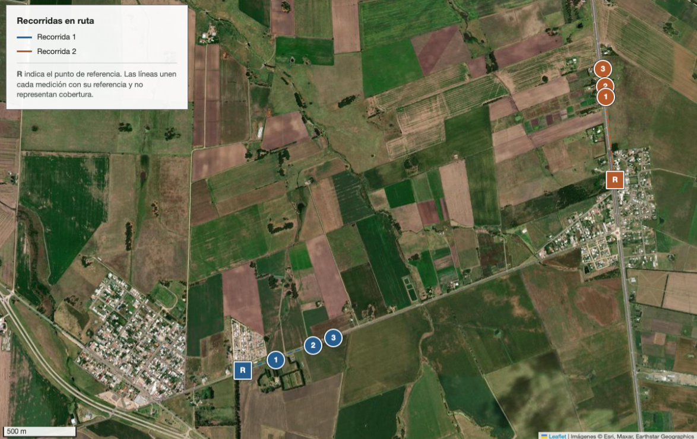
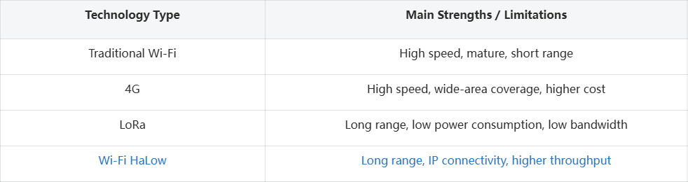

With the development of smart agriculture, an increasing number of agricultural monitoring systems are shifting from traditional manual inspections toward automated and digital monitoring. Cameras, sensors, and other devices can continuously collect field data and transmit it to remote servers for analysis via wireless networks.

However, in large outdoor environments such as orchards and farms, the trade-off between long-range connectivity, low power consumption, and high bandwidth remains a major challenge when  deploying wireless monitoring systems.

To address these challenges, [**LUMA Lab**](https://lab.luma.uy/en) in Uruguay is developing an automated system for agricultural pest monitoring.

Traditional pest monitoring typically relies on workers periodically checking traps. An automated solution, by contrast can continuously capture images with cameras and send them to a server for identification and analysis.

The overall system can be simplified as:

**Field Trap → Camera → Wireless Network → Server → Image Analysis**

In this system, wireless data transmission becomes a key factor in determining whether the entire system can operate reliably over the long term.

Unlike conventional sensors, this system needs to transmit image data. A single image typically ranges from 200~600 KB, meaning the system needs not only to cover a relatively large area, but also to provide sufficient data throughput.

This creates new challenges for traditional low-power wireless communication technologies.

---

# Traditional Wireless Solutions is Limited

##### 1. Cellular Networks:

During the initial stage of the project, a prototype system was developed using an ESP32, camera, 4G modem, battery, and solar power supply. However, field tests in the orchard revealed that the 4G network could not maintain a consistently stable connection under the environmental conditions.  At the same time, the cellular modem and its power system increased the overall power consumption of the device. For outdoor terminals powered by a combination of batteries and solar energy, higher power consumption directly shortens maintenance intervals and increases deployment costs. Therefore, although cellular networks offer excellent data rates, they are not necessarily the optimal choice for all remote agricultural environments.

#### 2. LoRaWAN: 

LoRaWAN is a widely used communication technology in agricultural IoT. It offers low power consumption and long-range coverage, making it well suited for small amounts of telemetry data such as temperature and humidity, positioning, and device status. However, this project needs to transmit image files ranging from 200–600 KB. If LoRaWAN were used to carry image data, the files would need to be divided into multiple packets, resulting in long transmission times and a higher risk of packet retransmission. In general, LoRa is better suited to small telemetry data rather than large image files.

---

# Wi-Fi HaLow: Another Networking Option

Wi-Fi HaLow is based on IEEE 802.11ah and operates in the Sub-1 GHz frequency band.

Compared with conventional 2.4 GHz and 5 GHz WiFi, WiFi HaLow is not primarily designed to pursue higher peak data rates. Instead, it uses a lower frequency band to achieve longer coverage distances while supporting the connectivity requirements of IoT devices.

For agricultural remote monitoring systems, its advantages can be summarized in three areas:

**Long-Range Connectivity**

The Sub-1 GHz frequency band has propagation characteristics that are well suited to long-distance wireless communication, enabling connections over hundreds of meters and potentially even farther.

**IP Networking**

Wi-Fi HaLow remains part of the WiFi ecosystem and can directly carry IP traffic.

This means remote devices can connect to existing network architectures without requiring a completely new proprietary communication protocol.

**Higher Data Throughput**

Compared with low-speed long-range communication technologies such as LoRaWAN, Wi-Fi HaLow can provide significantly higher data throughput, making it more suitable for applications involving images, files, and other larger data transfers.

---

# Field Testing in a Real Orchard Environment

To evaluate the performance of Wi-Fi HaLow in a real-world environment, LUMA Lab built a test network consisting of a fixed AP and mobile nodes.

The basic architecture was:

Internet / Ethernet  
↓  
[**Wi-Fi HaLow Dongle AP**](https://heltec.org/project/ht-hd01/)  
↓  
[**Wi-Fi HaLow Camera**](https://heltec.org/project/ht-hc33/)  
↓  
Mobile Test Node  
↓  
Data Transmission

The test used the [**Wi-Fi HaLow Dongle**](https://heltec.org/project/ht-hd01/), configured as a HaLow AP.

Rather than being conducted in a laboratory, the test was carried out in actual apple orchards and road environments to evaluate how vegetation, terrain, and other environmental factors affected the wireless link.

---

The tests were conducted at multiple locations, including apple orchards and road environments.

The test distances ranged from:

**137.6 meters → 753 meters**

The measured parameters included:

*  Download

* Upload

* RSSI

* Latency

* Maximum communication interruption time

This testing approach differs from simply measuring the "maximum communication distance." Instead, it focuses more on whether the network can still provide usable data transmission at practical operating distances.

---

The first test was conducted in an apple orchard. At a distance of **301.1** meters:

>Download: 1.863 Mbps  
Upload: 1.164 Mbps

The results show that even with trees and vegetation obstructing the wireless path, Wi-Fi HaLow was still able to achieve Mbps-level data transmission.

The second test extended the distance further. At **534.4** meters:

>Download: 1.088 Mbps  
Upload: 0.397 Mbps  
RSSI: approximately −90.22 dBm

At **640.1** meters:

>Download: 0.218 Mbps  
Upload: 0.053 Mbps

This indicates that in the vegetation-rich orchard environment, Wi-Fi HaLow could still maintain a usable connection over several hundred meters.

The third test was conducted in a road environment and produced one of the most representative results of the study. At a distance of **506** meters:

>Download: 1.710 Mbps  
Upload: 1.634 Mbps

Even beyond 500 meters, the bidirectional throughput remained above 1 Mbps. For an agricultural monitoring system, remote devices can not only upload sensor data but also transmit relatively large files such as images. This is an important difference between Wi-Fi HaLow and traditional low-speed long-range IoT technologies.

This is also one of the key differences between WiFi HaLow and conventional low-speed long-range IoT communication technologies.

More importantly, the test validated a practical networking requirement:

Transmitting larger amounts of data over hundreds of meters while maintaining an IP network connection.

This sits in a space between several traditional wireless technologies.

Traditional Wi-Fi offers high data rates but limited transmission distance; 4G/5G provides high speeds and wide coverage, but depends on carrier networks and generally consumes more power.

LoRa/LoRaWAN offers long range and low power consumption, but its extremely low bandwidth makes it unsuitable for transmitting large amounts of data such as images.

Wi-Fi HaLow, meanwhile, combines long-range connectivity, IP networking, and relatively high throughput. This makes it particularly suitable for outdoor agricultural environments spanning hundreds of meters where image transmission is required and traditional solutions are less suitable. It provides an effective complement to existing wireless IoT technologies.

---

# LoRa and Wi-Fi HaLow Can Complement Each Other

In practical IoT systems, LoRa and Wi-Fi HaLow do not necessarily need to compete with each other.

A more suitable architecture could be:

### LoRa

Responsible for:

* Sensor data

* GPS

* Status information

* Alerts

* Control commands

### Wi-Fi HaLow

Responsible for:

* Images

* Files

* Camera data

* High-volume IP communication

By combining the two technologies, a system can balance low power consumption, long-range connectivity, and higher data throughput.

---

# More Possibilities for Long-Range Connectivity

For developers who need to quickly build a long-range IP network, the [**Heltec Wi-Fi HaLow 7608 Router**](https://heltec.org/project/ht-h7608/) and [**Wi-Fi HaLow Dongle**](https://heltec.org/project/ht-hd01/) can serve as the network center and remote terminal, respectively.

Internet / Ethernet  
↓  
[**Heltec Wi-Fi HaLow 7608 Router**](https://heltec.org/project/ht-h7608/)  
↓  
[**Wi-Fi HaLow Dongle**](https://heltec.org/project/ht-hd01/)

This architecture eliminates the need to equip every remote device with a cellular connection while retaining IP networking capabilities.

As a result, the technology can be applied not only to agricultural monitoring, but also to:

* Remote cameras

* Farms and ranches

* Industrial parks

* Warehousing and logistics

* Construction sites

* Large outdoor areas

The LUMA Lab field test demonstrates a typical application of Wi-Fi HaLow in a real outdoor environment.

The test results show that even under the influence of vegetation, terrain, and other environmental factors, Wi-Fi HaLow can maintain usable data communication over several hundred meters. For devices that need to transmit images, files, or other IP data over long distances, this provides an alternative to traditional Wi-Fi, cellular networks, and LoRa.

More importantly, the test demonstrates more than simply a "maximum range" figure. It points to a more practical networking concept:

Extending IP connectivity into areas that are difficult for traditional Wi-Fi to reach.

As applications such as remote cameras, smart agriculture, industrial IoT, and outdoor monitoring continue to develop, Wi-Fi HaLow has the potential to become an important wireless technology for connecting long-distance, high-data-volume devices.

**Data sources** : https://lab.luma.uy/en/publications/wifi-halow-field-test