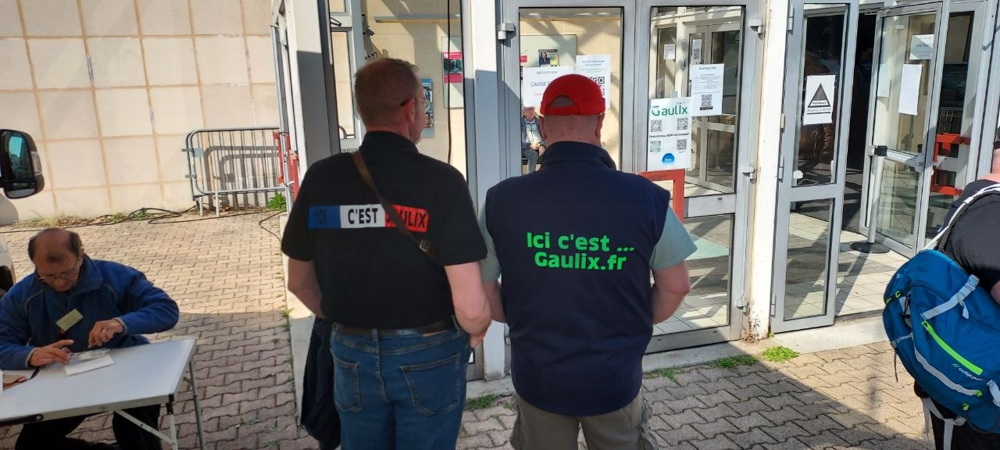
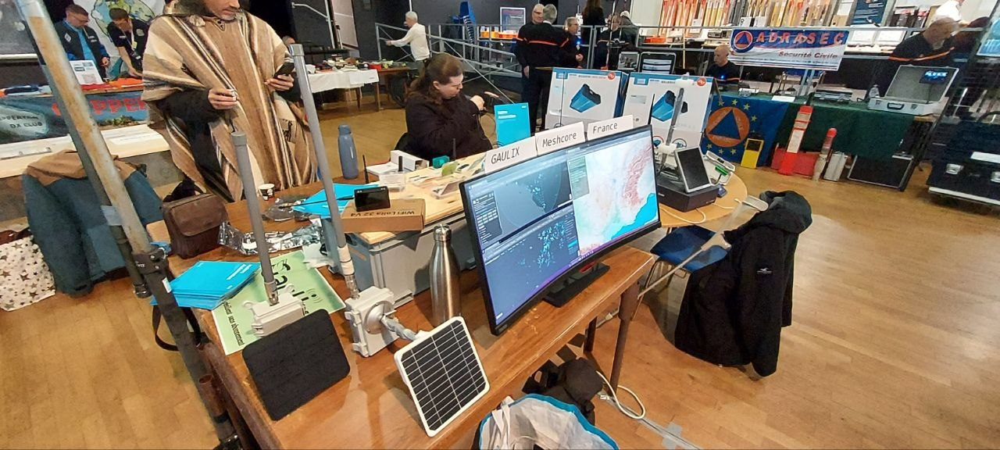
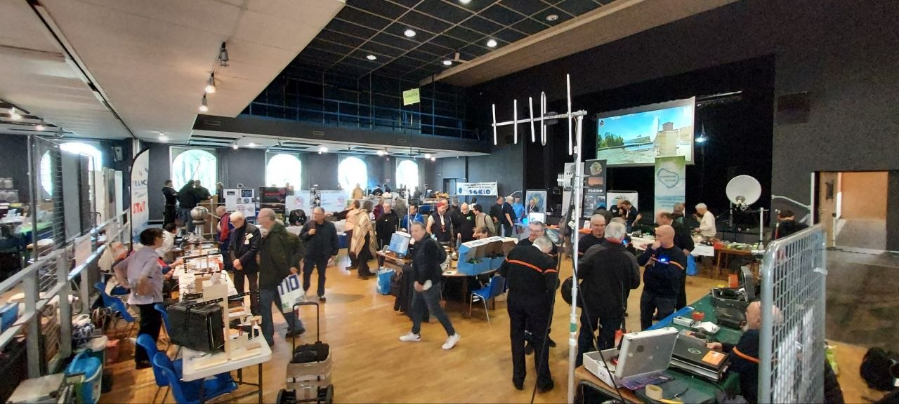
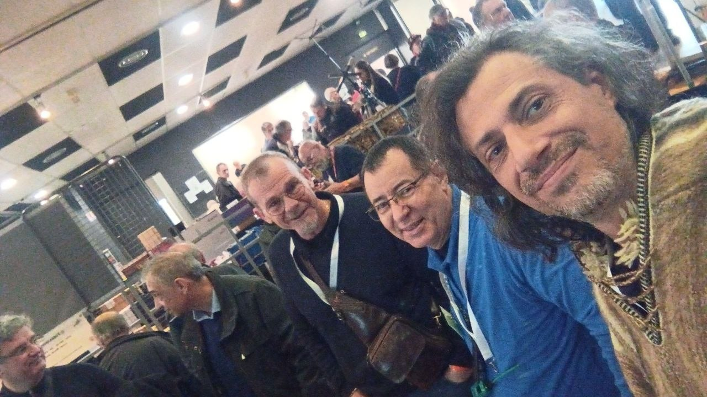
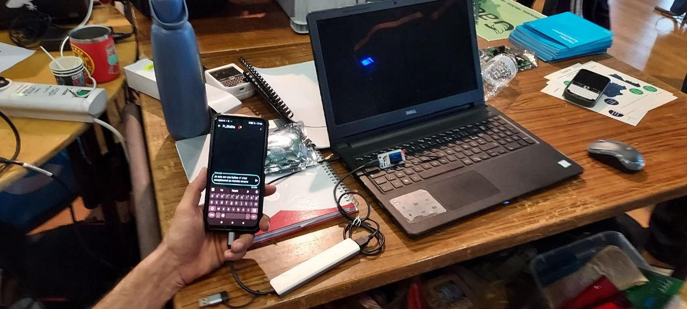
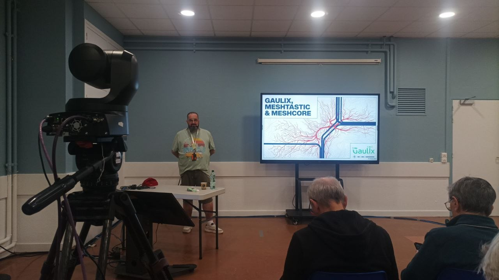
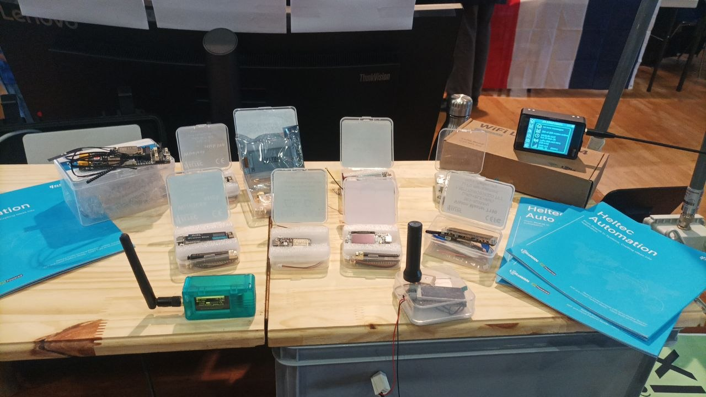
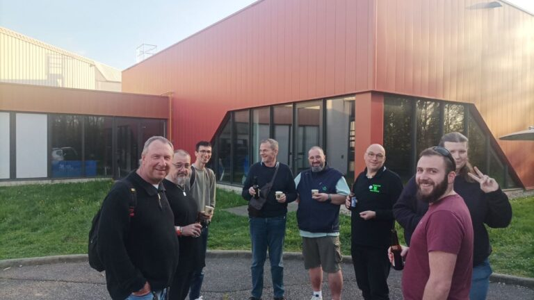

Before Ond’Expo 2026 officially opened its doors to the public, the venue was already abuzz with intense yet orderly preparations. The team from the [**Lyon Radio Club (F8KLY)**](https://f8kly.fr/) warmly welcomed all participants, while volunteers swiftly dove into their respective tasks to finalize the setup of the exhibition booths.

The [**Gaulix**](https://gaulix.fr/) team’s booth was quickly brought to readiness. Equipment was progressively installed, and a network map was displayed on a screen, making the structure of the MeshCore network instantly clear. As team members continued to arrive, the pace on the floor gradually quickened, with everything falling into place for the imminent opening.

Once the exhibition opened its doors, a steady stream of visitors poured in. Veterans familiar with the [**Meshtastic ecosystem**](https://meshtastic.org/), newcomers eager to explore, and curious onlookers interested in LoRa communication constantly gathered in front of the booth. Questions, discussions, and demonstrations intertwined, keeping the entire booth in a state of high-energy activity throughout the day. Some visitors came seeking technical assistance; others wished to understand the differences between various devices and firmware; and some, encountering mesh networking for the very first time, sought to grasp the potential of this decentralized mode of communication.

Throughout the day, the Gaulix team provided continuous technical support and demonstrations: node flashing, parameter configuration, network debugging, and device installation. Every question was treated with seriousness, and every interaction became an opportunity to share knowledge. Amidst a relaxed and open atmosphere, technology ceased to be merely a tool; instead, it became a bridge connecting people.

Meanwhile, [**MeshCore**](https://meshcore.co.uk/) technology emerged as one of the focal points of the event. Through intuitive demonstrations and explanations, the team showcased the practical application possibilities of this technology to the audience; its potential for rapid development also sparked widespread interest. After experiencing it firsthand, many visitors began to consider how they might introduce mesh networking into their own communities or projects.

The exhibition was also punctuated by several memorable moments—from lighthearted and humorous interactions to high-quality technical presentations, and even an on-site prize raffle—ensuring the entire event maintained an excellent pace and a strong sense of engagement. In particular, when the technical lectures were simultaneously broadcast via online platforms, the event's influence extended far beyond the physical confines of the exhibition hall.
As the exhibition drew to a close, the pace gradually slowed, yet the exchange of ideas continued unabated. Outside the exhibition hall, some team members continued their discussions—ranging from the day’s demonstrations to future project concepts, and from antenna design to network deployment—with every topic flowing naturally into the next. This exchange, extending well beyond the confines of the trade show, perhaps represents the truest embodiment of the community spirit.

Ond’Expo 2026 ultimately drew to a close amidst an atmosphere that was both fast-paced and immensely fulfilling. It was not merely a showcase of technology, but a practical exercise in connection, collaboration, and sharing. Through this event, Gaulix once again demonstrated that the true value of a Mesh network lies not solely in the act of communication itself, but—more importantly—in the power of the community it inspires.

