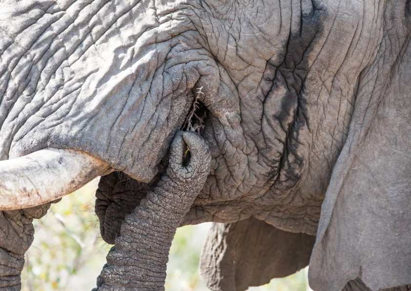
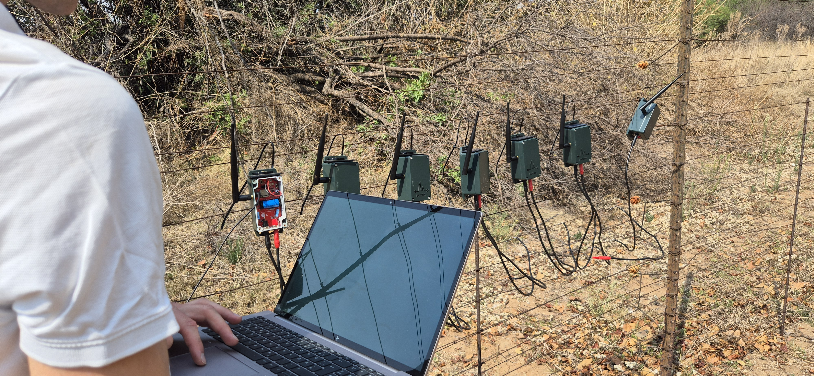
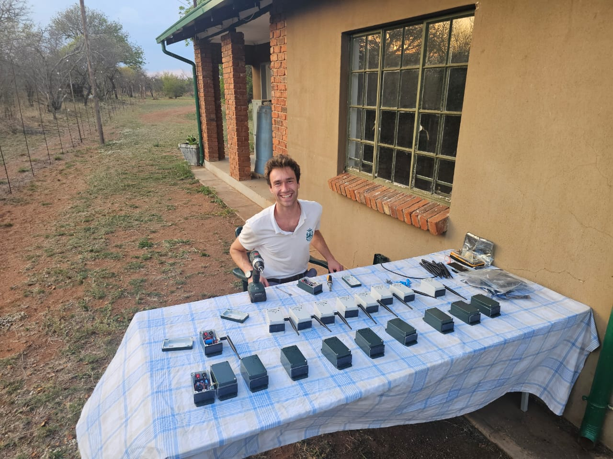
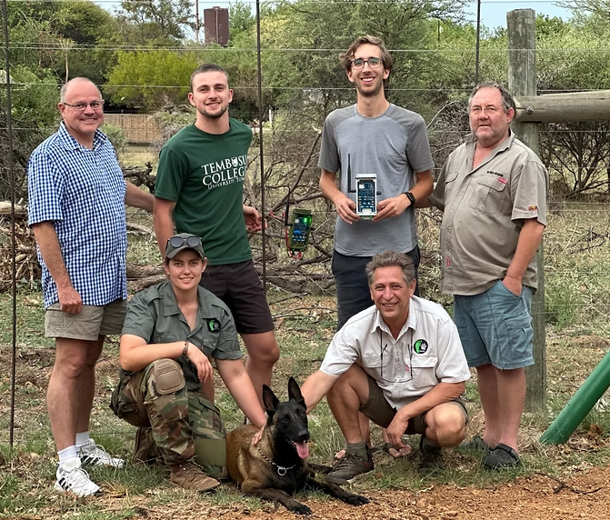

The Dinoken Wildlife Reserve in South Africa is a vast area where rhinos, elephants, antelopes, and other wild animals roam freely. However, the presence of poachers has recently posed an increasing threat to their safety. Poachers often cut through the reserve's iron fence at night, and the damage isn't discovered until the next morning—by which time the precious wildlife is often already dead. Rangers struggle to track poachers and detect gunfire, making it difficult to stop poaching before it occurs.

To address this problem and curb poaching at its source, [**WILD**](https://www.wildinternational.org/), in collaboration with [**SPOTS**](https://www.spots.org.za/) and the Dinoken Wildlife Reserve, developed a fence intrusion detection system called FenceRanger. This low-power, long-range communication system is specifically designed for large wildlife reserves. They installed one system every 1 to 2 kilometers along the reserve's motorized outer fence, continuously monitoring voltage changes.

If the fence is breached, the system sends an alert to rangers' devices via a LoRa network within approximately 3 seconds—even indicating the exact location of the damage. It also connects to WILD's AirRanger drone (a fully automated fixed-wing surveillance drone), allowing rangers to intercept poachers before they approach endangered animals. The device can even detect minute vibrations in the fence; if someone cuts a wire or knocks down a fence, the signal is transmitted directly to the ranger's screen via their self-built LoRa network.

The system is solar-powered, allowing it to operate autonomously. It operates 24/7, regardless of the environment's harshness—from the frigid winter nights to the scorching heat of South African summers, which can exceed 40 degrees Celsius.

This system has revolutionized the way rangers work. Previously, they could only patrol and investigate after incidents occurred; now they can prevent problems from happening in advance. Dealing with poachers is also safer due to the reduced unknown risks. Furthermore, fence repairs have become much easier—the system accurately informs rangers of the location of damage and the parts requiring immediate repair.

Back in December 2024, they installed the first eight test systems at the Dinoken Wildlife Sanctuary. Over the past year, they deployed 40 FenceRanger devices there, all of which passed reliability testing in real-world field environments. They also built a complete LoRa communication network covering the entire area, and the project is gradually transitioning from the testing phase to full deployment. The plan is to achieve full coverage of the 160-kilometer-long fence of the Dinoken Conservation Area by early Q2 2026. In the future, they hope to use Dinoken as a first large-scale example to promote this system to other protected areas around the world, allowing more wildlife areas to benefit from this technology.

In developing FenceRanger, they followed five key principles: low power consumption, long-distance communication in the absence of mobile networks, hardware adaptability to harsh field environments, modular and upgradeable PCB structure, and affordable pricing for use in large protected areas.

Heltec developed the core component of the system—the [**HT-CT62**](https://heltec.org/project/ht-ct62/) (ESP32-C3 + SX1262 LoRa) module. It serves as the system's "communication heart," supporting a three-dimensional protection architecture that includes ground detection, cloud-based early warning, and aerial coordination, thereby meeting all key design objectives. The ultra-low-power device continuously monitors the fence and, upon detecting anomalies, sends an alert with location information via the LoRa network. Meanwhile, the AirRanger drone transmits real-time aerial footage to assist rangers.

The system uses wireless LoRa networking, eliminating the need for complex wiring. This significantly reduces fence setup time, saves initial costs, is highly adaptable to field environments, reduces the need for equipment maintenance and replacement, and lowers long-term operating costs.

FenceRanger allows rangers to receive alerts within seconds and work in conjunction with the drone, shifting from "remedial" to "preventative" measures, making responses faster and safer. The next version of the system will utilize the [**WiFi LoRa 32 (V4)**](https://heltec.org/project/wifi-lora-32-v4/) platform, improving communication while maintaining low power consumption. Its modular design means rangers can update firmware and upgrade basic functions without replacing all hardware.

WILD and Heltec state that FenceRanger fills a gap in wildlife conservation technology. Heltec provides robust and cost-effective technical support to organizations like WILD, making technology accessible and sustainable, lowering the barriers to use, and creating a virtuous cycle between technology and practical application.

The project's larger goal is to protect all life, prevent habitat fragmentation, and stop biodiversity loss. This replicable and scalable technology aims to become a global model for wilderness conservation—helping technology and nature coexist harmoniously.

